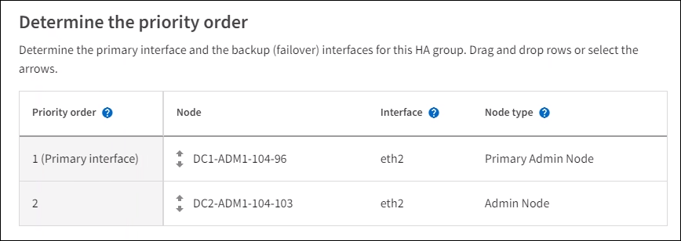

= Konfigurieren von Hochverfügbarkeitsgruppen
:allow-uri-read: 
:icons: font
:imagesdir: ../media/

[role="lead"]
Sie können Hochverfügbarkeitsgruppen (HA) konfigurieren, um einen hochverfügbaren Zugriff auf die Dienste auf Admin-Knoten oder Gateway-Knoten bereitzustellen.

.Bevor Sie beginnen
* Sie sind beim Grid Manager angemeldet mit einemlink:../admin/web-browser-requirements.html["unterstützter Webbrowser"] .
* Sie haben dielink:admin-group-permissions.html["Root-Zugriffsberechtigung"] .
* Wenn Sie eine VLAN-Schnittstelle in einer HA-Gruppe verwenden möchten, haben Sie die VLAN-Schnittstelle erstellt. Sehen link:../admin/configure-vlan-interfaces.html["Konfigurieren von VLAN-Schnittstellen"] .
* Wenn Sie eine Zugriffsschnittstelle für einen Knoten in einer HA-Gruppe verwenden möchten, haben Sie die Schnittstelle erstellt:
+
** *Red Hat Enterprise Linux (vor der Installation des Knotens)*:link:../rhel/creating-node-configuration-files.html["Erstellen Sie Knotenkonfigurationsdateien"]
** *Ubuntu oder Debian (vor der Installation des Knotens)*:link:../ubuntu/creating-node-configuration-files.html["Erstellen Sie Knotenkonfigurationsdateien"]
** *Linux (nach der Installation des Knotens)*:link:../maintain/linux-adding-trunk-or-access-interfaces-to-node.html["Linux: Trunk oder Zugriffsschnittstellen zu einem Knoten hinzufügen"]
** *VMware (nach der Installation des Knotens)*:link:../maintain/vmware-adding-trunk-or-access-interfaces-to-node.html["VMware: Trunk- oder Zugriffsschnittstellen zu einem Knoten hinzufügen"]

== Erstellen einer Hochverfügbarkeitsgruppe

Wenn Sie eine Hochverfügbarkeitsgruppe erstellen, wählen Sie eine oder mehrere Schnittstellen aus und organisieren sie nach Priorität.  Anschließend weisen Sie der Gruppe eine oder mehrere VIP-Adressen zu.

Eine Schnittstelle muss für einen Gateway-Knoten oder einen Admin-Knoten sein, um in eine HA-Gruppe aufgenommen zu werden.  Eine HA-Gruppe kann für jeden Knoten nur eine Schnittstelle verwenden. In anderen HA-Gruppen können jedoch andere Schnittstellen für denselben Knoten verwendet werden.

=== Zugriff auf den Assistenten

.Schritte
. Wählen Sie *KONFIGURATION* > *Netzwerk* > *Hochverfügbarkeitsgruppen*.
. Wählen Sie *Erstellen*.

=== Geben Sie Details für die HA-Gruppe ein

.Schritte
. Geben Sie einen eindeutigen Namen für die HA-Gruppe an.
. Geben Sie optional eine Beschreibung für die HA-Gruppe ein.
. Wählen Sie *Weiter*.

=== Schnittstellen zur HA-Gruppe hinzufügen

.Schritte
. Wählen Sie eine oder mehrere Schnittstellen aus, die dieser HA-Gruppe hinzugefügt werden sollen.
+
Nutzen Sie die Spaltenüberschriften zum Sortieren der Zeilen oder geben Sie einen Suchbegriff ein, um Schnittstellen schneller zu finden.

+
image::../media/ha_group_add_interfaces.png[HA-Gruppen fügen Schnittstellen hinzu]

+

NOTE: Warten Sie nach dem Erstellen einer VLAN-Schnittstelle bis zu 5 Minuten, bis die neue Schnittstelle in der Tabelle angezeigt wird.

+
.Richtlinien zur Auswahl von Schnittstellen
** Sie müssen mindestens eine Schnittstelle auswählen.
** Sie können für einen Knoten nur eine Schnittstelle auswählen.
** Wenn die HA-Gruppe zum HA-Schutz von Admin-Node-Diensten dient, zu denen der Grid Manager und der Tenant Manager gehören, wählen Sie nur Schnittstellen auf Admin-Nodes aus.
** Wenn die HA-Gruppe dem HA-Schutz des S3-Client-Datenverkehrs dient, wählen Sie Schnittstellen auf Admin-Knoten, Gateway-Knoten oder beiden aus.
** Wenn Sie Schnittstellen auf verschiedenen Knotentypen auswählen, wird ein Hinweis angezeigt.  Bitte beachten Sie, dass bei einem Failover die vom zuvor aktiven Knoten bereitgestellten Dienste auf dem neuen aktiven Knoten möglicherweise nicht verfügbar sind.  Beispielsweise kann ein Backup-Gateway-Knoten keinen HA-Schutz für Admin-Knotendienste bieten.  Ebenso kann ein Backup-Admin-Knoten nicht alle Wartungsverfahren durchführen, die der primäre Admin-Knoten bereitstellen kann.
** Wenn Sie keine Schnittstelle auswählen können, ist das entsprechende Kontrollkästchen deaktiviert.  Der Tooltip bietet weitere Informationen.
+
image::../media/vlan_parent_interface_tooltip.png[Tooltip für die VLAN-Schnittstelle]

** Sie können keine Schnittstelle auswählen, wenn ihr Subnetzwert oder Gateway mit einer anderen ausgewählten Schnittstelle in Konflikt steht.
** Sie können eine konfigurierte Schnittstelle nicht auswählen, wenn sie keine statische IP-Adresse hat.

. Wählen Sie *Weiter*.

=== Bestimmen Sie die Prioritätsreihenfolge

Wenn die HA-Gruppe mehr als eine Schnittstelle umfasst, können Sie bestimmen, welche die primäre Schnittstelle und welche die Backup-Schnittstellen (Failover) sind.  Wenn die primäre Schnittstelle ausfällt, werden die VIP-Adressen an die verfügbare Schnittstelle mit der höchsten Priorität weitergeleitet.  Wenn diese Schnittstelle ausfällt, werden die VIP-Adressen zur nächsten verfügbaren Schnittstelle mit der höchsten Priorität verschoben und so weiter.

.Schritte
. Ziehen Sie Zeilen in der Spalte *Prioritätsreihenfolge*, um die primäre Schnittstelle und alle Backup-Schnittstellen zu bestimmen.
+
Die erste Schnittstelle in der Liste ist die primäre Schnittstelle.  Die primäre Schnittstelle ist die aktive Schnittstelle, sofern kein Fehler auftritt.

+

+

TIP: Wenn die HA-Gruppe Zugriff auf den Grid Manager bietet, müssen Sie eine Schnittstelle auf dem primären Admin-Knoten als primäre Schnittstelle auswählen.  Einige Wartungsvorgänge können nur vom primären Admin-Knoten aus durchgeführt werden.

. Wählen Sie *Weiter*.

=== IP-Adressen eingeben

.Schritte
. Geben Sie im Feld *Subnetz-CIDR* das VIP-Subnetz in CIDR-Notation an – eine IPv4-Adresse gefolgt von einem Schrägstrich und der Subnetzlänge (0–32).
+
Für die Netzwerkadresse dürfen keine Hostbits gesetzt sein. Beispiel:  `192.16.0.0/22` .

+

NOTE: Wenn Sie ein 32-Bit-Präfix verwenden, dient die VIP-Netzwerkadresse auch als Gateway-Adresse und VIP-Adresse.

+
image::../media/ha_group_select_virtual_ips.png[HA-Gruppen geben VIPs ein]

. Wenn S3-Verwaltungs- oder Mandantenclients von einem anderen Subnetz aus auf diese VIP-Adressen zugreifen, geben Sie optional die *Gateway-IP-Adresse* ein.  Die Gateway-Adresse muss innerhalb des VIP-Subnetzes liegen.
+
Client- und Administratorbenutzer verwenden dieses Gateway, um auf die virtuellen IP-Adressen zuzugreifen.

. Geben Sie mindestens eine und höchstens zehn VIP-Adressen für die aktive Schnittstelle in der HA-Gruppe ein.  Alle VIP-Adressen müssen sich innerhalb des VIP-Subnetzes befinden und alle müssen gleichzeitig auf der aktiven Schnittstelle aktiv sein.
+
Sie müssen mindestens eine IPv4-Adresse angeben.  Optional können Sie zusätzliche IPv4- und IPv6-Adressen angeben.

. Wählen Sie *HA-Gruppe erstellen* und dann *Fertig stellen*.
+
Die HA-Gruppe wird erstellt und Sie können jetzt die konfigurierten virtuellen IP-Adressen verwenden.

=== Nächste Schritte

Wenn Sie diese HA-Gruppe zum Lastenausgleich verwenden möchten, erstellen Sie einen Lastenausgleichsendpunkt, um den Port und das Netzwerkprotokoll zu bestimmen und alle erforderlichen Zertifikate anzuhängen. Sehen link:configuring-load-balancer-endpoints.html["Konfigurieren von Load Balancer-Endpunkten"] .

== Bearbeiten einer Hochverfügbarkeitsgruppe

Sie können eine Hochverfügbarkeitsgruppe (HA) bearbeiten, um ihren Namen und ihre Beschreibung zu ändern, Schnittstellen hinzuzufügen oder zu entfernen, die Prioritätsreihenfolge zu ändern oder virtuelle IP-Adressen hinzuzufügen oder zu aktualisieren.

Beispielsweise müssen Sie möglicherweise eine HA-Gruppe bearbeiten, wenn Sie den Knoten entfernen möchten, der einer ausgewählten Schnittstelle in einem Site- oder Knoten-Außerbetriebnahmeverfahren zugeordnet ist.

.Schritte
. Wählen Sie *KONFIGURATION* > *Netzwerk* > *Hochverfügbarkeitsgruppen*.
+
Auf der Seite „Hochverfügbarkeitsgruppen“ werden alle vorhandenen HA-Gruppen angezeigt.

. Aktivieren Sie das Kontrollkästchen für die HA-Gruppe, die Sie bearbeiten möchten.
. Führen Sie je nachdem, was Sie aktualisieren möchten, einen der folgenden Schritte aus:
+
** Wählen Sie *Aktionen* > *Virtuelle IP-Adresse bearbeiten*, um VIP-Adressen hinzuzufügen oder zu entfernen.
** Wählen Sie *Aktionen* > *HA-Gruppe bearbeiten*, um den Namen oder die Beschreibung der Gruppe zu aktualisieren, Schnittstellen hinzuzufügen oder zu entfernen, die Prioritätsreihenfolge zu ändern oder VIP-Adressen hinzuzufügen oder zu entfernen.

. Wenn Sie *Virtuelle IP-Adresse bearbeiten* ausgewählt haben:
+
.. Aktualisieren Sie die virtuellen IP-Adressen für die HA-Gruppe.
.. Wählen Sie *Speichern*.
.. Wählen Sie *Fertig*.

. Wenn Sie *HA-Gruppe bearbeiten* ausgewählt haben:
+
.. Aktualisieren Sie optional den Namen oder die Beschreibung der Gruppe.
.. Aktivieren oder deaktivieren Sie optional die Kontrollkästchen, um Schnittstellen hinzuzufügen oder zu entfernen.
+

NOTE: Wenn die HA-Gruppe Zugriff auf den Grid Manager bietet, müssen Sie eine Schnittstelle auf dem primären Admin-Knoten als primäre Schnittstelle auswählen.  Einige Wartungsvorgänge können nur vom primären Admin-Knoten aus durchgeführt werden

.. Ziehen Sie optional Zeilen, um die Prioritätsreihenfolge der primären Schnittstelle und aller Backup-Schnittstellen für diese HA-Gruppe zu ändern.
.. Aktualisieren Sie optional die virtuellen IP-Adressen.
.. Wählen Sie *Speichern* und dann *Fertig*.

== Entfernen einer Hochverfügbarkeitsgruppe

Sie können eine oder mehrere Hochverfügbarkeitsgruppen (HA) gleichzeitig entfernen.

TIP: Sie können eine HA-Gruppe nicht entfernen, wenn sie an einen Load Balancer-Endpunkt gebunden ist.  Um eine HA-Gruppe zu löschen, müssen Sie sie von allen Load Balancer-Endpunkten entfernen, die sie verwenden.

Um Clientunterbrechungen zu vermeiden, aktualisieren Sie alle betroffenen S3-Clientanwendungen, bevor Sie eine HA-Gruppe entfernen.  Aktualisieren Sie jeden Client, um eine Verbindung über eine andere IP-Adresse herzustellen, beispielsweise die virtuelle IP-Adresse einer anderen HA-Gruppe oder die IP-Adresse, die während der Installation für eine Schnittstelle konfiguriert wurde.

.Schritte
. Wählen Sie *KONFIGURATION* > *Netzwerk* > *Hochverfügbarkeitsgruppen*.
. Überprüfen Sie die Spalte *Load Balancer-Endpunkte* für jede HA-Gruppe, die Sie entfernen möchten.  Wenn Load Balancer-Endpunkte aufgelistet sind:
+
.. Gehen Sie zu *KONFIGURATION* > *Netzwerk* > *Load Balancer-Endpunkte*.
.. Aktivieren Sie das Kontrollkästchen für den Endpunkt.
.. Wählen Sie *Aktionen* > *Endpunktbindungsmodus bearbeiten*.
.. Aktualisieren Sie den Bindungsmodus, um die HA-Gruppe zu entfernen.
.. Wählen Sie *Änderungen speichern*.

. Wenn keine Load Balancer-Endpunkte aufgelistet sind, aktivieren Sie das Kontrollkästchen für jede HA-Gruppe, die Sie entfernen möchten.
. Wählen Sie *Aktionen* > *HA-Gruppe entfernen*.
. Überprüfen Sie die Nachricht und wählen Sie *HA-Gruppe löschen*, um Ihre Auswahl zu bestätigen.
+
Alle von Ihnen ausgewählten HA-Gruppen werden entfernt.  Auf der Seite „Hochverfügbarkeitsgruppen“ wird ein grünes Erfolgsbanner angezeigt.

