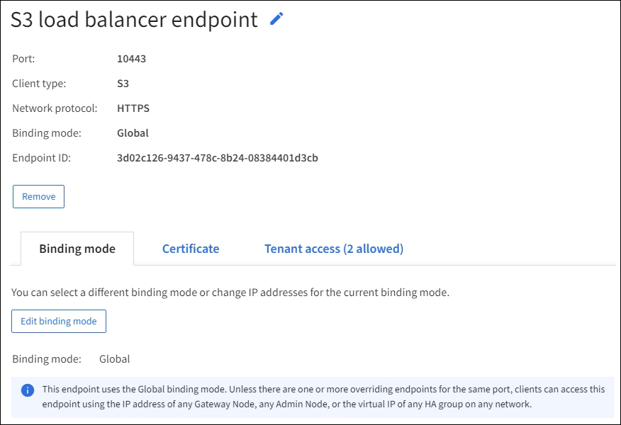

= Konfigurieren von Load Balancer-Endpunkten
:allow-uri-read: 
:icons: font
:imagesdir: ../media/

[role="lead"]
Load Balancer-Endpunkte bestimmen die Ports und Netzwerkprotokolle, die S3-Clients beim Herstellen einer Verbindung mit dem StorageGRID Load Balancer auf Gateway- und Admin-Knoten verwenden können.  Sie können auch Endpunkte verwenden, um auf den Grid Manager, den Tenant Manager oder beide zuzugreifen.

TIP: Swift-Details wurden aus dieser Version der Dokumentationssite entfernt. Sehen https://docs.netapp.com/us-en/storagegrid-118/admin/configuring-client-connections.html["Konfigurieren Sie S3- und Swift-Clientverbindungen"^] .

.Bevor Sie beginnen
* Sie sind beim Grid Manager angemeldet mit einemlink:../admin/web-browser-requirements.html["unterstützter Webbrowser"] .
* Sie haben dielink:admin-group-permissions.html["Root-Zugriffsberechtigung"] .
* Sie haben dielink:managing-load-balancing.html["Überlegungen zum Lastenausgleich"] .
* Wenn Sie zuvor einen Port neu zugeordnet haben, den Sie für den Load Balancer-Endpunkt verwenden möchten, müssen Sielink:../maintain/removing-port-remaps.html["die Port-Neuzuordnung wurde entfernt"] .
* Sie haben alle Hochverfügbarkeitsgruppen (HA) erstellt, die Sie verwenden möchten.  HA-Gruppen werden empfohlen, sind aber nicht erforderlich. Sehen link:managing-high-availability-groups.html["Verwalten von Hochverfügbarkeitsgruppen"] .
* Wenn der Load Balancer-Endpunkt verwendet wird vonlink:../admin/manage-s3-select-for-tenant-accounts.html["S3-Mandanten für S3 Select"] , es dürfen nicht die IP-Adressen oder FQDNs von Bare-Metal-Knoten verwendet werden.  Für die für S3 Select verwendeten Load Balancer-Endpunkte sind nur Service-Appliances und VMware-basierte Softwareknoten zulässig.
* Sie haben alle VLAN-Schnittstellen konfiguriert, die Sie verwenden möchten. Sehen link:configure-vlan-interfaces.html["Konfigurieren von VLAN-Schnittstellen"] .
* Wenn Sie einen HTTPS-Endpunkt erstellen (empfohlen), verfügen Sie über die Informationen für das Serverzertifikat.
+

NOTE: Es kann bis zu 15 Minuten dauern, bis Änderungen an einem Endpunktzertifikat auf alle Knoten angewendet werden.

+
** Zum Hochladen eines Zertifikats benötigen Sie das Serverzertifikat, den privaten Zertifikatsschlüssel und optional ein CA-Paket.
** Zum Generieren eines Zertifikats benötigen Sie alle Domänennamen und IP-Adressen, die S3-Clients für den Zugriff auf den Endpunkt verwenden.  Sie müssen auch den Betreff (Distinguished Name) kennen.
** Wenn Sie das StorageGRID S3-API-Zertifikat verwenden möchten (das auch für direkte Verbindungen zu Speicherknoten verwendet werden kann), haben Sie das Standardzertifikat bereits durch ein benutzerdefiniertes Zertifikat ersetzt, das von einer externen Zertifizierungsstelle signiert wurde. Sehen link:../admin/configuring-custom-server-certificate-for-storage-node.html["Konfigurieren von S3-API-Zertifikaten"] .

== Erstellen eines Load Balancer-Endpunkts

Jeder S3-Client-Load-Balancer-Endpunkt gibt einen Port, einen Clienttyp (S3) und ein Netzwerkprotokoll (HTTP oder HTTPS) an. Die Endpunkte des Lastenausgleichsmoduls der Verwaltungsschnittstelle geben einen Port, einen Schnittstellentyp und ein nicht vertrauenswürdiges Clientnetzwerk an.

=== Zugriff auf den Assistenten

.Schritte
. Wählen Sie *KONFIGURATION* > *Netzwerk* > *Load Balancer-Endpunkte*.
. Um einen Endpunkt für einen S3- oder Swift-Client zu erstellen, wählen Sie die Registerkarte *S3- oder Swift-Client*.
. Um einen Endpunkt für den Zugriff auf den Grid Manager, den Tenant Manager oder beide zu erstellen, wählen Sie die Registerkarte *Verwaltungsschnittstelle*.
. Wählen Sie *Erstellen*.

=== Geben Sie die Endpunktdetails ein

.Schritte
. Wählen Sie die entsprechenden Anweisungen aus, um Details für den Endpunkttyp einzugeben, den Sie erstellen möchten.

[role="tabbed-block"]
====
.S3- oder Swift-Client
--
[cols="1a,3a"]
|===
| Feld | Beschreibung 

 a| 
Name
 a| 
Ein beschreibender Name für den Endpunkt, der in der Tabelle auf der Seite „Load Balancer-Endpunkte“ angezeigt wird.

 a| 
Hafen
 a| 
Der StorageGRID -Port, den Sie für den Lastenausgleich verwenden möchten.  Der Standardwert dieses Felds für den ersten Endpunkt, den Sie erstellen, ist 10433. Sie können jedoch jeden nicht verwendeten externen Port zwischen 1 und 65535 eingeben.

Wenn Sie *80* oder *8443* eingeben, wird der Endpunkt nur auf Gateway-Knoten konfiguriert, es sei denn, Sie haben Port 8443 freigegeben.  Dann können Sie Port 8443 als S3-Endpunkt verwenden und der Port wird sowohl auf dem Gateway als auch auf den Admin-Knoten konfiguriert.

 a| 
Client-Typ
 a| 
Der Typ der Clientanwendung, die diesen Endpunkt verwendet, entweder *S3* oder *Swift*.

 a| 
Netzwerkprotokoll
 a| 
Das Netzwerkprotokoll, das Clients beim Herstellen einer Verbindung mit diesem Endpunkt verwenden.

* Wählen Sie *HTTPS* für eine sichere, TLS-verschlüsselte Kommunikation (empfohlen).  Sie müssen ein Sicherheitszertifikat anhängen, bevor Sie den Endpunkt speichern können.
* Wählen Sie *HTTP* für eine weniger sichere, unverschlüsselte Kommunikation.  Verwenden Sie HTTP nur für ein Nicht-Produktionsraster.

|===
--
.Verwaltungsschnittstelle
--
[cols="1a,3a"]
|===
| Feld | Beschreibung 

 a| 
Name
 a| 
Ein beschreibender Name für den Endpunkt, der in der Tabelle auf der Seite „Load Balancer-Endpunkte“ angezeigt wird.

 a| 
Hafen
 a| 
Der StorageGRID -Port, den Sie für den Zugriff auf den Grid Manager, den Tenant Manager oder beide verwenden möchten.

* Grid-Manager: *8443*
* Mietermanager: *9443*
* Sowohl Grid Manager als auch Tenant Manager: *443*

*Hinweis*: Sie können diese voreingestellten Ports oder andere verfügbare Ports verwenden.

 a| 
Schnittstellentyp
 a| 
Wählen Sie das Optionsfeld für die StorageGRID -Schnittstelle aus, auf die Sie über diesen Endpunkt zugreifen.

 a| 
Nicht vertrauenswürdiges Client-Netzwerk
 a| 
Wählen Sie *Ja*, wenn dieser Endpunkt für nicht vertrauenswürdige Clientnetzwerke zugänglich sein soll.  Andernfalls wählen Sie *Nein*.

Wenn Sie *Ja* auswählen, ist der Port in allen nicht vertrauenswürdigen Client-Netzwerken geöffnet.

*Hinweis*: Sie können einen Port nur so konfigurieren, dass er für nicht vertrauenswürdige Client-Netzwerke geöffnet oder geschlossen ist, wenn Sie den Load Balancer-Endpunkt erstellen.

|===
--
====
. Wählen Sie *Weiter*.

=== Auswählen eines Bindungsmodus

.Schritte
. Wählen Sie einen Bindungsmodus für den Endpunkt aus, um zu steuern, wie auf den Endpunkt über eine beliebige IP-Adresse oder über bestimmte IP-Adressen und Netzwerkschnittstellen zugegriffen wird.
+
Einige Bindungsmodi sind entweder für Client-Endpunkte oder Management-Schnittstellen-Endpunkte verfügbar.  Hier sind alle Modi für beide Endpunkttypen aufgelistet.

+
[cols="1a,3a"]
|===
| Modus | Beschreibung 

 a| 
Global (Standard für Client-Endpunkte)
 a| 
Clients können über die IP-Adresse eines beliebigen Gateway-Knotens oder Admin-Knotens, die virtuelle IP-Adresse (VIP) einer beliebigen HA-Gruppe in einem beliebigen Netzwerk oder einen entsprechenden FQDN auf den Endpunkt zugreifen.

Verwenden Sie die Einstellung *Global*, es sei denn, Sie müssen die Erreichbarkeit dieses Endpunkts einschränken.

 a| 
Virtuelle IPs von HA-Gruppen
 a| 
Clients müssen eine virtuelle IP-Adresse (oder den entsprechenden FQDN) einer HA-Gruppe verwenden, um auf diesen Endpunkt zuzugreifen.

Endpunkte mit diesem Bindungsmodus können alle dieselbe Portnummer verwenden, solange sich die von Ihnen für die Endpunkte ausgewählten HA-Gruppen nicht überschneiden.

 a| 
Knotenschnittstellen
 a| 
Clients müssen die IP-Adressen (oder entsprechenden FQDNs) ausgewählter Knotenschnittstellen verwenden, um auf diesen Endpunkt zuzugreifen.

 a| 
Knotentyp (nur Client-Endpunkte)
 a| 
Je nach ausgewähltem Knotentyp müssen Clients entweder die IP-Adresse (oder den entsprechenden FQDN) eines beliebigen Admin-Knotens oder die IP-Adresse (oder den entsprechenden FQDN) eines beliebigen Gateway-Knotens verwenden, um auf diesen Endpunkt zuzugreifen.

 a| 
Alle Admin-Knoten (Standard für Endpunkte der Verwaltungsschnittstelle)
 a| 
Clients müssen die IP-Adresse (oder den entsprechenden FQDN) eines beliebigen Admin-Knotens verwenden, um auf diesen Endpunkt zuzugreifen.

|===
+
Wenn mehr als ein Endpunkt denselben Port verwendet, verwendet StorageGRID diese Prioritätsreihenfolge, um zu entscheiden, welcher Endpunkt verwendet werden soll: *Virtuelle IPs von HA-Gruppen* > *Knotenschnittstellen* > *Knotentyp* > *Global*.

+
Wenn Sie Endpunkte für die Verwaltungsschnittstelle erstellen, sind nur Admin-Knoten zulässig.

. Wenn Sie *Virtuelle IPs von HA-Gruppen* ausgewählt haben, wählen Sie eine oder mehrere HA-Gruppen aus.
+
Wenn Sie Endpunkte der Verwaltungsschnittstelle erstellen, wählen Sie VIPs aus, die nur mit Admin-Knoten verknüpft sind.

. Wenn Sie *Knotenschnittstellen* ausgewählt haben, wählen Sie eine oder mehrere Knotenschnittstellen für jeden Admin-Knoten oder Gateway-Knoten aus, den Sie diesem Endpunkt zuordnen möchten.
. Wenn Sie *Knotentyp* ausgewählt haben, wählen Sie entweder „Admin-Knoten“, was sowohl den primären Admin-Knoten als auch alle nicht primären Admin-Knoten umfasst, oder „Gateway-Knoten“.

=== Steuern des Mandantenzugriffs

NOTE: Ein Management-Schnittstellen-Endpunkt kann den Mandantenzugriff nur steuern, wenn der Endpunkt über die<<enter-endpoint-details,Schnittstellentyp des Tenant Managers>> .

.Schritte
. Wählen Sie für den Schritt *Mandantenzugriff* eine der folgenden Optionen aus:
+
[cols="1a,2a"]
|===
| Feld | Beschreibung 

 a| 
Alle Mandanten zulassen (Standard)
 a| 
Alle Mandantenkonten können diesen Endpunkt verwenden, um auf ihre Buckets zuzugreifen.

Sie müssen diese Option auswählen, wenn Sie noch keine Mandantenkonten erstellt haben.  Nachdem Sie Mandantenkonten hinzugefügt haben, können Sie den Load Balancer-Endpunkt bearbeiten, um bestimmte Konten zuzulassen oder zu blockieren.

 a| 
Ausgewählte Mandanten zulassen
 a| 
Nur die ausgewählten Mandantenkonten können diesen Endpunkt verwenden, um auf ihre Buckets zuzugreifen.

 a| 
Ausgewählte Mieter blockieren
 a| 
Die ausgewählten Mandantenkonten können diesen Endpunkt nicht verwenden, um auf ihre Buckets zuzugreifen.  Alle anderen Mandanten können diesen Endpunkt verwenden.

|===
. Wenn Sie einen *HTTP*-Endpunkt erstellen, müssen Sie kein Zertifikat anhängen.  Wählen Sie *Erstellen* aus, um den neuen Load Balancer-Endpunkt hinzuzufügen.  Gehen Sie dann zu<<after-you-finish,Nach Abschluss>> .  Andernfalls wählen Sie *Weiter*, um das Zertifikat anzuhängen.

=== Zertifikat anhängen

.Schritte
. Wenn Sie einen *HTTPS*-Endpunkt erstellen, wählen Sie den Typ des Sicherheitszertifikats aus, das Sie an den Endpunkt anhängen möchten.
+
Das Zertifikat sichert die Verbindungen zwischen S3-Clients und dem Load Balancer-Dienst auf Admin-Knoten oder Gateway-Knoten.

+
** *Zertifikat hochladen*.  Wählen Sie diese Option, wenn Sie benutzerdefinierte Zertifikate hochladen möchten.
** *Zertifikat erstellen*.  Wählen Sie diese Option, wenn Sie über die zum Generieren eines benutzerdefinierten Zertifikats erforderlichen Werte verfügen.
** *Verwenden Sie das StorageGRID S3-Zertifikat*.  Wählen Sie diese Option, wenn Sie das globale S3-API-Zertifikat verwenden möchten, das auch für direkte Verbindungen zu Speicherknoten verwendet werden kann.
+
Sie können diese Option nur auswählen, wenn Sie das standardmäßige S3-API-Zertifikat, das von der Grid-CA signiert ist, durch ein benutzerdefiniertes Zertifikat ersetzt haben, das von einer externen Zertifizierungsstelle signiert ist. Sehen link:../admin/configuring-custom-server-certificate-for-storage-node.html["Konfigurieren von S3-API-Zertifikaten"] .

** *Zertifikat der Verwaltungsschnittstelle verwenden*.  Wählen Sie diese Option, wenn Sie das globale Verwaltungsschnittstellenzertifikat verwenden möchten, das auch für direkte Verbindungen zu Admin-Knoten verwendet werden kann.

. Wenn Sie das StorageGRID S3-Zertifikat nicht verwenden, laden Sie das Zertifikat hoch oder generieren Sie es.
+
[role="tabbed-block"]
====
.Zertifikat hochladen
--
.. Wählen Sie *Zertifikat hochladen*.
.. Laden Sie die erforderlichen Serverzertifikatsdateien hoch:
+
*** *Serverzertifikat*: Die benutzerdefinierte Serverzertifikatsdatei in PEM-Kodierung.
*** *Privater Zertifikatsschlüssel*: Die benutzerdefinierte private Schlüsseldatei des Serverzertifikats(`.key` ).
+

NOTE: Private EC-Schlüssel müssen mindestens 224 Bit lang sein.  Private RSA-Schlüssel müssen mindestens 2048 Bit lang sein.

*** *CA-Paket*: Eine einzelne optionale Datei, die die Zertifikate jeder zwischengeschalteten ausstellenden Zertifizierungsstelle (CA) enthält.  Die Datei sollte alle PEM-codierten CA-Zertifikatsdateien enthalten, die in der Reihenfolge der Zertifikatskette aneinandergereiht sind.

.. Erweitern Sie *Zertifikatdetails*, um die Metadaten für jedes von Ihnen hochgeladene Zertifikat anzuzeigen.  Wenn Sie ein optionales CA-Paket hochgeladen haben, wird jedes Zertifikat auf einer eigenen Registerkarte angezeigt.
+
*** Wählen Sie *Zertifikat herunterladen*, um die Zertifikatsdatei zu speichern, oder wählen Sie *CA-Paket herunterladen*, um das Zertifikatspaket zu speichern.
+
Geben Sie den Namen der Zertifikatsdatei und den Download-Speicherort an.  Speichern Sie die Datei mit der Erweiterung `.pem` .

+
Beispiel:  `storagegrid_certificate.pem`

*** Wählen Sie *Zertifikat PEM kopieren* oder *CA-Paket PEM kopieren*, um den Zertifikatsinhalt zum Einfügen an anderer Stelle zu kopieren.

.. Wählen Sie *Erstellen*. + Der Load Balancer-Endpunkt wird erstellt.  Das benutzerdefinierte Zertifikat wird für alle nachfolgenden neuen Verbindungen zwischen S3-Clients oder der Verwaltungsschnittstelle und dem Endpunkt verwendet.

--
.Zertifikat generieren
--
.. Wählen Sie *Zertifikat generieren*.
.. Geben Sie die Zertifikatsinformationen an:
+
[cols="1a,3a"]
|===
| Feld | Beschreibung 

 a| 
Domänenname
 a| 
Ein oder mehrere vollqualifizierte Domänennamen, die in das Zertifikat aufgenommen werden sollen.  Verwenden Sie ein * als Platzhalter, um mehrere Domänennamen darzustellen.

 a| 
IP
 a| 
Eine oder mehrere IP-Adressen, die in das Zertifikat aufgenommen werden sollen.

 a| 
Betreff (optional)
 a| 
X.509-Betreff oder Distinguished Name (DN) des Zertifikatsinhabers.

Wenn in dieses Feld kein Wert eingegeben wird, verwendet das generierte Zertifikat den ersten Domänennamen oder die erste IP-Adresse als allgemeinen Namen (CN) des Betreffs.

 a| 
Gültigkeitstage
 a| 
Anzahl der Tage nach der Erstellung, bis zu der das Zertifikat abläuft.

 a| 
Hinzufügen von Schlüsselverwendungserweiterungen
 a| 
Wenn ausgewählt (Standard und empfohlen), werden dem generierten Zertifikat Schlüsselverwendung und erweiterte Schlüsselverwendungserweiterungen hinzugefügt.

Diese Erweiterungen definieren den Zweck des im Zertifikat enthaltenen Schlüssels.

*Hinweis*: Lassen Sie dieses Kontrollkästchen aktiviert, es sei denn, Sie haben Verbindungsprobleme mit älteren Clients, wenn die Zertifikate diese Erweiterungen enthalten.

|===
.. Wählen Sie *Generieren*.
.. Wählen Sie *Zertifikatdetails* aus, um die Metadaten für das generierte Zertifikat anzuzeigen.
+
*** Wählen Sie *Zertifikat herunterladen*, um die Zertifikatsdatei zu speichern.
+
Geben Sie den Namen der Zertifikatsdatei und den Download-Speicherort an.  Speichern Sie die Datei mit der Erweiterung `.pem` .

+
Beispiel:  `storagegrid_certificate.pem`

*** Wählen Sie *Zertifikat PEM kopieren*, um den Zertifikatsinhalt zum Einfügen an anderer Stelle zu kopieren.

.. Wählen Sie *Erstellen*.
+
Der Load Balancer-Endpunkt wird erstellt.  Das benutzerdefinierte Zertifikat wird für alle nachfolgenden neuen Verbindungen zwischen S3-Clients oder der Verwaltungsschnittstelle und diesem Endpunkt verwendet.

--
====

=== Nach Abschluss

.Schritte
. Wenn Sie ein DNS verwenden, stellen Sie sicher, dass das DNS einen Datensatz enthält, um den vollqualifizierten Domänennamen (FQDN) von StorageGRID jeder IP-Adresse zuzuordnen, die Clients zum Herstellen von Verbindungen verwenden.
+
Die IP-Adresse, die Sie in den DNS-Eintrag eingeben, hängt davon ab, ob Sie eine HA-Gruppe von Lastausgleichsknoten verwenden:

+
** Wenn Sie eine HA-Gruppe konfiguriert haben, stellen Clients eine Verbindung zu den virtuellen IP-Adressen dieser HA-Gruppe her.
** Wenn Sie keine HA-Gruppe verwenden, stellen Clients über die IP-Adresse eines Gateway-Knotens oder Admin-Knotens eine Verbindung zum StorageGRID Load Balancer-Dienst her.
+
Sie müssen außerdem sicherstellen, dass der DNS-Eintrag auf alle erforderlichen Endpunktdomänennamen verweist, einschließlich aller Platzhalternamen.

. Stellen Sie S3-Clients die Informationen zur Verfügung, die zum Herstellen einer Verbindung mit dem Endpunkt erforderlich sind:
+
** Portnummer
** Vollqualifizierter Domänenname oder IP-Adresse
** Alle erforderlichen Zertifikatsdetails

== Anzeigen und Bearbeiten von Load Balancer-Endpunkten

Sie können Details zu vorhandenen Load Balancer-Endpunkten anzeigen, einschließlich der Zertifikatmetadaten für einen gesicherten Endpunkt.  Sie können bestimmte Einstellungen für einen Endpunkt ändern.

* Um grundlegende Informationen zu allen Load Balancer-Endpunkten anzuzeigen, sehen Sie sich die Tabellen auf der Seite „Load Balancer-Endpunkte“ an.
* Um alle Details zu einem bestimmten Endpunkt anzuzeigen, einschließlich Zertifikatmetadaten, wählen Sie den Namen des Endpunkts in der Tabelle aus.  Die angezeigten Informationen variieren je nach Endpunkttyp und Konfiguration.
+

* Um einen Endpunkt zu bearbeiten, verwenden Sie das Menü *Aktionen* auf der Seite „Load Balancer-Endpunkte“.
+

NOTE: Wenn Sie beim Bearbeiten des Ports eines Management-Schnittstellenendpunkts den Zugriff auf Grid Manager verlieren, aktualisieren Sie die URL und den Port, um den Zugriff wiederzuerlangen.

+

TIP: Nach der Bearbeitung eines Endpunkts müssen Sie möglicherweise bis zu 15 Minuten warten, bis Ihre Änderungen auf alle Knoten angewendet werden.

+
[cols="1a, 2a,2a"]
|===
| Aufgabe | Menü „Aktionen“ | Detailseite 

 a| 
Endpunktnamen bearbeiten
 a| 
.. Aktivieren Sie das Kontrollkästchen für den Endpunkt.
.. Wählen Sie *Aktionen* > *Endpunktnamen bearbeiten*.
.. Geben Sie den neuen Namen ein.
.. Wählen Sie *Speichern*.

 a| 
.. Wählen Sie den Endpunktnamen aus, um die Details anzuzeigen.
.. Wählen Sie das Bearbeitungssymbolimage:../media/icon_edit_tm.png["Symbol „Bearbeiten“"] .
.. Geben Sie den neuen Namen ein.
.. Wählen Sie *Speichern*.

 a| 
Endpunkt-Port bearbeiten
 a| 
.. Aktivieren Sie das Kontrollkästchen für den Endpunkt.
.. Wählen Sie *Aktionen* > *Endpunktport bearbeiten*
.. Geben Sie eine gültige Portnummer ein.
.. Wählen Sie *Speichern*.

 a| 
_n / A_

 a| 
Endpunktbindungsmodus bearbeiten
 a| 
.. Aktivieren Sie das Kontrollkästchen für den Endpunkt.
.. Wählen Sie *Aktionen* > *Endpunktbindungsmodus bearbeiten*.
.. Aktualisieren Sie den Bindungsmodus nach Bedarf.
.. Wählen Sie *Änderungen speichern*.

 a| 
.. Wählen Sie den Endpunktnamen aus, um die Details anzuzeigen.
.. Wählen Sie *Bindungsmodus bearbeiten*.
.. Aktualisieren Sie den Bindungsmodus nach Bedarf.
.. Wählen Sie *Änderungen speichern*.

 a| 
Endpunktzertifikat bearbeiten
 a| 
.. Aktivieren Sie das Kontrollkästchen für den Endpunkt.
.. Wählen Sie *Aktionen* > *Endpunktzertifikat bearbeiten*.
.. Laden Sie ein neues benutzerdefiniertes Zertifikat hoch oder generieren Sie es, oder beginnen Sie bei Bedarf mit der Verwendung des globalen S3-Zertifikats.
.. Wählen Sie *Änderungen speichern*.

 a| 
.. Wählen Sie den Endpunktnamen aus, um die Details anzuzeigen.
.. Wählen Sie die Registerkarte *Zertifikat*.
.. Wählen Sie *Zertifikat bearbeiten*.
.. Laden Sie ein neues benutzerdefiniertes Zertifikat hoch oder generieren Sie es, oder beginnen Sie bei Bedarf mit der Verwendung des globalen S3-Zertifikats.
.. Wählen Sie *Änderungen speichern*.

 a| 
Mandantenzugriff bearbeiten
 a| 
.. Aktivieren Sie das Kontrollkästchen für den Endpunkt.
.. Wählen Sie *Aktionen* > *Mandantenzugriff bearbeiten*.
.. Wählen Sie eine andere Zugriffsoption, wählen Sie Mandanten aus der Liste aus oder entfernen Sie sie, oder tun Sie beides.
.. Wählen Sie *Änderungen speichern*.

 a| 
.. Wählen Sie den Endpunktnamen aus, um die Details anzuzeigen.
.. Wählen Sie die Registerkarte *Mandantenzugriff*.
.. Wählen Sie *Mandantenzugriff bearbeiten*.
.. Wählen Sie eine andere Zugriffsoption, wählen Sie Mandanten aus der Liste aus oder entfernen Sie sie, oder tun Sie beides.
.. Wählen Sie *Änderungen speichern*.

|===

== Entfernen von Load Balancer-Endpunkten

Sie können einen oder mehrere Endpunkte über das Menü *Aktionen* entfernen oder einen einzelnen Endpunkt von der Detailseite entfernen.

CAUTION: Um Clientunterbrechungen zu vermeiden, aktualisieren Sie alle betroffenen S3-Clientanwendungen, bevor Sie einen Load Balancer-Endpunkt entfernen.  Aktualisieren Sie jeden Client, um eine Verbindung über einen Port herzustellen, der einem anderen Load Balancer-Endpunkt zugewiesen ist.  Denken Sie daran, auch alle erforderlichen Zertifikatsinformationen zu aktualisieren.

NOTE: Wenn Sie beim Entfernen eines Verwaltungsschnittstellen-Endpunkts den Zugriff auf Grid Manager verlieren, aktualisieren Sie die URL.

* So entfernen Sie einen oder mehrere Endpunkte:
+
.. Aktivieren Sie auf der Seite „Load Balancer“ das Kontrollkästchen für jeden Endpunkt, den Sie entfernen möchten.
.. Wählen Sie *Aktionen* > *Entfernen*.
.. Wählen Sie *OK*.

* So entfernen Sie einen Endpunkt von der Detailseite:
+
.. Wählen Sie auf der Seite „Load Balancer“ den Endpunktnamen aus.
.. Wählen Sie auf der Detailseite *Entfernen* aus.
.. Wählen Sie *OK*.

