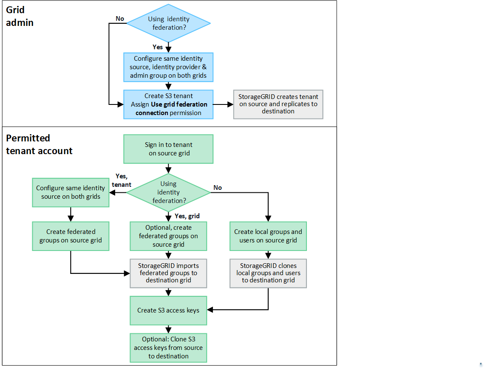

= Was ist ein Kontoklon?
:allow-uri-read: 
:icons: font
:imagesdir: ../media/

[role="lead"]
Beim Kontoklon handelt es sich um die automatische Replikation eines Mandantenkontos, von Mandantengruppen, Mandantenbenutzern und optional von S3-Zugriffsschlüsseln zwischen den StorageGRID Systemen in einemlink:grid-federation-overview.html["Netzverbundanschluss"] .

Kontoklon ist erforderlich fürlink:grid-federation-what-is-cross-grid-replication.html["Cross-Grid-Replikation"] .  Durch das Klonen von Kontoinformationen von einem Quell- StorageGRID -System auf ein Ziel StorageGRID System wird sichergestellt, dass Mandantenbenutzer und -gruppen auf die entsprechenden Buckets und Objekte in beiden Grids zugreifen können.

== Workflow zum Klonen von Konten

Das Workflow-Diagramm zeigt die Schritte, die Grid-Administratoren und zugelassene Mandanten ausführen, um einen Kontoklon einzurichten.  Diese Schritte werden ausgeführt, nachdemlink:grid-federation-create-connection.html["Grid-Föderation-Verbindung ist konfiguriert"] .

== Grid-Admin-Workflow

Die Schritte, die Grid-Administratoren durchführen, hängen davon ab, ob die StorageGRID -Systeme imlink:grid-federation-overview.html["Netzverbundanschluss"] Verwenden Sie Single Sign-On (SSO) oder Identitätsföderation.

=== [[account-clone-sso]]SSO für Kontoklon konfigurieren (optional)

Wenn eines der StorageGRID Systeme in der Grid-Föderationsverbindung SSO verwendet, müssen beide Grids SSO verwenden.  Vor dem Erstellen der Mandantenkonten für die Grid-Föderation müssen die Grid-Administratoren für die Quell- und Ziel-Grids des Mandanten diese Schritte ausführen.

.Schritte
. Konfigurieren Sie für beide Grids dieselbe Identitätsquelle. Sehen link:using-identity-federation.html["Verwenden der Identitätsföderation"] .
. Konfigurieren Sie für beide Grids denselben SSO-Identitätsanbieter (IdP). Sehen link:configuring-sso.html["Konfigurieren der einmaligen Anmeldung"] .
. link:managing-admin-groups.html["Erstellen Sie die gleiche Administratorgruppe"]auf beiden Grids durch Importieren derselben föderierten Gruppe.
+
Wenn Sie den Mandanten erstellen, wählen Sie diese Gruppe aus, um die anfängliche Root-Zugriffsberechtigung für die Quell- und Zielmandantenkonten zu erhalten.

+

NOTE: Wenn diese Administratorgruppe vor dem Erstellen des Mandanten nicht in beiden Rastern vorhanden ist, wird der Mandant nicht zum Ziel repliziert.

=== [[account-clone-identity-federation]]Konfigurieren Sie die Identitätsföderation auf Rasterebene für den Kontoklon (optional)

Wenn eines der StorageGRID -Systeme die Identitätsföderation ohne SSO verwendet, müssen beide Grids die Identitätsföderation verwenden.  Vor dem Erstellen der Mandantenkonten für die Grid-Föderation müssen die Grid-Administratoren für die Quell- und Ziel-Grids des Mandanten diese Schritte ausführen.

.Schritte
. Konfigurieren Sie für beide Grids dieselbe Identitätsquelle. Sehen link:using-identity-federation.html["Verwenden der Identitätsföderation"] .
. Optional: Wenn eine Verbundgruppe über die anfängliche Root-Zugriffsberechtigung für die Quell- und Zielmandantenkonten verfügt,link:managing-admin-groups.html["Erstellen Sie dieselbe Administratorgruppe"] auf beiden Grids durch Importieren derselben föderierten Gruppe.
+

NOTE: Wenn Sie einer föderierten Gruppe, die in beiden Grids nicht vorhanden ist, die Root-Zugriffsberechtigung zuweisen, wird der Mandant nicht in das Zielgrid repliziert.

. Wenn Sie nicht möchten, dass eine föderierte Gruppe anfänglich über die Root-Zugriffsberechtigung für beide Konten verfügt, geben Sie ein Kennwort für den lokalen Root-Benutzer an.

=== Erstellen Sie ein zulässiges S3-Mandantenkonto

Nach der optionalen Konfiguration von SSO oder Identitätsföderation führt ein Grid-Administrator diese Schritte aus, um zu bestimmen, welche Mandanten Bucket-Objekte auf andere StorageGRID Systeme replizieren können.

.Schritte
. Bestimmen Sie, welches Raster das Quellraster des Mandanten für Kontoklonvorgänge sein soll.
+
Das Raster, in dem der Mandant ursprünglich erstellt wurde, wird als _Quellraster_ des Mandanten bezeichnet.  Das Raster, in dem der Mandant repliziert wird, wird als _Zielraster_ des Mandanten bezeichnet.

. Erstellen Sie in diesem Raster ein neues S3-Mandantenkonto oder bearbeiten Sie ein vorhandenes Konto.
. Weisen Sie die Berechtigung *Grid-Föderationsverbindung verwenden* zu.
. Wenn das Mandantenkonto seine eigenen Verbundbenutzer verwalten soll, weisen Sie die Berechtigung *Eigene Identitätsquelle verwenden* zu.
+
Wenn diese Berechtigung zugewiesen ist, müssen sowohl die Quell- als auch die Zielmandantenkonten dieselbe Identitätsquelle konfigurieren, bevor Verbundgruppen erstellt werden.  Dem Quellmandanten hinzugefügte föderierte Gruppen können nicht auf den Zielmandanten geklont werden, es sei denn, beide Raster verwenden dieselbe Identitätsquelle.

. Wählen Sie eine bestimmte Grid-Föderation-Verbindung aus.
. Speichern Sie den neuen oder geänderten Mandanten.
+
Wenn ein neuer Mandant mit der Berechtigung *Grid-Föderationsverbindung verwenden* gespeichert wird, erstellt StorageGRID automatisch eine Replik dieses Mandanten auf dem anderen Grid, und zwar wie folgt:

+
** Beide Mandantenkonten haben dieselbe Konto-ID, denselben Namen, dasselbe Speicherkontingent und dieselben zugewiesenen Berechtigungen.
** Wenn Sie eine föderierte Gruppe ausgewählt haben, die über Root-Zugriffsberechtigungen für den Mandanten verfügt, wird diese Gruppe auf den Zielmandanten geklont.
** Wenn Sie einen lokalen Benutzer mit Root-Zugriffsberechtigung für den Mandanten ausgewählt haben, wird dieser Benutzer auf den Zielmandanten geklont.  Das Kennwort für diesen Benutzer wird jedoch nicht geklont.

Weitere Informationen finden Sie unter link:grid-federation-manage-tenants.html["Verwalten Sie zulässige Mandanten für die Grid-Föderation"] .

== Workflow für zulässige Mandantenkonten

Nachdem ein Mandant mit der Berechtigung *Grid-Föderationsverbindung verwenden* in das Ziel-Grid repliziert wurde, können berechtigte Mandantenkonten diese Schritte ausführen, um Mandantengruppen, Benutzer und S3-Zugriffsschlüssel zu klonen.

.Schritte
. Sign in beim Mandantenkonto im Quellraster des Mandanten an.
. Konfigurieren Sie, sofern zulässig, die Identifizierungsföderation sowohl für die Quell- als auch für die Zielmandantenkonten.
. Erstellen Sie Gruppen und Benutzer auf dem Quellmandanten.
+
Wenn auf dem Quellmandanten neue Gruppen oder Benutzer erstellt werden, klont StorageGRID diese automatisch auf den Zielmandanten, es erfolgt jedoch kein Klonen vom Ziel zurück zur Quelle.

. Erstellen Sie S3-Zugriffsschlüssel.
. Klonen Sie optional S3-Zugriffsschlüssel vom Quellmandanten auf den Zielmandanten.

Weitere Informationen zum Workflow für zulässige Mandantenkonten und zum Klonen von Gruppen, Benutzern und S3-Zugriffsschlüsseln finden Sie unterlink:../tenant/grid-federation-account-clone.html["Mandantengruppen und Benutzer klonen"] Undlink:../tenant/grid-federation-clone-keys-with-api.html["Klonen Sie S3-Zugriffsschlüssel mithilfe der API"] .
