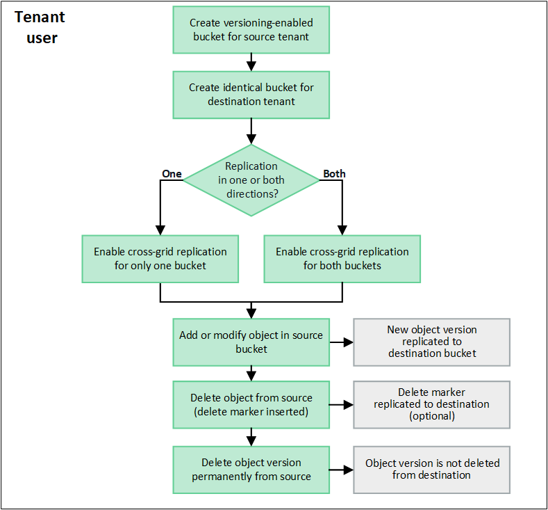

= Was ist Cross-Grid-Replikation?
:allow-uri-read: 
:icons: font
:imagesdir: ../media/

[role="lead"]
Cross-Grid-Replikation ist die automatische Replikation von Objekten zwischen ausgewählten S3-Buckets in zwei StorageGRID Systemen, die in einemlink:grid-federation-overview.html["Netzverbundanschluss"] . link:grid-federation-what-is-account-clone.html["Kontoklon"] ist für die Cross-Grid-Replikation erforderlich.

== Workflow für die Cross-Grid-Replikation

Das Workflow-Diagramm fasst die Schritte zum Konfigurieren der Cross-Grid-Replikation zwischen Buckets auf zwei Grids zusammen.

== Voraussetzungen für die Cross-Grid-Replikation

Wenn ein Mandantenkonto die Berechtigung *Grid-Föderationsverbindung verwenden* hat, um eine oder mehrerelink:grid-federation-overview.html["Grid-Föderation-Verbindungen"] , ein Mandantenbenutzer mit Root-Zugriffsberechtigung kann in den entsprechenden Mandantenkonten auf jedem Raster identische Buckets erstellen. Diese Eimer:

* Muss den gleichen Namen haben, kann aber unterschiedliche Regionen haben
* Die Versionsverwaltung muss aktiviert sein
* S3 Object Lock muss deaktiviert sein
* Muss leer sein

Nachdem beide Buckets erstellt wurden, kann die Cross-Grid-Replikation für einen oder beide Buckets konfiguriert werden.

.Mehr erfahren
link:../tenant/grid-federation-manage-cross-grid-replication.html["Verwalten der Cross-Grid-Replikation"]

== So funktioniert die Cross-Grid-Replikation

Die Cross-Grid-Replikation kann so konfiguriert werden, dass sie in eine oder in beide Richtungen erfolgt.

=== Replikation in eine Richtung

Wenn Sie die Cross-Grid-Replikation für einen Bucket nur auf einem Grid aktivieren, werden die diesem Bucket (dem Quell-Bucket) hinzugefügten Objekte in den entsprechenden Bucket auf dem anderen Grid (dem Ziel-Bucket) repliziert. Dem Ziel-Bucket hinzugefügte Objekte werden jedoch nicht zurück zur Quelle repliziert. In der Abbildung ist die Cross-Grid-Replikation aktiviert für `my-bucket` von Raster 1 zu Raster 2, aber in die andere Richtung ist es nicht aktiviert.

image::../media/grid-federation-cross-grid-replication-one-direction.png[Bild, das die Grid-Föderation-Verbindung in eine Richtung zeigt]

=== Replikation in beide Richtungen

Wenn Sie die Cross-Grid-Replikation für denselben Bucket auf beiden Grids aktivieren, werden zu einem Bucket hinzugefügte Objekte auf das andere Grid repliziert.  In der Abbildung ist die Cross-Grid-Replikation aktiviert für `my-bucket` in beide Richtungen.

image::../media/grid-federation-cross-grid-replication.png[Bild, das die Replikation in eine Richtung im Vergleich zur Replikation in beide Richtungen zeigt]

=== Was passiert, wenn Gegenstände verschluckt werden?

Wenn ein S3-Client ein Objekt zu einem Bucket hinzufügt, für den die Cross-Grid-Replikation aktiviert ist, geschieht Folgendes:

. StorageGRID repliziert das Objekt automatisch vom Quell-Bucket in den Ziel-Bucket.  Die für die Ausführung dieses Replikationsvorgangs im Hintergrund benötigte Zeit hängt von mehreren Faktoren ab, unter anderem von der Anzahl anderer ausstehender Replikationsvorgänge.
+
Der S3-Client kann den Replikationsstatus eines Objekts überprüfen, indem er eine GetObject- oder HeadObject-Anforderung ausgibt. Die Antwort enthält eine StorageGRID-spezifische `x-ntap-sg-cgr-replication-status` Antwortheader, der einen der folgenden Werte hat: Der S3-Client kann den Replikationsstatus eines Objekts überprüfen, indem er eine GetObject- oder HeadObject-Anforderung ausgibt.  Die Antwort enthält eine StorageGRID-spezifische `x-ntap-sg-cgr-replication-status` Antwortheader, der einen der folgenden Werte hat:

+
[cols="1a,2a"]
|===
| Netz | Replikationsstatus 

 a| 
Quelle
 a| 
** *ABGESCHLOSSEN*: Die Replikation war für alle Netzverbindungen erfolgreich.
** *AUSSTEHEND*: Das Objekt wurde nicht auf mindestens eine Grid-Verbindung repliziert.
** *FEHLER*: Für keine Netzverbindung steht eine Replikation aus und mindestens eine ist mit einem dauerhaften Fehler fehlgeschlagen. Der Fehler muss von einem Benutzer behoben werden.

 a| 
Ziel
 a| 
*REPLICA*: Das Objekt wurde aus dem Quellraster repliziert.

|===
+

NOTE: StorageGRID unterstützt nicht die `x-amz-replication-status` Kopfzeile.

. StorageGRID verwendet die aktiven ILM-Richtlinien jedes Grids, um die Objekte zu verwalten, genau wie jedes andere Objekt.  Beispielsweise könnte Objekt A auf Grid 1 als zwei replizierte Kopien gespeichert und für immer aufbewahrt werden, während die Kopie von Objekt A, die auf Grid 2 repliziert wurde, mit 2+1-Löschcodierung gespeichert und nach drei Jahren gelöscht werden könnte.

=== Was passiert, wenn Objekte gelöscht werden?

Wie beschrieben inlink:../primer/delete-data-flow.html["Datenfluss löschen"] , StorageGRID kann ein Objekt aus einem der folgenden Gründe löschen:

* Der S3-Client stellt eine Löschanforderung.
* Ein Tenant Manager-Benutzer wählt dielink:../tenant/deleting-s3-bucket-objects.html["Objekte im Bucket löschen"] Option zum Entfernen aller Objekte aus einem Bucket.
* Der Bucket verfügt über eine Lebenszykluskonfiguration, die abläuft.
* Der letzte Zeitraum in der ILM-Regel für das Objekt endet und es sind keine weiteren Platzierungen angegeben.

Wenn StorageGRID ein Objekt aufgrund eines Vorgangs zum Löschen von Objekten im Bucket, eines Ablaufs des Bucket-Lebenszyklus oder eines Ablaufs der ILM-Platzierung löscht, wird das replizierte Objekt in einer Grid-Föderationsverbindung nie aus dem anderen Grid gelöscht.  Allerdings können Löschmarkierungen, die durch S3-Client-Löschvorgänge zum Quell-Bucket hinzugefügt wurden, optional in den Ziel-Bucket repliziert werden.

Um zu verstehen, was passiert, wenn ein S3-Client Objekte aus einem Bucket löscht, für den die Cross-Grid-Replikation aktiviert ist, sehen Sie sich an, wie S3-Clients Objekte aus Buckets löschen, für die die Versionierung aktiviert ist:

* Wenn ein S3-Client eine Löschanforderung ausgibt, die eine Versions-ID enthält, wird diese Version des Objekts dauerhaft entfernt.  Dem Bucket wird keine Löschmarkierung hinzugefügt.
* Wenn ein S3-Client eine Löschanforderung ausgibt, die keine Versions-ID enthält, löscht StorageGRID keine Objektversionen. Stattdessen wird dem Bucket eine Löschmarkierung hinzugefügt. Die Löschmarkierung bewirkt, dass StorageGRID so reagiert, als ob das Objekt gelöscht worden wäre:
+
** Eine GetObject-Anforderung ohne Versions-ID schlägt fehl mit `404 No Object Found`
** Eine GetObject-Anforderung mit einer gültigen Versions-ID ist erfolgreich und gibt die angeforderte Objektversion zurück.

Wenn ein S3-Client ein Objekt aus einem Bucket löscht, für den die Cross-Grid-Replikation aktiviert ist, ermittelt StorageGRID wie folgt, ob die Löschanforderung an das Ziel repliziert werden soll:

* Wenn die Löschanforderung eine Versions-ID enthält, wird diese Objektversion dauerhaft aus dem Quellraster entfernt. StorageGRID repliziert jedoch keine Löschanforderungen, die eine Versions-ID enthalten, sodass dieselbe Objektversion nicht vom Ziel gelöscht wird.
* Wenn die Löschanforderung keine Versions-ID enthält, kann StorageGRID die Löschmarkierung optional replizieren, je nachdem, wie die Cross-Grid-Replikation für den Bucket konfiguriert ist:
+
** Wenn Sie Löschmarkierungen replizieren (Standard), wird dem Quell-Bucket eine Löschmarkierung hinzugefügt und in den Ziel-Bucket repliziert.  Tatsächlich scheint das Objekt auf beiden Rastern gelöscht zu sein.
** Wenn Sie sich gegen die Replikation von Löschmarkierungen entscheiden, wird dem Quell-Bucket eine Löschmarkierung hinzugefügt, diese wird jedoch nicht in den Ziel-Bucket repliziert. Tatsächlich werden Objekte, die im Quellraster gelöscht werden, nicht im Zielraster gelöscht.

In der Abbildung wurde *Löschmarkierungen replizieren* auf *Ja* gesetzt, alslink:../tenant/grid-federation-manage-cross-grid-replication.html["Cross-Grid-Replikation wurde aktiviert"] . Löschanforderungen für den Quell-Bucket, die eine Versions-ID enthalten, löschen keine Objekte aus dem Ziel-Bucket.  Löschanforderungen für den Quell-Bucket, die keine Versions-ID enthalten, führen scheinbar zum Löschen von Objekten im Ziel-Bucket.

image::../media/grid-federation-cross-grid-replication-delete.png[Bild, das das Löschen des replizierten Clients auf beiden Rastern zeigt]

NOTE: Wenn Sie die Objektlöschungen zwischen den Grids synchron halten möchten, erstellen Sie entsprechendelink:../s3/create-s3-lifecycle-configuration.html["S3-Lebenszykluskonfigurationen"] für die Eimer auf beiden Gittern.

=== So werden verschlüsselte Objekte repliziert

Wenn Sie die Cross-Grid-Replikation zum Replizieren von Objekten zwischen Grids verwenden, können Sie einzelne Objekte verschlüsseln, die Standard-Bucket-Verschlüsselung verwenden oder eine Grid-weite Verschlüsselung konfigurieren.  Sie können standardmäßige Bucket- oder Grid-weite Verschlüsselungseinstellungen hinzufügen, ändern oder entfernen, bevor oder nachdem Sie die Grid-übergreifende Replikation für einen Bucket aktivieren.

Um einzelne Objekte zu verschlüsseln, können Sie beim Hinzufügen der Objekte zum Quell-Bucket SSE (serverseitige Verschlüsselung mit von StorageGRID verwalteten Schlüsseln) verwenden.  Verwenden Sie die `x-amz-server-side-encryption` Anforderungsheader und geben Sie `AES256` . Sehen link:../s3/using-server-side-encryption.html["Verwenden Sie serverseitige Verschlüsselung"] .

NOTE: Die Verwendung von SSE-C (serverseitige Verschlüsselung mit vom Kunden bereitgestellten Schlüsseln) wird für die Cross-Grid-Replikation nicht unterstützt. Der Aufnahmevorgang schlägt fehl.

Um die Standardverschlüsselung für einen Bucket zu verwenden, verwenden Sie eine PutBucketEncryption-Anforderung und legen Sie die `SSEAlgorithm` Parameter auf `AES256` .  Die Verschlüsselung auf Bucket-Ebene gilt für alle Objekte, die ohne die `x-amz-server-side-encryption` Anforderungsheader. Sehen link:../s3/operations-on-buckets.html["Operationen an Buckets"] .

Um die Verschlüsselung auf Rasterebene zu verwenden, setzen Sie die Option *Gespeicherte Objektverschlüsselung* auf *AES-256*.  Die Verschlüsselung auf Grid-Ebene gilt für alle Objekte, die nicht auf Bucket-Ebene verschlüsselt sind oder die ohne die `x-amz-server-side-encryption` Anforderungsheader. Sehen link:../admin/changing-network-options-object-encryption.html["Konfigurieren von Netzwerk- und Objektoptionen"] .

NOTE: SSE unterstützt AES-128 nicht.  Wenn die Option *Gespeicherte Objektverschlüsselung* für das Quellraster mit der Option *AES-128* aktiviert ist, wird die Verwendung des AES-128-Algorithmus nicht auf das replizierte Objekt übertragen.  Stattdessen verwendet das replizierte Objekt die Standard-Bucket- oder Grid-Level-Verschlüsselungseinstellung des Ziels, sofern verfügbar.

Bei der Bestimmung, wie Quellobjekte verschlüsselt werden, wendet StorageGRID die folgenden Regeln an:

. Verwenden Sie die `x-amz-server-side-encryption` Ingest-Header, falls vorhanden.
. Wenn kein Ingest-Header vorhanden ist, verwenden Sie die Bucket-Standardverschlüsselungseinstellung, sofern konfiguriert.
. Wenn keine Bucket-Einstellung konfiguriert ist, verwenden Sie die Grid-weite Verschlüsselungseinstellung, sofern konfiguriert.
. Wenn keine rasterweite Einstellung vorhanden ist, verschlüsseln Sie das Quellobjekt nicht.

Bei der Bestimmung, wie replizierte Objekte verschlüsselt werden, wendet StorageGRID diese Regeln in dieser Reihenfolge an:

. Verwenden Sie dieselbe Verschlüsselung wie das Quellobjekt, es sei denn, dieses Objekt verwendet die AES-128-Verschlüsselung.
. Wenn das Quellobjekt nicht verschlüsselt ist oder AES-128 verwendet, verwenden Sie die Standardverschlüsselungseinstellung des Ziel-Buckets, sofern konfiguriert.
. Wenn der Ziel-Bucket keine Verschlüsselungseinstellung hat, verwenden Sie die gridweite Verschlüsselungseinstellung des Ziels, sofern konfiguriert.
. Wenn keine rasterweite Einstellung vorhanden ist, verschlüsseln Sie das Zielobjekt nicht.

=== PutObjectTagging und DeleteObjectTagging werden nicht unterstützt

PutObjectTagging- und DeleteObjectTagging-Anfragen werden für Objekte in Buckets, für die die Cross-Grid-Replikation aktiviert ist, nicht unterstützt.

Wenn ein S3-Client eine PutObjectTagging- oder DeleteObjectTagging-Anforderung ausgibt, `501 Not Implemented` wird zurückgegeben. Die Botschaft ist `Put(Delete) ObjectTagging is not available for buckets that have cross-grid replication configured` .

=== So werden segmentierte Objekte repliziert

Die maximale Segmentgröße des Quellrasters gilt für Objekte, die in das Zielraster repliziert werden. Wenn Objekte in ein anderes Raster repliziert werden, wird die Einstellung *Maximale Segmentgröße* (*KONFIGURATION* > *System* > *Speicheroptionen*) des Quellrasters auf beiden Rastern verwendet. Angenommen, die maximale Segmentgröße für das Quellraster beträgt 1 GB, während die maximale Segmentgröße des Zielrasters 50 MB beträgt. Wenn Sie ein 2-GB-Objekt in das Quellraster aufnehmen, wird dieses Objekt als zwei 1-GB-Segmente gespeichert.  Es wird auch als zwei 1-GB-Segmente in das Zielraster repliziert, obwohl die maximale Segmentgröße dieses Rasters 50 MB beträgt.
