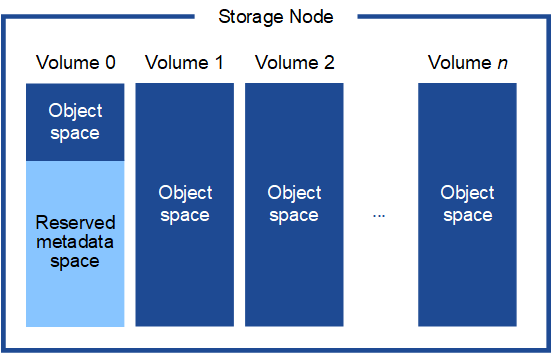

= Verwalten des Objektmetadatenspeichers
:allow-uri-read: 
:icons: font
:imagesdir: ../media/

[role="lead"]
Die Objektmetadatenkapazität eines StorageGRID -Systems steuert die maximale Anzahl von Objekten, die auf diesem System gespeichert werden können.  Um sicherzustellen, dass Ihr StorageGRID -System über ausreichend Speicherplatz zum Speichern neuer Objekte verfügt, müssen Sie wissen, wo und wie StorageGRID Objektmetadaten speichert.

== Was sind Objektmetadaten?

Objektmetadaten sind alle Informationen, die ein Objekt beschreiben.  StorageGRID verwendet Objektmetadaten, um die Standorte aller Objekte im gesamten Grid zu verfolgen und den Lebenszyklus jedes Objekts im Laufe der Zeit zu verwalten.

Für ein Objekt in StorageGRID umfassen die Objektmetadaten die folgenden Arten von Informationen:

* Systemmetadaten, einschließlich einer eindeutigen ID für jedes Objekt (UUID), des Objektnamens, des Namens des S3-Buckets, des Mandantenkontonamens oder der ID, der logischen Größe des Objekts, des Datums und der Uhrzeit der ersten Objekterstellung sowie des Datums und der Uhrzeit der letzten Objektänderung.
* Alle benutzerdefinierten Schlüssel-Wert-Paare der Benutzermetadaten, die mit dem Objekt verknüpft sind.
* Bei S3-Objekten alle mit dem Objekt verknüpften Schlüssel-Wert-Paare des Objekt-Tags.
* Bei replizierten Objektkopien der aktuelle Speicherort jeder Kopie.
* Bei Erasure-Coded-Objektkopien der aktuelle Speicherort jedes Fragments.
* Bei Objektkopien in einem Cloud Storage Pool der Speicherort des Objekts, einschließlich des Namens des externen Buckets und der eindeutigen Kennung des Objekts.
* Für segmentierte Objekte und mehrteilige Objekte: Segmentkennungen und Datengrößen.

== Wie werden Objektmetadaten gespeichert?

StorageGRID verwaltet Objektmetadaten in einer Cassandra-Datenbank, die unabhängig von Objektdaten gespeichert wird.  Um Redundanz zu gewährleisten und Objektmetadaten vor Verlust zu schützen, speichert StorageGRID an jedem Standort drei Kopien der Metadaten für alle Objekte im System.

Diese Abbildung stellt die Speicherknoten an zwei Standorten dar.  Jeder Standort verfügt über die gleiche Menge an Objektmetadaten und die Metadaten jedes Standorts werden auf alle Speicherknoten an diesem Standort aufgeteilt.

image::../media/metadata_space_across_sites.png[Metadatenbereich über mehrere Sites hinweg]

== Wo werden Objektmetadaten gespeichert?

Diese Abbildung stellt die Speichervolumina für einen einzelnen Speicherknoten dar.

Wie in der Abbildung gezeigt, reserviert StorageGRID Speicherplatz für Objektmetadaten auf Speichervolume 0 jedes Speicherknotens.  Es verwendet den reservierten Speicherplatz zum Speichern von Objektmetadaten und zum Ausführen wichtiger Datenbankvorgänge.  Der verbleibende Speicherplatz auf Speichervolume 0 und allen anderen Speichervolumes im Speicherknoten wird ausschließlich für Objektdaten (replizierte Kopien und Erasure-Coded-Fragmente) verwendet.

Die Menge an Speicherplatz, die für Objektmetadaten auf einem bestimmten Speicherknoten reserviert ist, hängt von mehreren Faktoren ab, die im Folgenden beschrieben werden.

== Einstellung für reservierten Speicherplatz für Metadaten

Der _Reservierte Speicherplatz für Metadaten_ ist eine systemweite Einstellung, die die Speicherplatzmenge darstellt, die auf Volume 0 jedes Speicherknotens für Metadaten reserviert wird.  Wie in der Tabelle gezeigt, basiert der Standardwert dieser Einstellung auf:

* Die Softwareversion, die Sie bei der Erstinstallation von StorageGRID verwendet haben.
* Die RAM-Menge auf jedem Speicherknoten.

[cols="1a,1a,1a"]
|===
| Für die Erstinstallation von StorageGRID verwendete Version | RAM-Menge auf Speicherknoten | Standardeinstellung für reservierten Speicherplatz für Metadaten 

 a| 
11,5 bis 11,9
 a| 
128 GB oder mehr auf jedem Speicherknoten im Grid
 a| 
8 TB (8.000 GB)

 a| 
 a| 
Weniger als 128 GB auf einem beliebigen Speicherknoten im Grid
 a| 
3 TB (3.000 GB)

 a| 
11,1 bis 11,4
 a| 
128 GB oder mehr auf jedem Speicherknoten an einem beliebigen Standort
 a| 
4 TB (4.000 GB)

 a| 
 a| 
Weniger als 128 GB auf jedem Speicherknoten an jedem Standort
 a| 
3 TB (3.000 GB)

 a| 
11.0 oder früher
 a| 
Beliebiger Betrag
 a| 
2 TB (2.000 GB)

|===

=== Einstellung für reservierten Speicherplatz für Metadaten anzeigen

Befolgen Sie diese Schritte, um die Einstellung für reservierten Speicherplatz für Metadaten für Ihr StorageGRID System anzuzeigen.

.Schritte
. Wählen Sie *KONFIGURATION* > *System* > *Speichereinstellungen*.
. Erweitern Sie auf der Seite „Speichereinstellungen“ den Abschnitt „Reservierter Speicherplatz für Metadaten“.

Für StorageGRID 11.8 oder höher muss der Wert für den reservierten Speicherplatz für Metadaten mindestens 100 GB und höchstens 1 PB betragen.

Die Standardeinstellung für eine neue Installation von StorageGRID 11.6 oder höher, bei der jeder Speicherknoten über 128 GB oder mehr RAM verfügt, beträgt 8.000 GB (8 TB).

== Tatsächlich reservierter Speicherplatz für Metadaten

Im Gegensatz zur systemweiten Einstellung für reservierten Speicherplatz für Metadaten wird der _tatsächlich reservierte Speicherplatz_ für Objektmetadaten für jeden Speicherknoten bestimmt.  Für jeden Speicherknoten hängt der tatsächlich reservierte Speicherplatz für Metadaten von der Größe des Volumes 0 für den Knoten und der systemweiten Einstellung für den reservierten Speicherplatz für Metadaten ab.

[cols="1a,1a"]
|===
| Größe des Datenträgers 0 für den Knoten | Tatsächlich reservierter Speicherplatz für Metadaten 

 a| 
Weniger als 500 GB (nicht produktive Nutzung)
 a| 
10% des Volumens 0

 a| 
500 GB oder mehr + oder + Nur-Metadaten-Speicherknoten
 a| 
Der kleinere dieser Werte:

* Band 0
* Einstellung für reservierten Speicherplatz für Metadaten

*Hinweis*: Für reine Metadaten-Speicherknoten ist nur eine Rangedb erforderlich.

|===

=== Tatsächlich reservierten Speicherplatz für Metadaten anzeigen

Befolgen Sie diese Schritte, um den tatsächlich reservierten Speicherplatz für Metadaten auf einem bestimmten Speicherknoten anzuzeigen.

.Schritte
. Wählen Sie im Grid Manager *NODES* > *_Storage Node_*.
. Wählen Sie die Registerkarte *Speicher*.
. Positionieren Sie den Cursor über dem Diagramm „Benutzter Speicher – Objektmetadaten“ und suchen Sie den Wert *Tatsächlich reserviert*.
+
image::../media/storage_used_object_metadata_actual_reserved.png[Verwendeter Speicher – Objektmetadaten – Tatsächlich reserviert]

Im Screenshot beträgt der *tatsächlich reservierte* Wert 8 TB.  Dieser Screenshot zeigt einen großen Speicherknoten in einer neuen StorageGRID 11.6-Installation.  Da die systemweite Einstellung für den reservierten Speicherplatz für Metadaten kleiner ist als Volume 0 für diesen Speicherknoten, entspricht der tatsächlich reservierte Speicherplatz für diesen Knoten der Einstellung für den reservierten Speicherplatz für Metadaten.

== Beispiel für tatsächlich reservierten Metadatenspeicherplatz

Angenommen, Sie installieren ein neues StorageGRID System mit Version 11.7 oder höher.  Gehen Sie für dieses Beispiel davon aus, dass jeder Speicherknoten über mehr als 128 GB RAM verfügt und dass Volume 0 von Speicherknoten 1 (SN1) 6 TB groß ist.  Basierend auf diesen Werten:

* Der systemweite *Reservierte Speicherplatz für Metadaten* ist auf 8 TB festgelegt.  (Dies ist der Standardwert für eine neue Installation von StorageGRID 11.6 oder höher, wenn jeder Speicherknoten über mehr als 128 GB RAM verfügt.)
* Der tatsächlich reservierte Speicherplatz für Metadaten für SN1 beträgt 6 TB.  (Das gesamte Volume ist reserviert, da Volume 0 kleiner ist als die Einstellung *Reservierter Speicherplatz für Metadaten*.)

== Zulässiger Metadatenspeicherplatz

Der tatsächlich für Metadaten reservierte Speicherplatz jedes Speicherknotens ist unterteilt in den für Objektmetadaten verfügbaren Speicherplatz (den _zulässigen Metadatenspeicherplatz_) und den für wichtige Datenbankvorgänge (wie Komprimierung und Reparatur) sowie zukünftige Hardware- und Software-Upgrades erforderlichen Speicherplatz.  Der zulässige Metadatenspeicherplatz bestimmt die Gesamtobjektkapazität.

image::../media/metadata_allowed_space_volume_0.png[Für Metadaten zulässiger Speicherplatz, Datenträger 0]

Die folgende Tabelle zeigt, wie StorageGRID den *zulässigen Metadatenspeicherplatz* für verschiedene Speicherknoten berechnet, basierend auf der Speichermenge für den Knoten und dem tatsächlich reservierten Speicherplatz für Metadaten.

[cols="1a,1a,2a,2a"]
|===

 a| 
 a| 
 a| 
*Speichermenge auf dem Speicherknoten*

 a| 
 a| 
 a| 
< 128 GB
 a| 
>= 128 GB

 a| 
*Tatsächlich reservierter Speicherplatz für Metadaten*
 a| 
<= 4 TB
 a| 
60 % des tatsächlich reservierten Speicherplatzes für Metadaten, bis zu einem Maximum von 1,32 TB
 a| 
60 % des tatsächlich reservierten Speicherplatzes für Metadaten, bis zu einem Maximum von 1,98 TB

 a| 
> 4 TB
 a| 
(Tatsächlich reservierter Speicherplatz für Metadaten − 1 TB) × 60 %, bis zu einem Maximum von 1,32 TB
 a| 
(Tatsächlich reservierter Speicherplatz für Metadaten − 1 TB) × 60 %, bis zu einem Maximum von 3,96 TB

|===

=== Zugelassenen Metadatenspeicherplatz anzeigen

Befolgen Sie diese Schritte, um den zulässigen Metadatenspeicherplatz für einen Speicherknoten anzuzeigen.

.Schritte
. Wählen Sie im Grid Manager *NODES* aus.
. Wählen Sie den Speicherknoten aus.
. Wählen Sie die Registerkarte *Speicher*.
. Positionieren Sie den Cursor über dem Diagramm „Verwendeter Speicher – Objektmetadaten“ und suchen Sie den Wert *Zulässig*.
+
image::../media/storage_used_object_metadata_allowed.png[Verwendeter Speicher – Objektmetadaten – Zulässig]

Im Screenshot beträgt der *zulässige* Wert 3,96 TB. Dies ist der Maximalwert für einen Speicherknoten, dessen tatsächlich reservierter Speicherplatz für Metadaten mehr als 4 TB beträgt.

Der *Zulässige* Wert entspricht dieser Prometheus-Metrik:

`storagegrid_storage_utilization_metadata_allowed_bytes`

== Beispiel für zulässigen Metadatenspeicherplatz

Angenommen, Sie installieren ein StorageGRID -System mit Version 11.6.  Gehen Sie für dieses Beispiel davon aus, dass jeder Speicherknoten über mehr als 128 GB RAM verfügt und dass Volume 0 von Speicherknoten 1 (SN1) 6 TB groß ist.  Basierend auf diesen Werten:

* Der systemweite *Reservierte Speicherplatz für Metadaten* ist auf 8 TB festgelegt.  (Dies ist der Standardwert für StorageGRID 11.6 oder höher, wenn jeder Speicherknoten über mehr als 128 GB RAM verfügt.)
* Der tatsächlich reservierte Speicherplatz für Metadaten für SN1 beträgt 6 TB.  (Das gesamte Volume ist reserviert, da Volume 0 kleiner ist als die Einstellung *Reservierter Speicherplatz für Metadaten*.)
* Der zulässige Speicherplatz für Metadaten auf SN1 beträgt 3 TB, basierend auf der Berechnung im<<table-allowed-space-for-metadata,Tabelle für zulässigen Speicherplatz für Metadaten>> : (Tatsächlich reservierter Speicherplatz für Metadaten − 1 TB) × 60 %, bis zu einem Maximum von 3,96 TB.

== Wie sich Speicherknoten unterschiedlicher Größe auf die Objektkapazität auswirken

Wie oben beschrieben, verteilt StorageGRID die Objektmetadaten gleichmäßig auf die Speicherknoten an jedem Standort.  Wenn eine Site Speicherknoten unterschiedlicher Größe enthält, bestimmt daher der kleinste Knoten an der Site die Metadatenkapazität der Site.

Betrachten Sie das folgende Beispiel:

* Sie verfügen über ein Single-Site-Raster mit drei Speicherknoten unterschiedlicher Größe.
* Die Einstellung für *Reservierter Speicherplatz für Metadaten* beträgt 4 TB.
* Die Speicherknoten haben die folgenden Werte für den tatsächlich reservierten Metadatenspeicherplatz und den zulässigen Metadatenspeicherplatz.
+
[cols="1a,1a,1a,1a"]
|===
| Speicherknoten | Größe des Datenträgers 0 | Tatsächlich reservierter Metadatenspeicherplatz | Zulässiger Metadatenspeicherplatz 

 a| 
SN1
 a| 
2,2 TB
 a| 
2,2 TB
 a| 
1,32 TB

 a| 
SN2
 a| 
5 TB
 a| 
4 TB
 a| 
1,98 TB

 a| 
SN3
 a| 
6 TB
 a| 
4 TB
 a| 
1,98 TB

|===

Da die Objektmetadaten gleichmäßig auf die Speicherknoten an einem Standort verteilt sind, kann jeder Knoten in diesem Beispiel nur 1,32 TB Metadaten speichern.  Die zusätzlichen 0,66 TB zulässiger Metadatenspeicherplatz für SN2 und SN3 können nicht verwendet werden.

image::../media/metadata_space_three_storage_nodes.png[Metadatenbereich Drei Speicherknoten]

Da StorageGRID alle Objektmetadaten für ein StorageGRID -System an jedem Standort verwaltet, wird die Gesamtmetadatenkapazität eines StorageGRID -Systems durch die Objektmetadatenkapazität des kleinsten Standorts bestimmt.

Und da die Kapazität der Objektmetadaten die maximale Objektanzahl steuert, ist das Grid effektiv voll, wenn einem Knoten die Metadatenkapazität ausgeht.

.Ähnliche Informationen
* Informationen zum Überwachen der Objektmetadatenkapazität für jeden Speicherknoten finden Sie in den Anweisungen fürlink:../monitor/index.html["Überwachung von StorageGRID"] .
* Um die Objektmetadatenkapazität für Ihr System zu erhöhen,link:../expand/index.html["ein Raster erweitern"] durch Hinzufügen neuer Speicherknoten.

