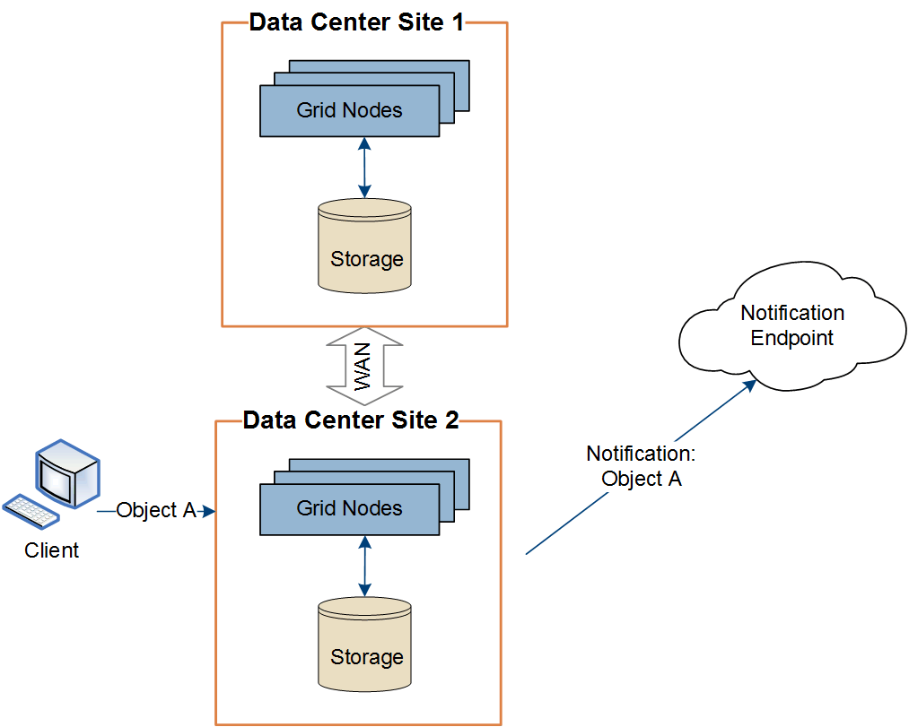

= Pro Site-Zustellung von Plattformdienstnachrichten
:allow-uri-read: 
:icons: font
:imagesdir: ../media/

[role="lead"]
Alle Vorgänge der Plattformdienste werden pro Site durchgeführt.

Das heißt, wenn ein Mandant einen Client verwendet, um einen S3-API-Erstellungsvorgang für ein Objekt auszuführen, indem er eine Verbindung zu einem Gateway-Knoten am Rechenzentrumsstandort 1 herstellt, wird die Benachrichtigung über diese Aktion ausgelöst und vom Rechenzentrumsstandort 1 gesendet.

image::../media/notification_multiple_sites.gif[Das Diagramm zeigt, dass eine Aktion an einem Objekt an Standort 1 eine Benachrichtigung von Standort 1 auslöst.]

Wenn der Client anschließend einen S3-API-Löschvorgang für dasselbe Objekt vom Rechenzentrumsstandort 2 aus durchführt, wird die Benachrichtigung über die Löschaktion ausgelöst und vom Rechenzentrumsstandort 2 gesendet.

Stellen Sie sicher, dass das Netzwerk an jedem Standort so konfiguriert ist, dass Nachrichten der Plattformdienste an ihre Ziele übermittelt werden können.
