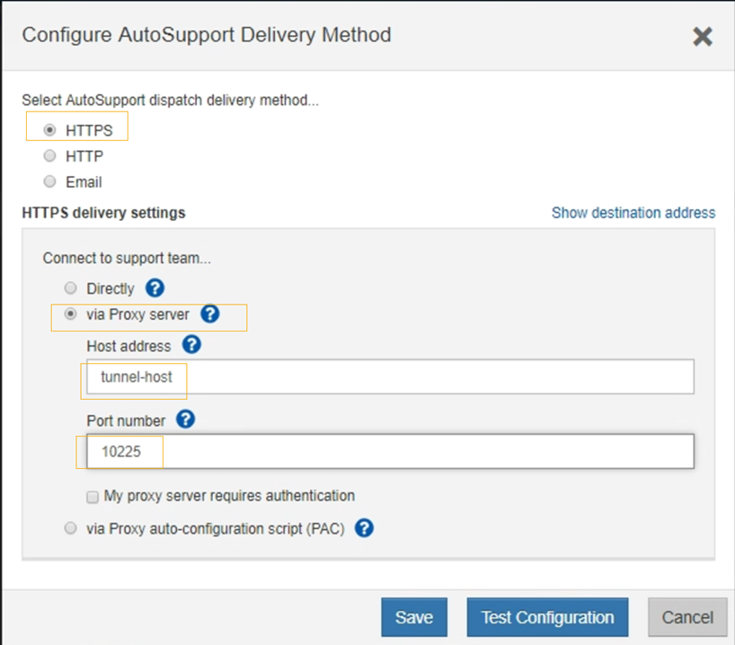

= Senden Sie E-Series AutoSupport -Pakete über StorageGRID
:allow-uri-read: 
:icons: font
:imagesdir: ../media/

[role="lead"]
Sie können E-Series SANtricity System Manager AutoSupport -Pakete über einen StorageGRID -Admin-Knoten statt über den Verwaltungsport des Speichergeräts an den technischen Support senden.

Sehen https://docs.netapp.com/us-en/e-series-santricity/sm-support/autosupport-feature-overview.html["E-Serie Hardware AutoSupport"^] Weitere Informationen zur Verwendung von AutoSupport mit Geräten der E-Serie.

.Bevor Sie beginnen
* Sie sind beim Grid Manager angemeldet mit einemlink:../admin/web-browser-requirements.html["unterstützter Webbrowser"] .
* Sie haben dielink:admin-group-permissions.html["Speichergeräteadministrator oder Root-Zugriffsberechtigung"] .
* Sie haben SANtricity AutoSupport konfiguriert:
+
** Für SG6000- und SG5700-Geräte, https://docs.netapp.com/us-en/storagegrid-appliances/installconfig/accessing-and-configuring-santricity-system-manager.html["AutoSupport im SANtricity System Manager konfigurieren"^]

NOTE: Sie müssen über die SANtricity -Firmware 8.70 oder höher verfügen, um über den Grid Manager auf den SANtricity System Manager zugreifen zu können.

.Informationen zu diesem Vorgang
E-Series AutoSupport -Pakete enthalten Details zur Speicherhardware und sind spezifischer als andere AutoSupport Pakete, die vom StorageGRID -System gesendet werden.

Sie können im SANtricity System Manager eine spezielle Proxyserveradresse konfigurieren, um AutoSupport Pakete über einen StorageGRID Admin-Knoten zu übertragen, ohne den Verwaltungsport des Geräts zu verwenden.  Die so übermittelten AutoSupport -Pakete werden von derlink:../primer/what-admin-node-is.html["bevorzugter Absender-Admin-Knoten"] und sie verwenden jedelink:../admin/configuring-admin-proxy-settings.html["Admin-Proxy-Einstellungen"] die im Grid Manager konfiguriert wurden.

NOTE: Dieses Verfahren dient nur zum Konfigurieren eines StorageGRID -Proxyservers für E-Series AutoSupport Pakete.  Weitere Informationen zur E-Series AutoSupport Konfiguration finden Sie im https://docs.netapp.com/us-en/e-series-family/index.html["Dokumentation zu NetApp E-Series und SANtricity"^] .

.Schritte
. Wählen Sie im Grid Manager *NODES* aus.
. Wählen Sie aus der Knotenliste auf der linken Seite den Speichergeräteknoten aus, den Sie konfigurieren möchten.
. Wählen Sie * SANtricity System Manager*.
+
Die Homepage des SANtricity System Managers wird angezeigt.

+
image::../media/autosupport_santricity_home_page.png[AutoSupport SANtricity -Homepage]

. Wählen Sie *SUPPORT* > *Supportcenter* > * AutoSupport*.
+
Die AutoSupport -Betriebsseite wird angezeigt.

+
image::../media/autosupport_santricity_operations.png[AutoSupport SANtricity AutoSupport -Operationen]

. Wählen Sie * AutoSupport Liefermethode konfigurieren*.
+
Die Seite „AutoSupport -Übermittlungsmethode konfigurieren“ wird angezeigt.

+

. Wählen Sie *HTTPS* als Übermittlungsmethode.
+

NOTE: Das Zertifikat, das HTTPS ermöglicht, ist vorinstalliert.

. Wählen Sie *über Proxyserver*.
. Eingeben `tunnel-host` für die *Hostadresse*.
+
`tunnel-host`ist die spezielle Adresse zum Verwenden eines Admin-Knotens zum Senden von E-Series AutoSupport Paketen.

. Eingeben `10225` für die *Portnummer*.
+
`10225`ist die Portnummer auf dem StorageGRID -Proxyserver, der AutoSupport Pakete vom E-Series-Controller im Gerät empfängt.

. Wählen Sie *Testkonfiguration*, um das Routing und die Konfiguration Ihres AutoSupport Proxyservers zu testen.
+
Wenn alles korrekt ist, wird in einem grünen Banner die Meldung „Ihre AutoSupport Konfiguration wurde überprüft“ angezeigt.

+
Wenn der Test fehlschlägt, wird eine Fehlermeldung in einem roten Banner angezeigt.  Überprüfen Sie Ihre StorageGRID -DNS-Einstellungen und das Netzwerk, stellen Sie sicher,link:../primer/what-admin-node-is.html["bevorzugter Absender-Admin-Knoten"] Sie können eine Verbindung zur NetApp Support-Site herstellen und den Test erneut versuchen.

. Wählen Sie *Speichern*.
+
Die Konfiguration wird gespeichert und eine Bestätigungsmeldung wird angezeigt: „Die AutoSupport Übermittlungsmethode wurde konfiguriert.“

