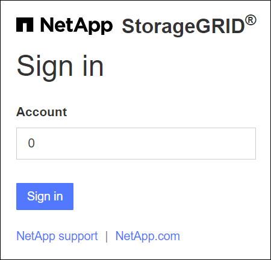

= Sign in
:allow-uri-read: 
:icons: font
:imagesdir: ../media/

[role="lead"]
Sie greifen auf die Anmeldeseite des Grid Managers zu, indem Sie den vollqualifizierten Domänennamen (FQDN) oder die IP-Adresse eines Admin-Knotens in die Adressleiste eines unterstützten Webbrowsers eingeben.

Jedes StorageGRID -System umfasst einen primären Admin-Knoten und eine beliebige Anzahl nicht-primärer Admin-Knoten.  Sie können sich auf jedem Admin-Knoten beim Grid Manager anmelden, um das StorageGRID -System zu verwalten.  Einige Wartungsvorgänge können jedoch nur vom primären Admin-Knoten aus durchgeführt werden.

=== Mit HA-Gruppe verbinden

Wenn Admin-Knoten in einer Hochverfügbarkeitsgruppe (HA) enthalten sind, stellen Sie die Verbindung über die virtuelle IP-Adresse der HA-Gruppe oder einen vollqualifizierten Domänennamen her, der der virtuellen IP-Adresse zugeordnet ist.  Der primäre Admin-Knoten sollte als primäre Schnittstelle der Gruppe ausgewählt werden, sodass Sie beim Zugriff auf den Grid Manager über den primären Admin-Knoten darauf zugreifen, es sei denn, der primäre Admin-Knoten ist nicht verfügbar. Sehen link:managing-high-availability-groups.html["Verwalten von Hochverfügbarkeitsgruppen"] .

=== Verwenden von SSO

Die Anmeldeschritte sind etwas anders, wennlink:configuring-sso.html["Single Sign-On (SSO) wurde konfiguriert"] .

== Sign in

.Bevor Sie beginnen
* Sie haben Ihre Anmeldedaten.
* Sie verwenden einelink:../admin/web-browser-requirements.html["unterstützter Webbrowser"] .
* Cookies sind in Ihrem Webbrowser aktiviert.
* Sie gehören einer Benutzergruppe an, die über mindestens eine Berechtigung verfügt.
* Sie haben die URL für den Grid Manager:
+
`https://_FQDN_or_Admin_Node_IP_/`

+
Sie können den vollqualifizierten Domänennamen, die IP-Adresse eines Admin-Knotens oder die virtuelle IP-Adresse einer HA-Gruppe von Admin-Knoten verwenden.

+
Um auf den Grid Manager über einen anderen Port als den Standardport für HTTPS (443) zuzugreifen, fügen Sie die Portnummer in die URL ein:

+
`https://_FQDN_or_Admin_Node_IP:port_/`

+

NOTE: SSO ist auf dem eingeschränkten Grid Manager-Port nicht verfügbar.  Sie müssen Port 443 verwenden.

.Schritte
. Starten Sie einen unterstützten Webbrowser.
. Geben Sie in der Adressleiste des Browsers die URL für den Grid Manager ein.
. Wenn eine Sicherheitswarnung angezeigt wird, installieren Sie das Zertifikat mithilfe des Installationsassistenten des Browsers. Sehen link:using-storagegrid-security-certificates.html["Sicherheitszertifikate verwalten"] .
. Sign in .
+
Der angezeigte Anmeldebildschirm hängt davon ab, ob Single Sign-On (SSO) für StorageGRID konfiguriert wurde.

+
[role="tabbed-block"]
====
.Kein SSO verwenden
--
.. Geben Sie Ihren Benutzernamen und Ihr Passwort für den Grid Manager ein.
.. Wählen Sie *Anmelden*.
+
image::../media/sign_in_grid_manager_no_sso.png[Sign in]

--
.Verwenden von SSO
--
** Wenn StorageGRID SSO verwendet und Sie die URL zum ersten Mal in diesem Browser aufrufen:
+
... Wählen Sie * Sign in*.  Die 0 können Sie im Feld Konto stehen lassen.
+

... Geben Sie Ihre Standard-SSO-Anmeldeinformationen auf der SSO-Anmeldeseite Ihrer Organisation ein. Beispiel:
+
image::../media/sso_organization_page.gif[Beispiel einer Anmeldeseite einer Organisation für SSO]

** Wenn StorageGRID SSO verwendet und Sie zuvor auf den Grid Manager oder ein Mandantenkonto zugegriffen haben:
+
... Geben Sie *0* ein (die Konto-ID für den Grid Manager) oder wählen Sie *Grid Manager* aus, wenn dieser in der Liste der letzten Konten angezeigt wird.
+
image::../media/sign_in_grid_manager_sso.png[Wählen Sie Grid Manager aus der Liste der letzten Konten aus, wenn SSO aktiviert ist.]

... Wählen Sie * Sign in*.
... Sign in mit Ihren Standard-SSO-Anmeldeinformationen auf der SSO-Anmeldeseite Ihrer Organisation an.

--
====

Wenn Sie angemeldet sind, wird die Startseite des Grid Managers angezeigt, die das Dashboard enthält.  Um zu erfahren, welche Informationen bereitgestellt werden, siehelink:../monitor/viewing-dashboard.html["Anzeigen und Verwalten des Dashboards"] .

image::../media/grid_manager_dashboard.png[Armaturenbrett]

== Melden Sie sich bei einem anderen Admin-Knoten an

Befolgen Sie diese Schritte, um sich bei einem anderen Admin-Knoten anzumelden.

[role="tabbed-block"]
====
.Kein SSO verwenden
--
.Schritte
. Geben Sie in der Adressleiste des Browsers den vollqualifizierten Domänennamen oder die IP-Adresse des anderen Admin-Knotens ein.  Geben Sie bei Bedarf die Portnummer an.
. Geben Sie Ihren Benutzernamen und Ihr Passwort für den Grid Manager ein.
. Wählen Sie *Anmelden*.

--
.Verwenden von SSO
--
Wenn StorageGRID SSO verwendet und Sie sich bei einem Admin-Knoten angemeldet haben, können Sie auf andere Admin-Knoten zugreifen, ohne sich erneut anmelden zu müssen.

.Schritte
. Geben Sie den vollqualifizierten Domänennamen oder die IP-Adresse des anderen Admin-Knotens in die Adressleiste des Browsers ein.
. Wenn Ihre SSO-Sitzung abgelaufen ist, geben Sie Ihre Anmeldeinformationen erneut ein.

--
====