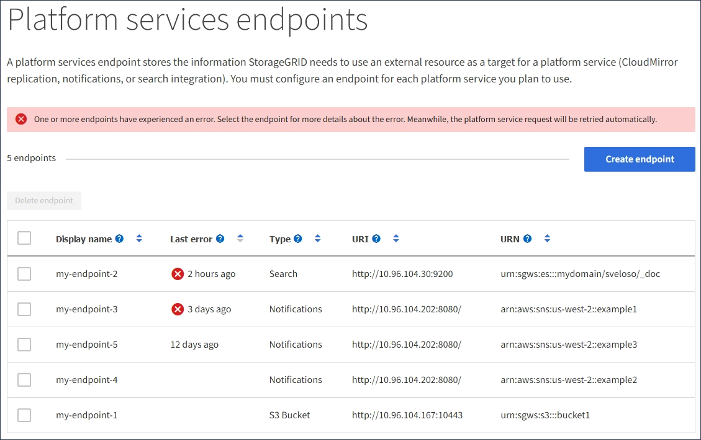

= Fehlerbehebung bei Plattformdiensten
:allow-uri-read: 
:icons: font
:imagesdir: ../media/

[role="lead"]
Die in Plattformdiensten verwendeten Endpunkte werden von Mandantenbenutzern im Mandanten-Manager erstellt und verwaltet. Wenn ein Mandant jedoch Probleme bei der Konfiguration oder Verwendung von Plattformdiensten hat, können Sie möglicherweise den Grid-Manager zur Lösung des Problems verwenden.

== Probleme mit neuen Endpunkten

Bevor ein Mandant Plattformdienste nutzen kann, muss er mithilfe des Mandanten-Managers einen oder mehrere Endpunkte erstellen.  Jeder Endpunkt stellt ein externes Ziel für einen Plattformdienst dar, beispielsweise einen StorageGRID S3-Bucket, einen Amazon Web Services-Bucket, ein Amazon Simple Notification Service-Thema, ein Kafka-Thema oder einen lokal oder auf AWS gehosteten Elasticsearch-Cluster.  Jeder Endpunkt enthält sowohl den Standort der externen Ressource als auch die für den Zugriff auf diese Ressource erforderlichen Anmeldeinformationen.

Wenn ein Mandant einen Endpunkt erstellt, überprüft das StorageGRID -System, ob der Endpunkt vorhanden ist und mit den angegebenen Anmeldeinformationen erreicht werden kann.  Die Verbindung zum Endpunkt wird von einem Knoten an jedem Standort validiert.

Wenn die Endpunktvalidierung fehlschlägt, wird in einer Fehlermeldung der Grund für das Fehlschlagen der Endpunktvalidierung erläutert.  Der Mandantenbenutzer sollte das Problem beheben und dann erneut versuchen, den Endpunkt zu erstellen.

NOTE: Die Endpunkterstellung schlägt fehl, wenn die Plattformdienste für das Mandantenkonto nicht aktiviert sind.

== Probleme mit vorhandenen Endpunkten

Wenn beim Versuch von StorageGRID , einen vorhandenen Endpunkt zu erreichen, ein Fehler auftritt, wird auf dem Dashboard im Tenant Manager eine Meldung angezeigt.

image::../media/tenant_dashboard_endpoint_error.png[Endpunkt-Fehlermeldung auf dem Dashboard]

Mandantenbenutzer können auf der Seite „Endpunkte“ die neueste Fehlermeldung für jeden Endpunkt überprüfen und feststellen, wie lange der Fehler her ist.  In der Spalte *Letzter Fehler* wird für jeden Endpunkt die aktuellste Fehlermeldung angezeigt und angegeben, wie lange der Fehler her ist.  Fehler, die Folgendes beinhalten:image:../media/icon_alert_red_critical.png["Rotes X-Symbol"] Symbol ist innerhalb der letzten 7 Tage aufgetreten.

NOTE: Einige Fehlermeldungen in der Spalte *Letzter Fehler* enthalten möglicherweise eine Protokoll-ID in Klammern.  Ein Grid-Administrator oder der technische Support kann anhand dieser ID detailliertere Informationen zum Fehler im bycast.log finden.

== Probleme im Zusammenhang mit Proxyservern

Wenn Sie einelink:configuring-storage-proxy-settings.html["Speicherproxy"] zwischen Speicherknoten und Plattformdienst-Endpunkten können Fehler auftreten, wenn Ihr Proxydienst keine Nachrichten von StorageGRID zulässt. Um diese Probleme zu beheben, überprüfen Sie die Einstellungen Ihres Proxyservers, um sicherzustellen, dass plattformdienstbezogene Nachrichten nicht blockiert werden.

== Feststellen, ob ein Fehler aufgetreten ist

Wenn innerhalb der letzten 7 Tage Endpunktfehler aufgetreten sind, wird im Dashboard im Tenant Manager eine Warnmeldung angezeigt.  Weitere Einzelheiten zum Fehler finden Sie auf der Seite „Endpunkte“.

== Clientvorgänge schlagen fehl

Einige Probleme mit Plattformdiensten können dazu führen, dass Clientvorgänge im S3-Bucket fehlschlagen.  Beispielsweise schlagen S3-Clientvorgänge fehl, wenn der interne Dienst „Replicated State Machine“ (RSM) angehalten wird oder wenn zu viele Nachrichten der Plattformdienste zur Zustellung in der Warteschlange stehen.

So überprüfen Sie den Status der Dienste:

. Wählen Sie *SUPPORT* > *Tools* > *Gittertopologie*.
. Wählen Sie *_site_* > *_Storage Node_* > *SSM* > *Services*.

== Behebbare und nicht behebbare Endpunktfehler

Nachdem Endpunkte erstellt wurden, können aus verschiedenen Gründen Fehler bei Plattform-Serviceanforderungen auftreten.  Einige Fehler können durch Benutzereingriff behoben werden.  Behebbare Fehler können beispielsweise aus folgenden Gründen auftreten:

* Die Anmeldeinformationen des Benutzers wurden gelöscht oder sind abgelaufen.
* Der Ziel-Bucket existiert nicht.
* Die Benachrichtigung kann nicht zugestellt werden.

Wenn StorageGRID auf einen behebbaren Fehler stößt, wird die Plattform-Serviceanforderung so lange wiederholt, bis sie erfolgreich ist.

Andere Fehler sind nicht behebbar. Beispielsweise tritt ein nicht behebbarer Fehler auf, wenn der Endpunkt gelöscht wird.

Wenn StorageGRID auf einen nicht behebbaren Endpunktfehler stößt:

* Gehen Sie im Grid Manager zu *Support* > *Tools* > *Metriken* > *Grafana* > *Übersicht über Plattformdienste*, um Fehlerdetails anzuzeigen.
* Gehen Sie im Tenant Manager zu *STORAGE (S3)* > *Platform Services Endpoints*, um die Fehlerdetails anzuzeigen.
* Überprüfen Sie die `/var/local/log/bycast-err.log` für zugehörige Fehler.  Speicherknoten mit dem ADC-Dienst enthalten diese Protokolldatei.

== Nachrichten der Plattformdienste können nicht zugestellt werden

Wenn beim Ziel ein Problem auftritt, das die Annahme von Plattformdienstnachrichten verhindert, ist der Clientvorgang für den Bucket zwar erfolgreich, die Plattformdienstnachricht wird jedoch nicht zugestellt. Dieser Fehler kann beispielsweise auftreten, wenn die Anmeldeinformationen am Ziel aktualisiert werden, sodass StorageGRID sich nicht mehr beim Zieldienst authentifizieren kann.

Suchen Sie nach zugehörigen Warnungen.

== Geringere Leistung bei Plattformdienstanfragen

Die StorageGRID Software drosselt möglicherweise eingehende S3-Anfragen für einen Bucket, wenn die Rate, mit der die Anfragen gesendet werden, die Rate überschreitet, mit der der Zielendpunkt die Anfragen empfangen kann.  Eine Drosselung tritt nur auf, wenn ein Rückstand an Anfragen besteht, die darauf warten, an den Zielendpunkt gesendet zu werden.

Der einzige sichtbare Effekt besteht darin, dass die Ausführung eingehender S3-Anfragen länger dauert.  Wenn Sie eine deutlich langsamere Leistung feststellen, sollten Sie die Aufnahmerate reduzieren oder einen Endpunkt mit höherer Kapazität verwenden.  Wenn der Rückstand an Anfragen weiter wächst, schlagen Client-S3-Operationen (wie etwa PUT-Anfragen) letztendlich fehl.

Bei CloudMirror-Anfragen ist die Leistung des Zielendpunkts wahrscheinlicher beeinträchtigt, da diese Anfragen in der Regel mehr Datenübertragungen beinhalten als Anfragen zur Suchintegration oder Ereignisbenachrichtigung.

== Plattformdienstanforderungen schlagen fehl

So zeigen Sie die Anforderungsfehlerrate für Plattformdienste an:

. Wählen Sie *NODES*.
. Wählen Sie *_site_* > *Plattformdienste*.
. Sehen Sie sich das Diagramm zur Anforderungsfehlerrate an.
+
image::../media/nodes_page_site_level_platform_services.gif[Knotenseite Site-Level-Plattformdienste]

== Warnung: Nicht verfügbare Plattformdienste

Die Warnung *Plattformdienste nicht verfügbar* weist darauf hin, dass an einem Standort keine Plattformdienstvorgänge ausgeführt werden können, da zu wenige Speicherknoten mit dem RSM-Dienst ausgeführt werden oder verfügbar sind.

Der RSM-Dienst stellt sicher, dass Plattformdienstanforderungen an ihre jeweiligen Endpunkte gesendet werden.

Um diese Warnung zu beheben, ermitteln Sie, welche Speicherknoten am Standort den RSM-Dienst enthalten.  (Der RSM-Dienst ist auf Speicherknoten vorhanden, die auch den ADC-Dienst enthalten.)  Stellen Sie dann sicher, dass die einfache Mehrheit dieser Speicherknoten ausgeführt wird und verfügbar ist.

NOTE: Wenn an einem Standort mehr als ein Speicherknoten ausfällt, der den RSM-Dienst enthält, gehen alle ausstehenden Plattformdienstanforderungen für diesen Standort verloren.

== Zusätzliche Anleitung zur Fehlerbehebung für Plattformdienst-Endpunkte

Weitere Informationen finden Sie unterlink:../tenant/troubleshooting-platform-services-endpoint-errors.html["Verwenden Sie ein Mandantenkonto > Beheben Sie Probleme mit Plattformdienst-Endpunkten"] .

.Ähnliche Informationen
link:../troubleshoot/index.html["Fehlerbehebung beim StorageGRID -System"]
