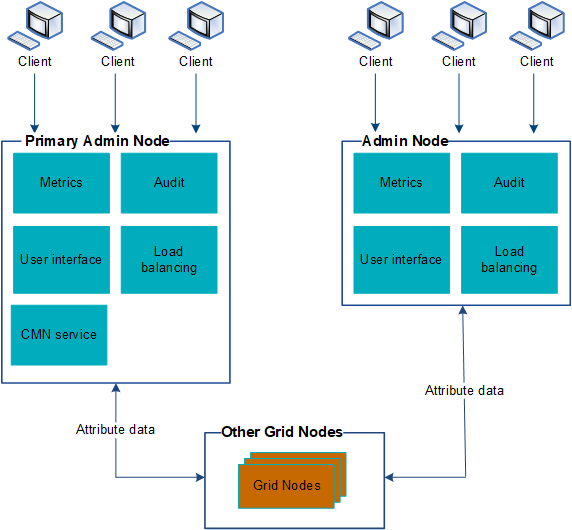

= Verwenden Sie mehrere Admin-Knoten
:allow-uri-read: 
:icons: font
:imagesdir: ../media/

[role="lead"]
Ein StorageGRID -System kann mehrere Admin-Knoten umfassen, damit Sie Ihr StorageGRID System kontinuierlich überwachen und konfigurieren können, selbst wenn ein Admin-Knoten ausfällt.

Wenn ein Admin-Knoten nicht mehr verfügbar ist, wird die Attributverarbeitung fortgesetzt, Warnungen werden weiterhin ausgelöst und E-Mail-Benachrichtigungen und AutoSupport Pakete werden weiterhin gesendet.  Allerdings bietet das Vorhandensein mehrerer Admin-Knoten keinen Failover-Schutz, mit Ausnahme von Benachrichtigungen und AutoSupport Paketen.

Es gibt zwei Möglichkeiten, das StorageGRID -System weiterhin anzuzeigen und zu konfigurieren, wenn ein Admin-Knoten ausfällt:

* Webclients können die Verbindung zu jedem anderen verfügbaren Admin-Knoten wiederherstellen.
* Wenn ein Systemadministrator eine Hochverfügbarkeitsgruppe von Admin-Knoten konfiguriert hat, können Webclients weiterhin über die virtuelle IP-Adresse der HA-Gruppe auf den Grid Manager oder den Tenant Manager zugreifen. Sehen link:managing-high-availability-groups.html["Verwalten von Hochverfügbarkeitsgruppen"] .
+

NOTE: Bei Verwendung einer HA-Gruppe wird der Zugriff unterbrochen, wenn der aktive Admin-Knoten ausfällt.  Benutzer müssen sich erneut anmelden, nachdem die virtuelle IP-Adresse der HA-Gruppe auf einen anderen Admin-Knoten in der Gruppe umgeschaltet wurde.

Einige Wartungsaufgaben können nur mit dem primären Admin-Knoten durchgeführt werden.  Wenn der primäre Admin-Knoten ausfällt, muss er wiederhergestellt werden, bevor das StorageGRID -System wieder voll funktionsfähig ist.
