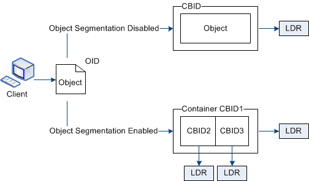

= Was ist Objektsegmentierung?
:allow-uri-read: 
:icons: font
:imagesdir: ../media/

[role="lead"]
Bei der Objektsegmentierung handelt es sich um den Prozess, ein Objekt in eine Sammlung kleinerer Objekte mit fester Größe aufzuteilen, um den Speicher- und Ressourcenverbrauch für große Objekte zu optimieren.  Der mehrteilige S3-Upload erstellt auch segmentierte Objekte, wobei jedes Teil durch ein Objekt dargestellt wird.

Wenn ein Objekt in das StorageGRID -System aufgenommen wird, teilt der LDR-Dienst das Objekt in Segmente auf und erstellt einen Segmentcontainer, der die Header-Informationen aller Segmente als Inhalt auflistet.

Beim Abrufen eines Segmentcontainers setzt der LDR-Dienst das ursprüngliche Objekt aus seinen Segmenten zusammen und gibt das Objekt an den Client zurück.

Der Container und die Segmente werden nicht unbedingt auf demselben Speicherknoten gespeichert.  Container und Segmente können auf jedem Speicherknoten innerhalb des in der ILM-Regel angegebenen Speicherpools gespeichert werden.

Jedes Segment wird vom StorageGRID -System unabhängig behandelt und trägt zur Anzahl von Attributen wie verwalteten Objekten und gespeicherten Objekten bei.  Wenn beispielsweise ein im StorageGRID -System gespeichertes Objekt in zwei Segmente aufgeteilt wird, erhöht sich der Wert von Managed Objects nach Abschluss der Aufnahme wie folgt um drei:

`segment container + segment 1 + segment 2 = three stored objects`
