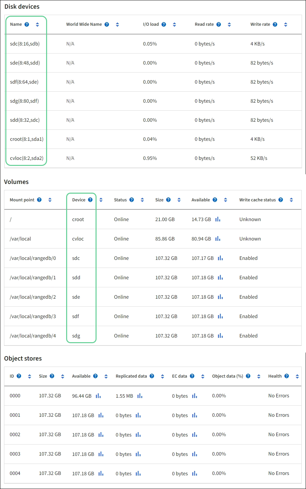

= Speichervolumes zu Speicherknoten hinzufügen
:allow-uri-read: 
:icons: font
:imagesdir: ../media/

[role="lead"]
Sie können die Speicherkapazität von Speicherknoten erweitern, die unter der maximal unterstützten Anzahl von Volumes liegen. Möglicherweise müssen Sie Speichervolumes zu mehr als einem Speicherknoten hinzufügen, um die ILM-Anforderungen für replizierte oder löschcodierte Kopien zu erfüllen.

.Bevor Sie beginnen
Bevor Sie Speichervolumes hinzufügen, überprüfen Sie dielink:guidelines-for-adding-object-capacity.html["Richtlinien zum Hinzufügen von Objektkapazität"] um sicherzustellen, dass Sie wissen, wo Sie Volumes hinzufügen müssen, um die Anforderungen Ihrer ILM-Richtlinie zu erfüllen.

NOTE: Diese Anweisungen gelten nur für softwarebasierte Speicherknoten.  Sehen https://docs.netapp.com/us-en/storagegrid-appliances/sg6000/adding-expansion-shelf-to-deployed-sg6060.html["Erweiterungsfach zum bereitgestellten SG6060 hinzufügen"^] oder https://docs.netapp.com/us-en/storagegrid-appliances/sg6100/adding-expansion-shelf-to-deployed-sg6160.html["Erweiterungsfach zum bereitgestellten SG6160 hinzufügen"^] um zu erfahren, wie Sie durch die Installation von Erweiterungsregalen Speichervolumes zum SG6060 oder SG6160 hinzufügen.  Andere Appliance-Speicherknoten können nicht erweitert werden.

.Informationen zu diesem Vorgang
Der zugrunde liegende Speicher eines Speicherknotens ist in Speichervolumes unterteilt.  Speichervolumes sind blockbasierte Speichergeräte, die vom StorageGRID -System formatiert und zum Speichern von Objekten bereitgestellt werden.  Jeder Speicherknoten kann bis zu 48 Speichervolumes unterstützen, die im Grid Manager als _Objektspeicher_ bezeichnet werden.

NOTE: Objektmetadaten werden immer im Objektspeicher 0 gespeichert.

Jeder Objektspeicher wird auf einem Datenträger bereitgestellt, der seiner ID entspricht.  Beispielsweise entspricht der Objektspeicher mit der ID 0000 dem `/var/local/rangedb/0` Einhängepunkt.

Bevor Sie neue Speichervolumes hinzufügen, verwenden Sie den Grid Manager, um die aktuellen Objektspeicher für jeden Speicherknoten sowie die entsprechenden Bereitstellungspunkte anzuzeigen.  Sie können diese Informationen beim Hinzufügen von Speichervolumes verwenden.

.Schritte
. Wählen Sie *NODES* > *_site_* > *_Storage Node_* > *Storage*.
. Scrollen Sie nach unten, um die Menge des verfügbaren Speichers für jedes Volume und jeden Objektspeicher anzuzeigen.
+
Bei Appliance-Speicherknoten entspricht der weltweite Name für jede Festplatte der weltweiten Volume-Kennung (WWID), die angezeigt wird, wenn Sie die Standard-Volume-Eigenschaften in SANtricity OS anzeigen (der Verwaltungssoftware, die mit dem Speichercontroller der Appliance verbunden ist).

+
Um Ihnen die Interpretation der Lese- und Schreibstatistiken für die Datenträger in Bezug auf Volume-Mount-Punkte zu erleichtern, entspricht der erste Teil des in der Spalte *Name* der Tabelle „Datenträgergeräte“ angezeigten Namens (also _sdc_, _sdd_, _sde_ usw.) dem in der Spalte *Gerät* der Tabelle „Volumes“ angezeigten Wert.

+

. Befolgen Sie die Anweisungen für Ihre Plattform, um dem Speicherknoten neue Speichervolumes hinzuzufügen.
+
** link:vmware-adding-storage-volumes-to-storage-node.html["VMware: Speichervolumes zum Speicherknoten hinzufügen"]
** link:linux-adding-direct-attached-or-san-volumes-to-storage-node.html["Linux: Direkt angeschlossene oder SAN-Volumes zum Speicherknoten hinzufügen"]

