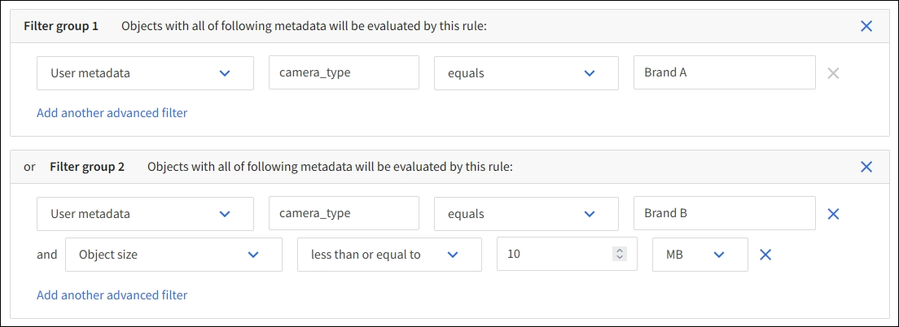

= Schritt 1 von 3: Details eingeben
:allow-uri-read: 
:icons: font
:imagesdir: ../media/

[role="lead"]
Im Schritt *Details eingeben* des Assistenten „ILM-Regel erstellen“ können Sie einen Namen und eine Beschreibung für die Regel eingeben und Filter für die Regel definieren.

Die Eingabe einer Beschreibung und die Definition von Filtern für die Regel sind optional.

.Informationen zu diesem Vorgang
Bei der Bewertung eines Objekts anhand einerlink:what-ilm-rule-is.html["ILM-Regel"] , StorageGRID vergleicht die Objektmetadaten mit den Filtern der Regel.  Wenn die Objektmetadaten allen Filtern entsprechen, verwendet StorageGRID die Regel, um das Objekt zu platzieren.  Sie können eine Regel entwerfen, die auf alle Objekte angewendet wird, oder Sie können grundlegende Filter angeben, beispielsweise ein oder mehrere Mandantenkonten oder Bucket-Namen, oder erweiterte Filter, beispielsweise die Größe des Objekts oder Benutzermetadaten.

.Schritte
. Geben Sie im Feld *Name* einen eindeutigen Namen für die Regel ein.
. Geben Sie optional im Feld *Beschreibung* eine kurze Beschreibung für die Regel ein.
+
Sie sollten den Zweck bzw. die Funktion der Regel beschreiben, damit Sie die Regel später wiedererkennen.

. Wählen Sie optional ein oder mehrere S3-Mandantenkonten aus, für die diese Regel gilt.  Wenn diese Regel für alle Mieter gilt, lassen Sie dieses Feld leer.
+
Wenn Sie weder über die Berechtigung „Root-Zugriff“ noch über die Berechtigung „Mandantenkonten“ verfügen, können Sie keine Mandanten aus der Liste auswählen.  Geben Sie stattdessen die Mandanten-ID oder mehrere IDs als durch Kommas getrennte Zeichenfolge ein.

. Geben Sie optional die S3-Buckets an, für die diese Regel gilt.
+
Wenn *gilt für alle Buckets* ausgewählt ist (Standard), gilt die Regel für alle S3-Buckets.

. Wählen Sie für S3-Mandanten optional *Ja* aus, um die Regel nur auf ältere Objektversionen in S3-Buckets anzuwenden, bei denen die Versionierung aktiviert ist.
+
Wenn Sie *Ja* wählen, wird automatisch "Nicht aktuelle Zeit" als Referenzzeit ausgewählt inlink:create-ilm-rule-define-placements.html["Schritt 2 des Assistenten „ILM-Regel erstellen“"] .

+

NOTE: Die nicht aktuelle Zeit gilt nur für S3-Objekte in Buckets mit aktivierter Versionierung. Sehenlink:../s3/operations-on-buckets.html["Operationen an Buckets, PutBucketVersioning"] Undlink:managing-objects-with-s3-object-lock.html["Verwalten von Objekten mit S3 Object Lock"] .

+
Mit dieser Option können Sie die Speicherbelastung versionierter Objekte reduzieren, indem Sie nach nicht aktuellen Objektversionen filtern. Sehen link:example-4-ilm-rules-and-policy-for-s3-versioned-objects.html["Beispiel 4: ILM-Regeln und -Richtlinien für versionierte S3-Objekte"] .

. Wählen Sie optional *Erweiterten Filter hinzufügen* aus, um zusätzliche Filter anzugeben.
+
Wenn Sie keine erweiterte Filterung konfigurieren, gilt die Regel für alle Objekte, die den grundlegenden Filtern entsprechen.  Weitere Informationen zur erweiterten Filterung finden Sie unter<<Verwenden Sie erweiterte Filter in ILM-Regeln>> Und<<Angeben mehrerer Metadatentypen und -werte>> .

. Wählen Sie *Weiter*. link:create-ilm-rule-define-placements.html["Schritt 2 (Platzierungen definieren)"]des Assistenten „ILM-Regel erstellen“ wird angezeigt.

== Verwenden Sie erweiterte Filter in ILM-Regeln

Mithilfe der erweiterten Filterung können Sie ILM-Regeln erstellen, die basierend auf ihren Metadaten nur für bestimmte Objekte gelten.  Wenn Sie die erweiterte Filterung für eine Regel einrichten, wählen Sie den Typ der abzugleichenden Metadaten aus, wählen einen Operator aus und geben einen Metadatenwert an.  Bei der Auswertung von Objekten wird die ILM-Regel nur auf die Objekte angewendet, deren Metadaten dem erweiterten Filter entsprechen.

Die Tabelle zeigt die Metadatentypen, die Sie in erweiterten Filtern angeben können, die Operatoren, die Sie für jeden Metadatentyp verwenden können, und die erwarteten Metadatenwerte.

[cols="1a,1a,2a"]
|===
| Metadatentyp | Unterstützte Operatoren | Metadatenwert 

 a| 
Aufnahmezeit
 a| 
* Ist
* ist nicht
* ist vor
* ist am oder vor
* ist nach
* ist am oder nach

 a| 
Uhrzeit und Datum der Aufnahme des Objekts.

*Hinweis:* Um Ressourcenprobleme beim Aktivieren einer neuen ILM-Richtlinie zu vermeiden, können Sie den erweiterten Filter „Aufnahmezeit“ in jeder Regel verwenden, die den Speicherort einer großen Anzahl vorhandener Objekte ändern könnte.  Legen Sie die Aufnahmezeit so fest, dass sie größer oder gleich der ungefähren Zeit ist, zu der die neue Richtlinie in Kraft tritt, um sicherzustellen, dass vorhandene Objekte nicht unnötig verschoben werden.

 a| 
Schlüssel
 a| 
* gleich
* ist nicht gleich
* enthält
* enthält nicht
* beginnt mit
* beginnt nicht mit
* endet mit
* endet nicht mit

 a| 
Der gesamte oder ein Teil eines eindeutigen S3-Objektschlüssels.

Beispielsweise möchten Sie möglicherweise Objekte abgleichen, die mit enden `.txt` oder beginnen Sie mit `test-object/` .

 a| 
Letzter Zugriffszeitpunkt
 a| 
* Ist
* ist nicht
* ist vor
* ist am oder vor
* ist nach
* ist am oder nach

 a| 
Uhrzeit und Datum des letzten Abrufs (Lesens oder Anzeigens) des Objekts.

*Hinweis:* Wenn Sie planen,link:using-last-access-time-in-ilm-rules.html["letzte Zugriffszeit verwenden"] Als erweiterter Filter müssen Aktualisierungen der letzten Zugriffszeit für den S3-Bucket aktiviert werden.

 a| 
Standortbeschränkung (nur S3)
 a| 
* gleich
* ist nicht gleich

 a| 
Die Region, in der ein S3-Bucket erstellt wurde.  Verwenden Sie *ILM* > *Regionen*, um die angezeigten Regionen zu definieren.

*Hinweis:* Ein Wert von us-east-1 entspricht Objekten in Buckets, die in der Region us-east-1 erstellt wurden, sowie Objekten in Buckets, für die keine Region angegeben ist. Sehen link:configuring-regions-optional-and-s3-only.html["Regionen konfigurieren (optional und nur S3)"] .

 a| 
Objektgröße
 a| 
* gleich
* ist nicht gleich
* weniger als
* kleiner oder gleich
* größer als
* größer oder gleich

 a| 
Die Größe des Objekts.

Erasure Coding eignet sich am besten für Objekte, die größer als 1 MB sind.  Verwenden Sie Erasure Coding nicht für Objekte, die kleiner als 200 KB sind, um den Verwaltungsaufwand für sehr kleine Erasure-Coding-Fragmente zu vermeiden.

 a| 
Benutzermetadaten
 a| 
* enthält
* endet mit
* gleich
* existiert
* beginnt mit
* enthält nicht
* endet nicht mit
* ist nicht gleich
* existiert nicht
* beginnt nicht mit

 a| 
Schlüssel-Wert-Paar, wobei *Benutzermetadatenname* der Schlüssel und *Metadatenwert* der Wert ist.

Um beispielsweise nach Objekten zu filtern, die Benutzermetadaten von `color=blue` , geben Sie an `color` für *Benutzermetadatenname*, `equals` für den Betreiber und `blue` für *Metadatenwert*.

*Hinweis:* Bei Benutzermetadatennamen wird die Groß-/Kleinschreibung nicht beachtet; bei Benutzermetadatenwerten hingegen schon.

 a| 
Objekt-Tag (nur S3)
 a| 
* enthält
* endet mit
* gleich
* existiert
* beginnt mit
* enthält nicht
* endet nicht mit
* ist nicht gleich
* existiert nicht
* beginnt nicht mit

 a| 
Schlüssel-Wert-Paar, wobei *Objekt-Tag-Name* der Schlüssel und *Objekt-Tag-Wert* der Wert ist.

Um beispielsweise nach Objekten zu filtern, die den Objekttag `Image=True` , geben Sie an `Image` für *Objekt-Tag-Name*, `equals` für den Betreiber und `True` für *Objekt-Tag-Wert*.

*Hinweis:* Bei Objekt-Tag-Namen und Objekt-Tag-Werten wird zwischen Groß- und Kleinschreibung unterschieden.  Sie müssen diese Elemente genau so eingeben, wie sie für das Objekt definiert wurden.

|===

== Angeben mehrerer Metadatentypen und -werte

Wenn Sie erweiterte Filter definieren, können Sie mehrere Metadatentypen und mehrere Metadatenwerte angeben.  Wenn Sie beispielsweise möchten, dass eine Regel auf Objekte mit einer Größe zwischen 10 MB und 100 MB zutrifft, wählen Sie den Metadatentyp *Objektgröße* aus und geben zwei Metadatenwerte an.

* Der erste Metadatenwert gibt Objekte an, die größer oder gleich 10 MB sind.
* Der zweite Metadatenwert gibt Objekte an, die kleiner oder gleich 100 MB sind.

image::../media/advanced_filtering_size_between.png[Beispiel für erweitertes Filtern nach Objektgröße]

Durch die Verwendung mehrerer Einträge haben Sie eine genaue Kontrolle darüber, welche Objekte abgeglichen werden.  Im folgenden Beispiel gilt die Regel für Objekte, die als Wert der Benutzermetadaten „camera_type“ die Marke A oder Marke B haben.  Die Regel gilt jedoch nur für Objekte der Marke B, die kleiner als 10 MB sind.

