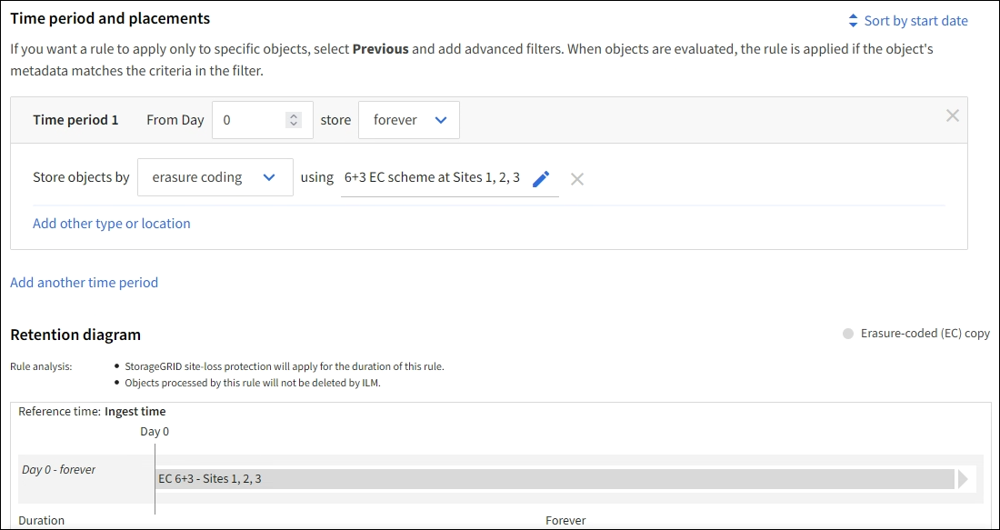

= Beispiel 1: ILM-Regeln und -Richtlinien für Objektspeicher
:allow-uri-read: 
:icons: font
:imagesdir: ../media/

[role="lead"]
Sie können die folgenden Beispielregeln und -richtlinien als Ausgangspunkt verwenden, wenn Sie eine ILM-Richtlinie definieren, um Ihre Anforderungen an den Objektschutz und die Objektaufbewahrung zu erfüllen.

CAUTION: Die folgenden ILM-Regeln und -Richtlinien sind nur Beispiele.  Es gibt viele Möglichkeiten, ILM-Regeln zu konfigurieren.  Bevor Sie eine neue Richtlinie aktivieren, simulieren Sie sie, um sicherzustellen, dass sie wie vorgesehen funktioniert und Inhalte vor Verlust schützt.

== ILM-Regel 1 für Beispiel 1: Objektdaten auf zwei Sites kopieren

Diese beispielhafte ILM-Regel kopiert Objektdaten in Speicherpools an zwei Standorten.

[cols="1a,2a"]
|===
| Regeldefinition | Beispielwert 

 a| 
Speicherpools an einem Standort
 a| 
Zwei Speicherpools, die jeweils unterschiedliche Sites enthalten, mit den Namen Site 1 und Site 2.

 a| 
Regelname
 a| 
Zwei Kopien, zwei Standorte

 a| 
Referenzzeit
 a| 
Aufnahmezeit

 a| 
Platzierungen
 a| 
Behalten Sie vom Tag 0 bis in alle Ewigkeit eine replizierte Kopie an Standort 1 und eine replizierte Kopie an Standort 2.

|===
Im Abschnitt „Regelanalyse“ des Retention-Diagramms heißt es:

* Für die Dauer dieser Regelung gilt der Site-Loss-Schutz von StorageGRID .
* Von dieser Regel verarbeitete Objekte werden von ILM nicht gelöscht.

image::../media/ilm_rule_two_copies_two_data_centers.png[ILM-Regel 1 für Beispiel 1: Objektdaten auf zwei Sites kopieren]

== ILM-Regel 2 für Beispiel 1: Erasure-Coding-Profil mit Bucket-Matching

Dieses Beispiel einer ILM-Regel verwendet ein Erasure-Coding-Profil und einen S3-Bucket, um zu bestimmen, wo und wie lange das Objekt gespeichert wird.

[cols="1a,2a"]
|===
| Regeldefinition | Beispielwert 

 a| 
Speicherpool mit mehreren Standorten
 a| 
* Ein Speicherpool an drei Standorten (Standorte 1, 2, 3)
* Verwenden Sie das 6+3-Löschcodierungsschema

 a| 
Regelname
 a| 
S3 Bucket Finanzaufzeichnungen

 a| 
Referenzzeit
 a| 
Aufnahmezeit

 a| 
Platzierungen
 a| 
Erstellen Sie für Objekte im S3-Bucket mit dem Namen „finance-records“ eine Erasure-Coding-Kopie im Pool, der durch das Erasure-Coding-Profil angegeben ist.  Bewahren Sie diese Kopie für immer auf.

|===

== ILM-Richtlinie für Beispiel 1

In der Praxis sind die meisten ILM-Richtlinien einfach, obwohl das StorageGRID -System die Entwicklung anspruchsvoller und komplexer ILM-Richtlinien ermöglicht.

Eine typische ILM-Richtlinie für ein Grid mit mehreren Standorten könnte ILM-Regeln wie die folgenden enthalten:

* Speichern Sie beim Ingest alle Objekte, die zum S3-Bucket mit dem Namen gehören `finance-records` in einem Speicherpool, der drei Standorte enthält.  Verwenden Sie 6+3-Löschcodierung.
* Wenn ein Objekt nicht der ersten ILM-Regel entspricht, verwenden Sie die ILM-Standardregel der Richtlinie „Zwei Kopien, zwei Rechenzentren“, um eine Kopie dieses Objekts an Standort 1 und eine Kopie an Standort 2 zu speichern.
+
image::../media/policy_1_configured_policy.png[ILM-Richtlinie für Beispiel 1]

.Ähnliche Informationen
* link:ilm-policy-overview.html["Verwenden von ILM-Richtlinien"]
* link:creating-ilm-policy.html["Erstellen von ILM-Richtlinien"]

