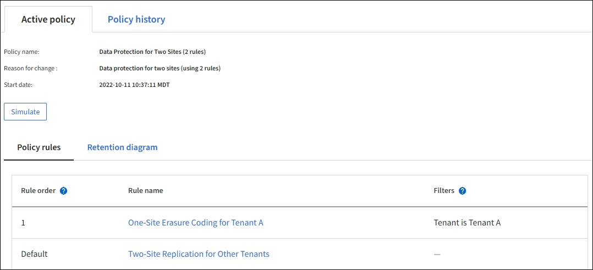

= Beispiel 6: Ändern einer ILM-Richtlinie
:allow-uri-read: 
:icons: font
:imagesdir: ../media/

[role="lead"]
Wenn Ihr Datenschutz geändert werden muss oder Sie neue Sites hinzufügen, können Sie eine neue ILM-Richtlinie erstellen und aktivieren.

Bevor Sie eine Richtlinie ändern, müssen Sie verstehen, wie sich Änderungen an ILM-Platzierungen vorübergehend auf die Gesamtleistung eines StorageGRID Systems auswirken können.

In diesem Beispiel wurde im Rahmen einer Erweiterung ein neuer StorageGRID Standort hinzugefügt und es muss eine neue aktive ILM-Richtlinie implementiert werden, um Daten am neuen Standort zu speichern.  Um eine neue aktive Richtlinie zu implementieren, müssen Sie zunächstlink:creating-ilm-policy.html["Erstellen einer Richtlinie"] .  Anschließend müssen Sielink:../ilm/creating-ilm-policy.html#simulate-ilm-policy["simulieren"] und dannlink:../ilm/creating-ilm-policy.html#activate-ilm-policy["aktivieren"] die neue Richtlinie.

CAUTION: Die folgenden ILM-Regeln und -Richtlinien sind nur Beispiele.  Es gibt viele Möglichkeiten, ILM-Regeln zu konfigurieren.  Bevor Sie eine neue Richtlinie aktivieren, simulieren Sie sie, um sicherzustellen, dass sie wie vorgesehen funktioniert und Inhalte vor Verlust schützt.

== Auswirkungen der Änderung einer ILM-Richtlinie auf die Leistung

Wenn Sie eine neue ILM-Richtlinie aktivieren, kann die Leistung Ihres StorageGRID -Systems vorübergehend beeinträchtigt werden, insbesondere wenn die Platzierungsanweisungen in der neuen Richtlinie erfordern, dass viele vorhandene Objekte an neue Speicherorte verschoben werden.

Wenn Sie eine neue ILM-Richtlinie aktivieren, verwendet StorageGRID diese zum Verwalten aller Objekte, einschließlich vorhandener und neu aufgenommener Objekte.  Überprüfen Sie vor der Aktivierung einer neuen ILM-Richtlinie alle Änderungen an der Platzierung vorhandener replizierter und löschcodierter Objekte.  Das Ändern des Standorts eines vorhandenen Objekts kann zu vorübergehenden Ressourcenproblemen führen, wenn die neuen Platzierungen ausgewertet und implementiert werden.

Um sicherzustellen, dass eine neue ILM-Richtlinie keinen Einfluss auf die Platzierung vorhandener replizierter und erasure-coded Objekte hat, können Sielink:create-ilm-rule-enter-details.html#use-advanced-filters-in-ilm-rules["Erstellen Sie eine ILM-Regel mit einem Aufnahmezeitfilter"] .  Beispiel: *Aufnahmezeit _ist am oder nach_ _<Datum und Uhrzeit>_*, sodass die neue Regel nur für Objekte gilt, die am oder nach dem angegebenen Datum und der angegebenen Uhrzeit aufgenommen wurden.

Zu den Arten von ILM-Richtlinienänderungen, die die Leistung von StorageGRID vorübergehend beeinträchtigen können, gehören die folgenden:

* Anwenden eines anderen Erasure-Coding-Profils auf vorhandene Erasure-Coding-Objekte.
+

NOTE: StorageGRID betrachtet jedes Erasure-Coding-Profil als einzigartig und verwendet Erasure-Coding-Fragmente nicht erneut, wenn ein neues Profil verwendet wird.

* Ändern des Typs der Kopien, die für vorhandene Objekte erforderlich sind. Beispielsweise das Konvertieren eines großen Prozentsatzes replizierter Objekte in Erasure-Coded-Objekte.
* Verschieben von Kopien vorhandener Objekte an einen völlig anderen Ort; beispielsweise das Verschieben einer großen Anzahl von Objekten in oder aus einem Cloud-Speicherpool oder zu oder von einem Remote-Standort.

== Aktive ILM-Richtlinie für Beispiel 6: Datenschutz an zwei Standorten

In diesem Beispiel wurde die aktive ILM-Richtlinie ursprünglich für ein StorageGRID -System mit zwei Standorten entwickelt und verwendet zwei ILM-Regeln.

In dieser ILM-Richtlinie werden Objekte des Mandanten A durch 2+1-Löschcodierung an einem einzelnen Standort geschützt, während Objekte aller anderen Mandanten über zwei Standorte hinweg durch 2-Kopien-Replikation geschützt werden.

=== Regel 1: One-Site-Erasure-Coding für Mandant A

[cols="1a,2a"]
|===
| Regeldefinition | Beispielwert 

 a| 
Regelname
 a| 
One-Site Erasure Coding für Mieter A

 a| 
Mandantenkonto
 a| 
Mieter A

 a| 
Speicherpool
 a| 
Standort 1

 a| 
Platzierungen
 a| 
2+1 Erasure Coding in Site 1 von Tag 0 bis für immer

|===

=== Regel 2: Zwei-Site-Replikation für andere Mandanten

[cols="1a,2a"]
|===
| Regeldefinition | Beispielwert 

 a| 
Regelname
 a| 
Zwei-Site-Replikation für andere Mandanten

 a| 
Mandantenkonto
 a| 
Ignorieren

 a| 
Speicherpools
 a| 
Standort 1 und Standort 2

 a| 
Platzierungen
 a| 
Zwei replizierte Kopien vom Tag 0 bis in alle Ewigkeit: eine Kopie an Standort 1 und eine Kopie an Standort 2.

|===

== ILM-Richtlinie für Beispiel 6: Datenschutz an drei Standorten

In diesem Beispiel wird die ILM-Richtlinie durch eine neue Richtlinie für ein StorageGRID System mit drei Standorten ersetzt.

Nachdem der Grid-Administrator eine Erweiterung zum Hinzufügen der neuen Site durchgeführt hatte, erstellte er zwei neue Speicherpools: einen Speicherpool für Site 3 und einen Speicherpool, der alle drei Sites enthält (nicht derselbe wie der Standardspeicherpool „Alle Speicherknoten“).  Anschließend erstellte der Administrator zwei neue ILM-Regeln und eine neue ILM-Richtlinie, die dem Schutz der Daten an allen drei Standorten dienen soll.

Wenn diese neue ILM-Richtlinie aktiviert wird, werden Objekte von Mandant A durch 2+1-Löschcodierung an drei Standorten geschützt, während Objekte anderer Mandanten (und kleinere Objekte von Mandant A) an drei Standorten durch 3-Kopien-Replikation geschützt werden.

=== Regel 1: Drei-Site-Löschcodierung für Mandant A

[cols="1a,2a"]
|===
| Regeldefinition | Beispielwert 

 a| 
Regelname
 a| 
Drei-Site-Erasure-Coding für Mieter A

 a| 
Mandantenkonto
 a| 
Mieter A

 a| 
Speicherpool
 a| 
Alle 3 Standorte (einschließlich Standort 1, Standort 2 und Standort 3)

 a| 
Platzierungen
 a| 
2+1 Erasure Coding an allen 3 Standorten vom Tag 0 bis für immer

|===

=== Regel 2: Drei-Standort-Replikation für andere Mandanten

[cols="1a,2a"]
|===
| Regeldefinition | Beispielwert 

 a| 
Regelname
 a| 
Drei-Site-Replikation für andere Mandanten

 a| 
Mandantenkonto
 a| 
Ignorieren

 a| 
Speicherpools
 a| 
Standort 1, Standort 2 und Standort 3

 a| 
Platzierungen
 a| 
Drei replizierte Kopien vom Tag 0 bis in alle Ewigkeit: eine Kopie an Standort 1, eine Kopie an Standort 2 und eine Kopie an Standort 3.

|===

== Aktivieren der ILM-Richtlinie für Beispiel 6

Wenn Sie eine neue ILM-Richtlinie aktivieren, werden vorhandene Objekte möglicherweise an neue Speicherorte verschoben oder es werden neue Objektkopien für vorhandene Objekte erstellt, basierend auf den Platzierungsanweisungen in neuen oder aktualisierten Regeln.

CAUTION: Fehler in einer ILM-Richtlinie können zu nicht wiederherstellbarem Datenverlust führen.  Überprüfen und simulieren Sie die Richtlinie sorgfältig, bevor Sie sie aktivieren, um sicherzustellen, dass sie wie vorgesehen funktioniert.

CAUTION: Wenn Sie eine neue ILM-Richtlinie aktivieren, verwendet StorageGRID diese zum Verwalten aller Objekte, einschließlich vorhandener und neu aufgenommener Objekte.  Überprüfen Sie vor der Aktivierung einer neuen ILM-Richtlinie alle Änderungen an der Platzierung vorhandener replizierter und löschcodierter Objekte.  Das Ändern des Standorts eines vorhandenen Objekts kann zu vorübergehenden Ressourcenproblemen führen, wenn die neuen Platzierungen ausgewertet und implementiert werden.

=== Was passiert, wenn sich die Anweisungen zur Erasure-Codierung ändern?

In der derzeit aktiven ILM-Richtlinie für dieses Beispiel werden Objekte des Mandanten A mithilfe von 2+1-Löschcodierung an Standort 1 geschützt.  In der neuen ILM-Richtlinie werden Objekte des Mandanten A mithilfe von 2+1-Löschcodierung an den Standorten 1, 2 und 3 geschützt.

Wenn die neue ILM-Richtlinie aktiviert wird, werden die folgenden ILM-Vorgänge ausgeführt:

* Neue, von Mandant A aufgenommene Objekte werden in zwei Datenfragmente aufgeteilt und ein Paritätsfragment wird hinzugefügt.  Anschließend wird jedes der drei Fragmente an einem anderen Ort gespeichert.
* Die vorhandenen Objekte des Mandanten A werden während des laufenden ILM-Scan-Prozesses neu ausgewertet.  Da die ILM-Platzierungsanweisungen ein neues Erasure-Coding-Profil verwenden, werden völlig neue Erasure-Coding-Fragmente erstellt und an die drei Standorte verteilt.
+

NOTE: Die vorhandenen 2+1-Fragmente an Standort 1 werden nicht wiederverwendet.  StorageGRID betrachtet jedes Erasure-Coding-Profil als einzigartig und verwendet Erasure-Coding-Fragmente nicht erneut, wenn ein neues Profil verwendet wird.

=== Was passiert, wenn sich Replikationsanweisungen ändern?

In der derzeit aktiven ILM-Richtlinie für dieses Beispiel werden Objekte anderer Mandanten mithilfe von zwei replizierten Kopien in Speicherpools an den Standorten 1 und 2 geschützt.  In der neuen ILM-Richtlinie werden Objekte anderer Mandanten mithilfe von drei replizierten Kopien in Speicherpools an den Standorten 1, 2 und 3 geschützt.

Wenn die neue ILM-Richtlinie aktiviert wird, werden die folgenden ILM-Vorgänge ausgeführt:

* Wenn ein anderer Mandant als Mandant A ein neues Objekt aufnimmt, erstellt StorageGRID drei Kopien und speichert an jedem Standort eine Kopie.
* Vorhandene Objekte dieser anderen Mandanten werden während des laufenden ILM-Scanvorgangs neu bewertet.  Da die vorhandenen Objektkopien an Standort 1 und Standort 2 weiterhin die Replikationsanforderungen der neuen ILM-Regel erfüllen, muss StorageGRID nur eine neue Kopie des Objekts für Standort 3 erstellen.

=== Auswirkungen der Aktivierung dieser Richtlinie auf die Leistung

Wenn die ILM-Richtlinie in diesem Beispiel aktiviert wird, wird die Gesamtleistung dieses StorageGRID Systems vorübergehend beeinträchtigt.  Es werden mehr Grid-Ressourcen als üblich benötigt, um neue Erasure-Code-Fragmente für die vorhandenen Objekte von Mandant A und neue replizierte Kopien an Standort 3 für die vorhandenen Objekte anderer Mandanten zu erstellen.

Aufgrund der Änderung der ILM-Richtlinie kann es bei Lese- und Schreibanforderungen des Clients vorübergehend zu höheren Latenzen als normal kommen.  Die Latenzen werden wieder auf ein normales Niveau zurückkehren, nachdem die Platzierungsanweisungen im gesamten Raster vollständig implementiert wurden.

Um Ressourcenprobleme beim Aktivieren einer neuen ILM-Richtlinie zu vermeiden, können Sie den erweiterten Filter „Aufnahmezeit“ in jeder Regel verwenden, die den Speicherort einer großen Anzahl vorhandener Objekte ändern könnte.  Legen Sie die Aufnahmezeit so fest, dass sie größer oder gleich der ungefähren Zeit ist, zu der die neue Richtlinie in Kraft tritt, um sicherzustellen, dass vorhandene Objekte nicht unnötig verschoben werden.

NOTE: Wenden Sie sich an den technischen Support, wenn Sie die Geschwindigkeit, mit der Objekte nach einer Änderung der ILM-Richtlinie verarbeitet werden, verlangsamen oder erhöhen müssen.
