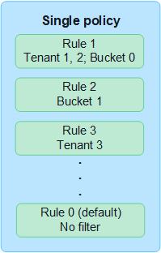

= Verwenden von ILM-Richtlinien
:allow-uri-read: 
:icons: font
:imagesdir: ../media/

[role="lead"]
Eine Richtlinie für das Information Lifecycle Management (ILM) ist ein geordneter Satz von ILM-Regeln, der bestimmt, wie das StorageGRID -System Objektdaten im Laufe der Zeit verwaltet.

CAUTION: Eine falsch konfigurierte ILM-Richtlinie kann zu einem nicht wiederherstellbaren Datenverlust führen.  Bevor Sie eine ILM-Richtlinie aktivieren, überprüfen Sie die ILM-Richtlinie und ihre ILM-Regeln sorgfältig und simulieren Sie dann die ILM-Richtlinie.  Stellen Sie immer sicher, dass die ILM-Richtlinie wie vorgesehen funktioniert.

== Standard-ILM-Richtlinie

Wenn Sie StorageGRID installieren und Sites hinzufügen, wird automatisch eine Standard-ILM-Richtlinie wie folgt erstellt:

* Wenn Ihr Raster eine Site enthält, enthält die Standardrichtlinie eine Standardregel, die zwei Kopien jedes Objekts an dieser Site repliziert.
* Wenn Ihr Raster mehr als eine Site enthält, repliziert die Standardregel eine Kopie jedes Objekts an jeder Site.

Wenn die Standardrichtlinie Ihren Speicheranforderungen nicht entspricht, können Sie Ihre eigenen Regeln und Richtlinien erstellen. Sehenlink:what-ilm-rule-is.html["Erstellen einer ILM-Regel"] Undlink:creating-ilm-policy.html["Erstellen einer ILM-Richtlinie"] .

== Eine oder mehrere aktive ILM-Richtlinien?

Sie können eine oder mehrere aktive ILM-Richtlinien gleichzeitig haben.

=== Eine Richtlinie

Wenn Ihr Grid ein einfaches Datenschutzschema mit wenigen mandanten- und bucketspezifischen Regeln verwendet, verwenden Sie eine einzelne aktive ILM-Richtlinie.  Die ILM-Regeln können Filter enthalten, um verschiedene Buckets oder Mandanten zu verwalten.

Wenn Sie nur eine Richtlinie haben und sich die Anforderungen eines Mandanten ändern, müssen Sie eine neue ILM-Richtlinie erstellen oder die vorhandene Richtlinie klonen, um Änderungen anzuwenden, die neue ILM-Richtlinie zu simulieren und dann zu aktivieren.  Änderungen an der ILM-Richtlinie können zu Objektverschiebungen führen, die mehrere Tage dauern und zu Systemlatenz führen können.

=== Mehrere Richtlinien

Um den Mietern unterschiedliche Servicequalitätsoptionen bereitzustellen, können Sie mehrere aktive Richtlinien gleichzeitig haben.  Jede Richtlinie kann bestimmte Mandanten, S3-Buckets und Objekte verwalten.  Wenn Sie eine Richtlinie für einen bestimmten Satz von Mandanten oder Objekten anwenden oder ändern, sind die auf andere Mandanten und Objekte angewendeten Richtlinien davon nicht betroffen.

ILM-Richtlinientags:: Wenn Sie es Mandanten ermöglichen möchten, problemlos zwischen mehreren Datenschutzrichtlinien pro Bucket zu wechseln, verwenden Sie mehrere ILM-Richtlinien mit _ILM-Richtlinien-Tags_.  Sie weisen jeder ILM-Richtlinie ein Tag zu, und anschließend markieren Mandanten einen Bucket, um die Richtlinie auf diesen Bucket anzuwenden.  Sie können ILM-Richtlinien-Tags nur auf S3-Buckets festlegen.
+
--
Sie könnten beispielsweise drei Tags mit den Namen „Gold“, „Silber“ und „Bronze“ haben.  Sie können jedem Tag eine ILM-Richtlinie zuweisen, basierend darauf, wie lange und wo diese Richtlinie Objekte speichert.  Mieter können durch Markieren ihrer Buckets auswählen, welche Richtlinie verwendet werden soll.  Ein Bucket mit der Kennzeichnung „Gold“ wird durch die Gold-Richtlinie verwaltet und erhält die Datenschutz- und Leistungsstufe „Gold“.

--
Standard-ILM-Richtlinientag:: Bei der Installation von StorageGRID wird automatisch ein standardmäßiges ILM-Richtlinientag erstellt.  Jedes Raster muss über eine aktive Richtlinie verfügen, die dem Standardtag zugewiesen ist.  Die Standardrichtlinie gilt für alle nicht markierten S3-Buckets.

image::../media/ilm-policies-tags-conceptual.png[Diagramm mit mehreren ILM-Richtlinien]

== Wie bewertet eine ILM-Richtlinie Objekte?

Eine aktive ILM-Richtlinie steuert die Platzierung, Dauer und den Datenschutz von Objekten.

Wenn Clients Objekte in StorageGRID speichern, werden die Objekte anhand des geordneten Satzes von ILM-Regeln in der Richtlinie wie folgt ausgewertet:

. Wenn die Filter für die erste Regel in der Richtlinie mit einem Objekt übereinstimmen, wird das Objekt gemäß dem Aufnahmeverhalten dieser Regel aufgenommen und gemäß den Platzierungsanweisungen dieser Regel gespeichert.
. Wenn die Filter für die erste Regel nicht mit dem Objekt übereinstimmen, wird das Objekt anhand jeder nachfolgenden Regel in der Richtlinie ausgewertet, bis eine Übereinstimmung gefunden wird.
. Wenn keine Regeln mit einem Objekt übereinstimmen, werden das Aufnahmeverhalten und die Platzierungsanweisungen für die Standardregel in der Richtlinie angewendet.  Die Standardregel ist die letzte Regel in einer Richtlinie.  Die Standardregel muss für alle Mandanten, alle S3-Buckets und alle Objektversionen gelten und darf keine erweiterten Filter verwenden.

== Beispiel einer ILM-Richtlinie

Beispielsweise könnte eine ILM-Richtlinie drei ILM-Regeln enthalten, die Folgendes festlegen:

* *Regel 1: Replikate für Mieter A*
+
** Alle Objekte abgleichen, die zu Mieter A gehören.
** Speichern Sie diese Objekte als drei replizierte Kopien an drei Standorten.
** Objekte, die anderen Mandanten gehören, werden nicht mit Regel 1 abgeglichen, daher werden sie anhand von Regel 2 ausgewertet.

* *Regel 2: Erasure Coding für Objekte größer als 1 MB*
+
** Alle Objekte anderer Mandanten werden abgeglichen, aber nur, wenn sie größer als 1 MB sind.  Diese größeren Objekte werden mittels 6+3-Erasure-Coding an drei Standorten gespeichert.
** Stimmt nicht mit Objekten überein, die 1 MB oder kleiner sind. Daher werden diese Objekte anhand von Regel 3 ausgewertet.

* *Regel 3: 2 Kopien, 2 Rechenzentren* (Standard)
+
** Ist die letzte und Standardregel in der Richtlinie.  Verwendet keine Filter.
** Erstellen Sie zwei replizierte Kopien aller Objekte, die nicht mit Regel 1 oder Regel 2 übereinstimmen (Objekte, die nicht zu Mandant A gehören und 1 MB oder kleiner sind).

image::../media/ilm_policy_and_rules.png[ILM-Richtlinien und -Regeln]

== Was sind aktive und inaktive Richtlinien?

Jedes StorageGRID -System muss über mindestens eine aktive ILM-Richtlinie verfügen.  Wenn Sie mehr als eine aktive ILM-Richtlinie haben möchten, erstellen Sie ILM-Richtlinien-Tags und weisen jedem Tag eine Richtlinie zu.  Anschließend wenden Mandanten Tags auf S3-Buckets an.  Die Standardrichtlinie wird auf alle Objekte in Buckets angewendet, denen kein Richtlinientag zugewiesen ist.

Wenn Sie zum ersten Mal eine ILM-Richtlinie erstellen, wählen Sie eine oder mehrere ILM-Regeln aus und ordnen sie in einer bestimmten Reihenfolge an.  Nachdem Sie die Richtlinie simuliert haben, um ihr Verhalten zu bestätigen, aktivieren Sie sie.

Wenn Sie eine ILM-Richtlinie aktivieren, verwendet StorageGRID diese Richtlinie zum Verwalten aller Objekte, einschließlich vorhandener und neu aufgenommener Objekte.  Vorhandene Objekte werden möglicherweise an neue Speicherorte verschoben, wenn die ILM-Regeln in der neuen Richtlinie implementiert werden.

Wenn Sie mehrere ILM-Richtlinien gleichzeitig aktivieren und Mandanten Richtlinien-Tags auf S3-Buckets anwenden, werden die Objekte in jedem Bucket entsprechend der dem Tag zugewiesenen Richtlinie verwaltet.

Ein StorageGRID -System verfolgt den Verlauf der aktivierten oder deaktivierten Richtlinien.

== Überlegungen zum Erstellen einer ILM-Richtlinie

* Verwenden Sie in Testsystemen nur die vom System bereitgestellte Richtlinie „Baseline 2-Kopienrichtlinie“.  Für StorageGRID 11.6 und früher verwendet die Regel „2 Kopien erstellen“ in dieser Richtlinie den Speicherpool „Alle Speicherknoten“, der alle Sites enthält.  Wenn Ihr StorageGRID -System über mehr als einen Standort verfügt, können zwei Kopien eines Objekts am selben Standort platziert werden.
+

NOTE: Der Speicherpool „Alle Speicherknoten“ wird während der Installation von StorageGRID 11.6 und früher automatisch erstellt.  Wenn Sie auf eine neuere Version von StorageGRID aktualisieren, bleibt der Pool „Alle Speicherknoten“ weiterhin vorhanden.  Wenn Sie StorageGRID 11.7 oder höher als Neuinstallation installieren, wird der Pool „Alle Speicherknoten“ nicht erstellt.

* Berücksichtigen Sie beim Entwerfen einer neuen Richtlinie alle verschiedenen Objekttypen, die in Ihr Raster aufgenommen werden könnten.  Stellen Sie sicher, dass die Richtlinie Regeln zum Abgleichen und Platzieren dieser Objekte nach Bedarf enthält.
* Halten Sie die ILM-Richtlinie so einfach wie möglich.  Dadurch werden potenziell gefährliche Situationen vermieden, in denen Objektdaten nicht wie vorgesehen geschützt sind, wenn im Laufe der Zeit Änderungen am StorageGRID -System vorgenommen werden.
* Stellen Sie sicher, dass die Regeln in der Richtlinie in der richtigen Reihenfolge stehen.  Wenn die Richtlinie aktiviert ist, werden neue und vorhandene Objekte von den Regeln in der aufgeführten Reihenfolge (von oben beginnend) ausgewertet.  Wenn beispielsweise die erste Regel in einer Richtlinie mit einem Objekt übereinstimmt, wird dieses Objekt von keiner anderen Regel ausgewertet.
* Die letzte Regel in jeder ILM-Richtlinie ist die Standard-ILM-Regel, die keine Filter verwenden kann.  Wenn ein Objekt keiner anderen Regel entspricht, steuert die Standardregel, wo das Objekt platziert wird und wie lange es aufbewahrt wird.
* Überprüfen Sie vor der Aktivierung einer neuen Richtlinie alle Änderungen, die die Richtlinie an der Platzierung vorhandener Objekte vornimmt.  Das Ändern des Standorts eines vorhandenen Objekts kann zu vorübergehenden Ressourcenproblemen führen, wenn die neuen Platzierungen ausgewertet und implementiert werden.

