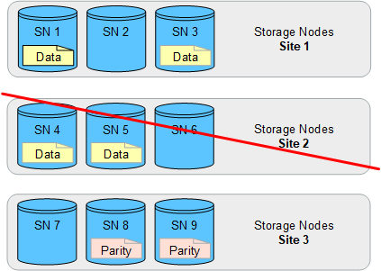

= Aktivieren Sie den Site-Loss-Schutz
:allow-uri-read: 
:icons: font
:imagesdir: ../media/

[role="lead"]
Wenn Ihre StorageGRID Bereitstellung mehr als einen Standort umfasst, können Sie Replikation und Erasure Coding mit entsprechend konfigurierten Speicherpools verwenden, um einen Schutz vor Standortverlust zu aktivieren.

Replikation und Erasure Coding erfordern unterschiedliche Speicherpoolkonfigurationen:

* Um die Replikation zum Schutz vor Site-Verlust zu nutzen, verwenden Sie die standortspezifischen Speicherpools, die während der StorageGRID -Installation automatisch erstellt werden.  Erstellen Sie anschließend ILM-Regeln mitlink:create-ilm-rule-define-placements.html["Platzierungsanweisungen"] die mehrere Speicherpools angeben, sodass an jedem Standort eine Kopie jedes Objekts abgelegt wird.
* Um Erasure Coding zum Schutz vor Site-Loss zu verwenden,link:guidelines-for-creating-storage-pools.html#guidelines-for-storage-pools-used-for-erasure-coded-copies["Erstellen Sie Speicherpools, die aus mehreren Sites bestehen"] .  Erstellen Sie dann ILM-Regeln, die einen Speicherpool verwenden, der aus mehreren Sites und allen verfügbaren Erasure-Coding-Schemata besteht.

CAUTION: Bei der Konfiguration Ihrer StorageGRID -Bereitstellung für den Site-Loss-Schutz müssen Sie auch die Auswirkungen vonlink:data-protection-options-for-ingest.html["Aufnahmeoptionen"] Undlink:../s3/consistency-controls.html["Konsistenz"] .

== Replikationsbeispiel

Standardmäßig wird während der StorageGRID -Installation für jede Site ein Speicherpool erstellt.  Wenn Sie über Speicherpools verfügen, die nur aus einem Standort bestehen, können Sie ILM-Regeln konfigurieren, die zum Schutz vor Standortverlust die Replikation verwenden. In diesem Beispiel:

* Speicherpool 1 enthält Standort 1
* Speicherpool 2 enthält Standort 2
* Die ILM-Regel enthält zwei Platzierungen:
+
** Speichern Sie Objekte, indem Sie 1 Kopie an Standort 1 replizieren
** Speichern Sie Objekte, indem Sie 1 Kopie an Standort 2 replizieren

ILM-Regelplatzierungen:

image::../media/ilm_replication_at_2_sites.png[Replizieren von jeweils 1 Kopie an 2 Standorten]

image::../media/ilm_replication_make_2_copies_2_pools_2_sites.png[Erstellen Sie an jedem der beiden Standorte eine Kopie – standortspezifischer Speicherpool]

Bei Verlust eines Standorts sind Kopien der Objekte am anderen Standort verfügbar.

== Beispiel für Erasure Coding

Wenn Sie über Speicherpools verfügen, die aus mehr als einem Standort pro Speicherpool bestehen, können Sie ILM-Regeln konfigurieren, die Erasure Coding zum Schutz vor Standortverlust verwenden. In diesem Beispiel:

* Speicherpool 1 enthält die Standorte 1 bis 3
* Die ILM-Regel enthält eine Platzierung: Speichern Sie Objekte durch Erasure Coding mit einem 4+2 EC-Schema im Speicherpool 1, der drei Standorte enthält

ILM-Regelplatzierungen:

image::../media/ilm_erasure_coding_site_loss_protection_4+2.png[EC 1 Speicherpool 9 Speicherknoten 3 Standorte]

In diesem Beispiel:

* Die ILM-Regel verwendet ein 4+2-Erasure-Coding-Schema.
* Jedes Objekt wird in vier gleiche Datenfragmente aufgeteilt und aus den Objektdaten werden zwei Paritätsfragmente berechnet.
* Jedes der sechs Fragmente wird auf einem anderen Knoten an drei Rechenzentrumsstandorten gespeichert, um Datenschutz bei Knotenausfällen oder Standortverlust zu gewährleisten.

NOTE: Erasure Coding ist in Speicherpools zulässig, die eine beliebige Anzahl von Standorten enthalten, _außer_ zwei Standorten.

ILM-Regel mit 4+2-Erasure-Coding-Schema:

image::../media/ec_three_sites_4_plus_2_site_loss_example_template.png[Speichern Sie Objekte durch Erasure Coding mit einem 4+2 EC-Schema an 3 Standorten]

Wenn eine Site verloren geht, können die Daten dennoch wiederhergestellt werden:

