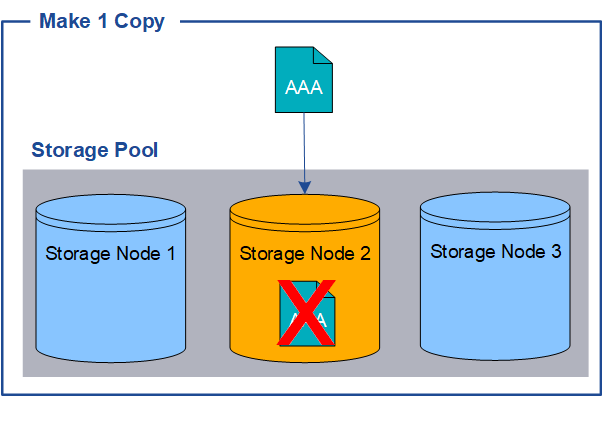
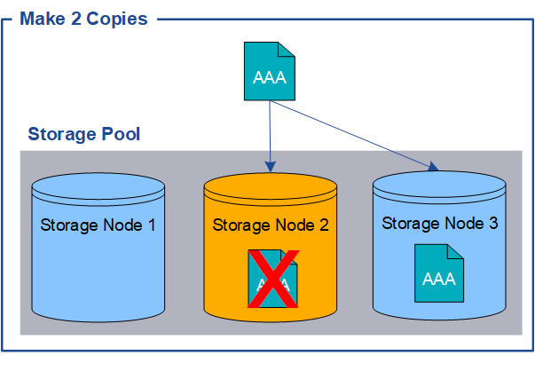

= Warum Sie keine Einzelkopiereplikation verwenden sollten
:allow-uri-read: 
:icons: font
:imagesdir: ../media/

[role="lead"]
Wenn Sie eine ILM-Regel zum Erstellen replizierter Kopien erstellen, sollten Sie in den Platzierungsanweisungen immer mindestens zwei Kopien für einen beliebigen Zeitraum angeben.

NOTE: Verwenden Sie keine ILM-Regel, die für einen bestimmten Zeitraum nur eine replizierte Kopie erstellt.  Wenn nur eine replizierte Kopie eines Objekts vorhanden ist, geht dieses Objekt verloren, wenn ein Speicherknoten ausfällt oder einen schwerwiegenden Fehler aufweist.  Auch während Wartungsvorgängen wie Upgrades verlieren Sie vorübergehend den Zugriff auf das Objekt.

Im folgenden Beispiel gibt die ILM-Regel „1 Kopie erstellen“ an, dass eine replizierte Kopie eines Objekts in einem Speicherpool abgelegt wird, der drei Speicherknoten enthält.  Wenn ein Objekt aufgenommen wird, das dieser Regel entspricht, platziert StorageGRID eine einzelne Kopie auf nur einem Speicherknoten.

image::../media/ilm_replication_make_1_copy.png[ILM-Replikation: 1 Kopie erstellen]

Wenn eine ILM-Regel nur eine replizierte Kopie eines Objekts erstellt, ist der Zugriff auf das Objekt nicht mehr möglich, wenn der Speicherknoten nicht verfügbar ist.  In diesem Beispiel verlieren Sie vorübergehend den Zugriff auf Objekt AAA, wenn Speicherknoten 2 offline ist, beispielsweise während eines Upgrades oder eines anderen Wartungsvorgangs.  Sie verlieren Objekt AAA vollständig, wenn Speicherknoten 2 ausfällt.

Um den Verlust von Objektdaten zu vermeiden, sollten Sie immer mindestens zwei Kopien aller Objekte erstellen, die Sie durch Replikation schützen möchten.  Wenn zwei oder mehr Kopien vorhanden sind, können Sie weiterhin auf das Objekt zugreifen, wenn ein Speicherknoten ausfällt oder offline geht.

