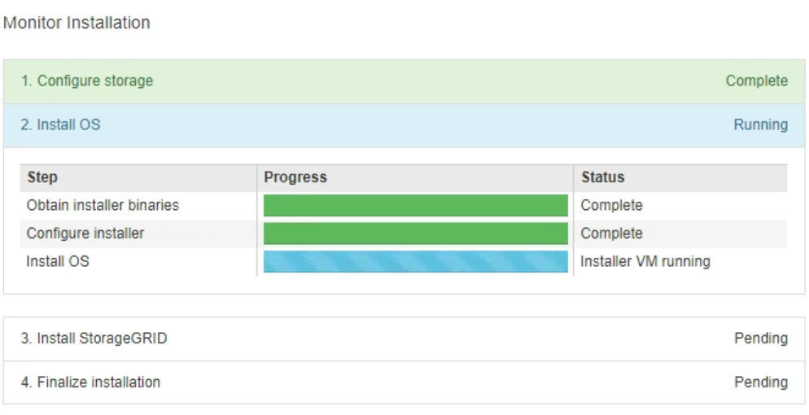

= Installation der Appliance für Überwachungsdienste
:allow-uri-read: 
:icons: font
:imagesdir: ../media/

[role="lead"]
Der StorageGRID Appliance Installer zeigt den Status an, bis die Installation abgeschlossen ist.  Wenn die Softwareinstallation abgeschlossen ist, wird das Gerät neu gestartet.

.Schritte
. Um den Installationsfortschritt zu überwachen, klicken Sie in der Menüleiste auf *Installation überwachen*.
+
Auf der Seite „Installation überwachen“ wird der Installationsfortschritt angezeigt.

+

+
Die blaue Statusleiste zeigt an, welche Aufgabe gerade ausgeführt wird.  Grüne Statusbalken zeigen Aufgaben an, die erfolgreich abgeschlossen wurden.

+

NOTE: Das Installationsprogramm stellt sicher, dass Aufgaben, die bei einer vorherigen Installation abgeschlossen wurden, nicht erneut ausgeführt werden.  Wenn Sie eine Installation erneut ausführen, werden alle Aufgaben, die nicht erneut ausgeführt werden müssen, mit einer grünen Statusleiste und dem Status „Übersprungen“ angezeigt.

. Überprüfen Sie den Fortschritt der ersten beiden Installationsphasen.
+
** *1.  Speicher konfigurieren*
+
Während dieser Phase löscht das Installationsprogramm alle vorhandenen Konfigurationen von den Laufwerken und konfiguriert die Hosteinstellungen.

** *2.  Betriebssystem installieren*
+
Während dieser Phase kopiert das Installationsprogramm das Basisbetriebssystem-Image für StorageGRID vom primären Admin-Knoten auf die Appliance oder installiert das Basisbetriebssystem aus dem Installationspaket für den primären Admin-Knoten.

. Überwachen Sie den Installationsfortschritt weiter, bis eines der folgenden Ereignisse eintritt:
+
** Bei Gateway-Knoten oder nicht primären Appliance-Admin-Knoten wird die Phase * StorageGRID installieren* angehalten und auf der eingebetteten Konsole wird eine Meldung angezeigt, in der Sie aufgefordert werden, diesen Knoten mithilfe des Grid Managers auf dem Admin-Knoten zu genehmigen.
+
image::../media/monitor_installation_install_sgws.gif[Das Bild wird durch den umgebenden Text beschrieben]

** Für primäre Admin-Knoten der Appliance wird eine fünfte Phase ( StorageGRID -Installationsprogramm laden) angezeigt.  Wenn die fünfte Phase länger als 10 Minuten dauert, aktualisieren Sie die Seite manuell.
+
image::../media/monitor_reinstallation_primary_admin.png[Screenshot der 5. Phase für die Neuinstallation des primären Admin-Knotens]

. Fahren Sie mit dem nächsten Schritt des Wiederherstellungsprozesses für den Typ des Appliance-Grid-Knotens fort, den Sie wiederherstellen.
+
[cols="1a,2a"]
|===
| Art der Wiederherstellung | Referenz 

 a| 
Gateway-Knoten
 a| 
link:selecting-start-recovery-to-configure-gateway-node.html["Wählen Sie „Wiederherstellung starten“, um den Gateway-Knoten zu konfigurieren."]

 a| 
Nicht-primärer Admin-Knoten
 a| 
link:selecting-start-recovery-to-configure-non-primary-admin-node.html["Wählen Sie „Wiederherstellung starten“, um den nicht primären Admin-Knoten zu konfigurieren"]

 a| 
Primärer Admin-Knoten
 a| 
link:configuring-replacement-primary-admin-node.html["Konfigurieren Sie den Ersatz-Primäradministratorknoten"]

|===

