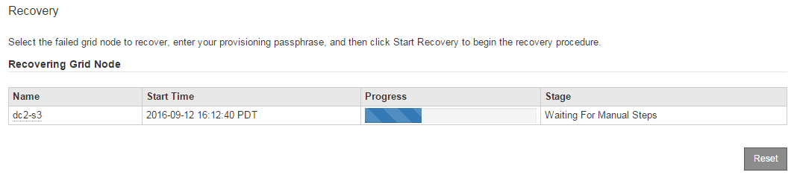

= Wählen Sie „Wiederherstellung starten“, um den Speicherknoten zu konfigurieren.
:allow-uri-read: 
:icons: font
:imagesdir: ../media/

[role="lead"]
Nachdem Sie einen Speicherknoten ersetzt haben, müssen Sie im Grid Manager „Wiederherstellung starten“ auswählen, um den neuen Knoten als Ersatz für den ausgefallenen Knoten zu konfigurieren.

.Bevor Sie beginnen
* Sie sind beim Grid Manager angemeldet mit einemlink:../admin/web-browser-requirements.html["unterstützter Webbrowser"] .
* Sie haben dielink:../admin/admin-group-permissions.html["Wartungs- oder Root-Zugriffsberechtigung"] .
* Sie haben die Bereitstellungspassphrase.
* Sie haben den Ersatzknoten bereitgestellt und konfiguriert.
* Sie verfügen über das Startdatum aller Reparaturaufträge für löschcodierte Daten.
* Sie haben überprüft, dass der Speicherknoten innerhalb der letzten 15 Tage nicht neu erstellt wurde.

.Informationen zu diesem Vorgang
Wenn der Speicherknoten als Container auf einem Linux-Host installiert ist, müssen Sie diesen Schritt nur ausführen, wenn einer der folgenden Punkte zutrifft:

* Sie mussten die `--force` Flag zum Importieren des Knotens, oder Sie haben `storagegrid node force-recovery _node-name_`
* Sie mussten eine vollständige Neuinstallation des Knotens durchführen oder /var/local wiederherstellen.

.Schritte
. Wählen Sie im Grid Manager *WARTUNG* > *Aufgaben* > *Wiederherstellung*.
. Wählen Sie in der Liste „Ausstehende Knoten“ den Grid-Knoten aus, den Sie wiederherstellen möchten.
+
Knoten werden in der Liste angezeigt, nachdem sie ausgefallen sind. Sie können einen Knoten jedoch erst auswählen, wenn er neu installiert wurde und zur Wiederherstellung bereit ist.

. Geben Sie die *Bereitstellungspassphrase* ein.
. Klicken Sie auf *Wiederherstellung starten*.
+
image::../media/4b_select_recovery_node.png[Screenshot der Seite „Wartung > Wiederherstellung“]

. Überwachen Sie den Fortschritt der Wiederherstellung in der Tabelle „Grid-Knoten wird wiederhergestellt“.
+

NOTE: Während der Wiederherstellungsvorgang läuft, können Sie auf *Zurücksetzen* klicken, um eine neue Wiederherstellung zu starten.  Es wird ein Dialogfeld angezeigt, das darauf hinweist, dass der Knoten in einem unbestimmten Zustand verbleibt, wenn Sie die Prozedur zurücksetzen.

+
image::../media/recovery_reset_warning.gif[Screenshot mit dem Dialogfeld „Wiederherstellung zurücksetzen“]

+
Wenn Sie die Wiederherstellung nach dem Zurücksetzen des Verfahrens wiederholen möchten, müssen Sie den Knoten wie folgt in einen vorinstallierten Zustand zurückversetzen:

+
** *VMware*: Löschen Sie den bereitgestellten virtuellen Grid-Knoten.  Wenn Sie dann bereit sind, die Wiederherstellung neu zu starten, stellen Sie den Knoten erneut bereit.
** *Linux*: Starten Sie den Knoten neu, indem Sie diesen Befehl auf dem Linux-Host ausführen: `storagegrid node force-recovery _node-name_`

. Wenn der Speicherknoten die Phase „Warten auf manuelle Schritte“ erreicht, gehen Sie zulink:remounting-and-reformatting-storage-volumes-manual-steps.html["Speichervolumes erneut mounten und neu formatieren (manuelle Schritte)"] .
+

