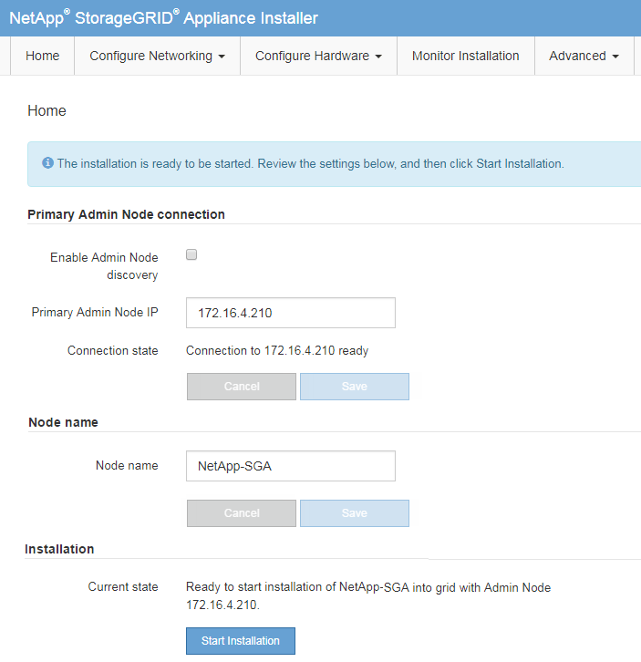

= Starten Sie die Installation der StorageGRID -Appliance
:allow-uri-read: 
:icons: font
:imagesdir: ../media/

[role="lead"]
Um StorageGRID auf einem Appliance-Speicherknoten zu installieren, verwenden Sie den StorageGRID Appliance Installer, der auf der Appliance enthalten ist.

.Bevor Sie beginnen
* Das Gerät wurde in einem Rack installiert, mit Ihren Netzwerken verbunden und eingeschaltet.
* Netzwerkverbindungen und IP-Adressen wurden für das Gerät mithilfe des StorageGRID Appliance Installer konfiguriert.
* Sie kennen die IP-Adresse des primären Admin-Knotens für das StorageGRID Grid.
* Alle auf der IP-Konfigurationsseite des StorageGRID Appliance Installer aufgeführten Grid-Netzwerk-Subnetze wurden in der Grid-Netzwerk-Subnetzliste auf dem primären Admin-Knoten definiert.
* Sie haben diese erforderlichen Aufgaben abgeschlossen, indem Sie die Installationsanweisungen für Ihr Speichergerät befolgt haben. Sehen https://docs.netapp.com/us-en/storagegrid-appliances/installconfig/index.html["Schnellstart für die Hardwareinstallation"^] .
* Sie verwenden einelink:../admin/web-browser-requirements.html["unterstützter Webbrowser"] .
* Sie kennen eine der dem Compute-Controller im Gerät zugewiesenen IP-Adressen.  Sie können die IP-Adresse für das Admin-Netzwerk (Verwaltungsport 1 am Controller), das Grid-Netzwerk oder das Client-Netzwerk verwenden.

.Informationen zu diesem Vorgang
So installieren Sie StorageGRID auf einem Appliance-Speicherknoten:

* Sie geben die IP-Adresse des primären Admin-Knotens und den Hostnamen (Systemnamen) des Knotens an oder bestätigen diese.
* Sie starten die Installation und warten, während die Volumes konfiguriert und die Software installiert wird.
+

NOTE: Wenn Sie einen Appliance-Speicherknoten wiederherstellen, installieren Sie ihn mit demselben Speichertyp wie die ursprüngliche Appliance neu (Kombiniert, Nur Metadaten oder Nur Daten). Wenn Sie einen anderen Speichertyp angeben, schlägt die Wiederherstellung fehl und erfordert eine Neuinstallation der Appliance mit dem richtigen angegebenen Speichertyp.

* Während des Vorgangs wird die Installation unterbrochen.  Um die Installation fortzusetzen, müssen Sie sich beim Grid Manager anmelden und den ausstehenden Speicherknoten als Ersatz für den ausgefallenen Knoten konfigurieren.
* Nachdem Sie den Knoten konfiguriert haben, wird der Installationsprozess der Appliance abgeschlossen und die Appliance neu gestartet.

.Schritte
. Öffnen Sie einen Browser und geben Sie eine der IP-Adressen für den Compute Controller im Gerät ein.
+
`https://_Controller_IP_:8443`

+
Die Startseite des StorageGRID Appliance-Installationsprogramms wird angezeigt.

. Legen Sie im Abschnitt „Verbindung zum primären Admin-Knoten“ fest, ob Sie die IP-Adresse für den primären Admin-Knoten angeben müssen.
+
Das StorageGRID Appliance Installer kann diese IP-Adresse automatisch erkennen, vorausgesetzt, der primäre Admin-Knoten oder mindestens ein anderer Grid-Knoten mit konfigurierter ADMIN_IP ist im selben Subnetz vorhanden.

. Wenn diese IP-Adresse nicht angezeigt wird oder Sie sie ändern müssen, geben Sie die Adresse an:
+
[cols="1a,2a"]
|===
| Option | Schritte 

 a| 
Manuelle IP-Eingabe
 a| 
.. Deaktivieren Sie das Kontrollkästchen *Admin-Knotenerkennung aktivieren*.
.. Geben Sie die IP-Adresse manuell ein.
.. Klicken Sie auf *Speichern*.
.. Warten Sie, bis der Verbindungsstatus für die neue IP-Adresse „Bereit“ lautet.

 a| 
Automatische Erkennung aller verbundenen primären Admin-Knoten
 a| 
.. Aktivieren Sie das Kontrollkästchen *Admin-Knotenerkennung aktivieren*.
.. Wählen Sie aus der Liste der erkannten IP-Adressen den primären Admin-Knoten für das Grid aus, in dem dieser Appliance-Speicherknoten bereitgestellt wird.
.. Klicken Sie auf *Speichern*.
.. Warten Sie, bis der Verbindungsstatus für die neue IP-Adresse „Bereit“ lautet.

|===
. Geben Sie im Feld *Knotenname* denselben Hostnamen (Systemnamen) ein, der für den Knoten verwendet wurde, den Sie wiederherstellen, und klicken Sie auf *Speichern*.
. Bestätigen Sie im Abschnitt Installation, dass der aktuelle Status „Bereit zum Starten der Installation von `_node name_` in das Grid mit dem primären Admin-Knoten „_admin_ip_“ und dass die Schaltfläche „Installation starten“ aktiviert ist.
+
Wenn die Schaltfläche *Installation starten* nicht aktiviert ist, müssen Sie möglicherweise die Netzwerkkonfiguration oder die Porteinstellungen ändern.  Anweisungen hierzu finden Sie in der Wartungsanleitung Ihres Geräts.

. Klicken Sie auf der Startseite des StorageGRID Appliance Installer auf *Installation starten*.
+

+
Der aktuelle Status ändert sich in „Installation läuft“ und die Seite „Monitorinstallation“ wird angezeigt.

+

NOTE: Wenn Sie manuell auf die Seite „Monitorinstallation“ zugreifen müssen, klicken Sie in der Menüleiste auf „Monitorinstallation“. Sehen https://docs.netapp.com/us-en/storagegrid-appliances/installconfig/monitoring-appliance-installation.html["Überwachen Sie die Installation der Appliance"^] .

