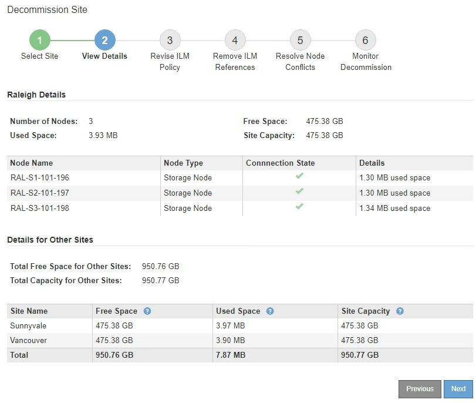

= Schritt 2: Details anzeigen
:allow-uri-read: 
:icons: font
:imagesdir: ../media/

[role="lead"]
In Schritt 2 (Details anzeigen) des Assistenten „Site außer Betrieb nehmen“ können Sie überprüfen, welche Knoten in der Site enthalten sind, sehen, wie viel Speicherplatz auf jedem Speicherknoten verwendet wurde, und beurteilen, wie viel freier Speicherplatz an den anderen Sites in Ihrem Grid verfügbar ist.

.Bevor Sie beginnen
Bevor Sie eine Site außer Betrieb nehmen, müssen Sie überprüfen, wie viele Objektdaten an der Site vorhanden sind.

* Wenn Sie die Außerbetriebnahme einer verbundenen Site durchführen, müssen Sie wissen, wie viele Objektdaten derzeit an der Site vorhanden sind, bevor Sie ILM aktualisieren.  Basierend auf den Standortkapazitäten und Ihren Datenschutzanforderungen können Sie neue ILM-Regeln erstellen, um Daten an andere Standorte zu verschieben oder Objektdaten vom Standort zu löschen.
* Führen Sie nach Möglichkeit alle erforderlichen Speicherknotenerweiterungen durch, bevor Sie mit der Außerbetriebnahme beginnen.
* Wenn Sie eine getrennte Site außer Betrieb nehmen, müssen Sie sich darüber im Klaren sein, wie viele Objektdaten durch die Entfernung der Site dauerhaft unzugänglich werden.

CAUTION: Wenn Sie eine getrennte Site außer Betrieb nehmen, kann ILM keine Objektdaten verschieben oder löschen.  Alle auf der Site verbleibenden Daten gehen verloren.  Wenn Ihre ILM-Richtlinie jedoch zum Schutz vor dem Verlust einer einzelnen Site konzipiert wurde, sind auf den verbleibenden Sites weiterhin Kopien Ihrer Objektdaten vorhanden. Sehen link:../ilm/using-multiple-storage-pools-for-cross-site-replication.html["Aktivieren Sie den Site-Loss-Schutz"] .

.Schritte
. Überprüfen Sie ab Schritt 2 (Details anzeigen) alle Warnungen im Zusammenhang mit der Site, die Sie zum Entfernen ausgewählt haben.
+
image::../media/decommission_site_step_2_site_warnings.png[Außerbetriebnahme des Standorts – Schritt 2 – Standortwarnungen]

+
In diesen Fällen wird eine Warnung angezeigt:

+
** Die Site umfasst einen Gateway-Knoten.  Wenn S3-Clients derzeit eine Verbindung zu diesem Knoten herstellen, müssen Sie einen entsprechenden Knoten an einem anderen Standort konfigurieren.  Stellen Sie sicher, dass Clients eine Verbindung zum Ersatzknoten herstellen können, bevor Sie mit der Außerbetriebnahme fortfahren.
** Die Site enthält eine Mischung aus verbundenen (image:../media/icon_alert_green_checkmark.png["Symbol Alarm Grünes Häkchen"] ) und getrennte Knoten (image:../media/icon_alarm_gray_administratively_down.png["Symbol Alarm Grau Administrativ Heruntergefahren"] oderimage:../media/icon_alarm_blue_unknown.png["Symbol Alarm Blau Unbekannt"] ).  Bevor Sie diese Site entfernen können, müssen Sie alle Offline-Knoten wieder online bringen.

. Überprüfen Sie die Details der Site, die Sie zum Entfernen ausgewählt haben.
+

+
Für den ausgewählten Standort sind folgende Informationen enthalten:

+
** Anzahl der Knoten
** Der insgesamt genutzte Speicherplatz, der freie Speicherplatz und die Kapazität aller Speicherknoten am Standort.
+
*** Bei der Außerbetriebnahme eines verbundenen Standorts gibt der Wert „Verwendeter Speicherplatz“ an, wie viele Objektdaten an andere Standorte verschoben oder mit ILM gelöscht werden müssen.
*** Bei der Außerbetriebnahme einer getrennten Site gibt der Wert „Benutzter Speicherplatz“ an, wie viele Objektdaten nicht mehr zugänglich sind, wenn Sie die Site entfernen.

** Knotennamen, Typen und Verbindungszustände:
+
*** image:../media/icon_alert_green_checkmark.png["Symbol Alarm Grünes Häkchen"](Verbunden)
*** image:../media/icon_alarm_gray_administratively_down.png["Symbol Alarm Grau Administrativ Heruntergefahren"](Administrativ nicht erreichbar)
*** image:../media/icon_alarm_blue_unknown.png["Symbol Alarm Blau Unbekannt"](Unbekannt)

** Details zu jedem Knoten:
+
*** Für jeden Speicherknoten die Menge an Speicherplatz, die für Objektdaten verwendet wurde.
*** Bei Admin-Knoten und Gateway-Knoten: Ob der Knoten derzeit in einer Hochverfügbarkeitsgruppe (HA) verwendet wird.  Sie können einen Admin-Knoten oder Gateway-Knoten, der in einer HA-Gruppe verwendet wird, nicht außer Betrieb nehmen.  Bevor Sie mit der Außerbetriebnahme beginnen, bearbeiten Sie HA-Gruppen, um alle Knoten am Standort zu entfernen, oder entfernen Sie die HA-Gruppe, wenn sie nur Knoten von diesem Standort enthält. Anweisungen hierzu finden Sie unterlink:../admin/managing-high-availability-groups.html["Verwalten von Hochverfügbarkeitsgruppen (HA)"] .

. Prüfen Sie im Abschnitt „Details für andere Sites“ der Seite, wie viel Platz an den anderen Sites in Ihrem Raster verfügbar ist.
+
image::../media/decommission_site_step_2_view_details_for_other_sites.png[Außerbetriebnahme des Standorts, Schritt 2. Details für andere Standorte anzeigen]

+
Wenn Sie eine verbundene Site außer Betrieb nehmen und ILM zum Verschieben von Objektdaten von der ausgewählten Site verwenden möchten (anstatt sie einfach zu löschen), müssen Sie sicherstellen, dass die anderen Sites über genügend Kapazität verfügen, um die verschobenen Daten aufzunehmen, und dass ausreichend Kapazität für zukünftiges Wachstum verbleibt.

+

NOTE: Eine Warnung wird angezeigt, wenn der *belegte Speicherplatz* für die Site, die Sie entfernen möchten, größer ist als der *gesamte freie Speicherplatz für andere Sites*.  Um sicherzustellen, dass nach der Entfernung der Site ausreichend Speicherkapazität zur Verfügung steht, müssen Sie möglicherweise vor der Durchführung dieses Verfahrens eine Erweiterung durchführen.

. Wählen Sie *Weiter*.
+
Schritt 3 (ILM-Richtlinie überarbeiten) wird angezeigt.

