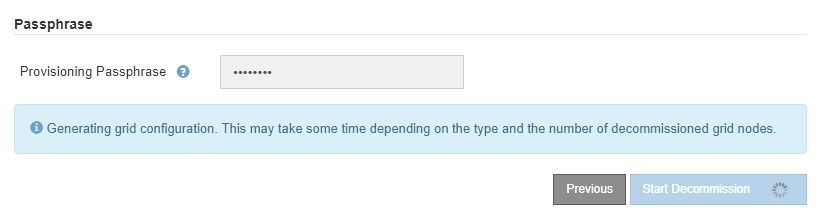

= Schritt 5: Knotenkonflikte lösen (und Außerbetriebnahme starten)
:allow-uri-read: 
:icons: font
:imagesdir: ../media/

[role="lead"]
In Schritt 5 (Knotenkonflikte lösen) des Assistenten „Site außer Betrieb nehmen“ können Sie feststellen, ob Knoten in Ihrem StorageGRID -System getrennt sind oder ob Knoten an der ausgewählten Site zu einer Hochverfügbarkeitsgruppe (HA) gehören.  Nachdem alle Knotenkonflikte gelöst wurden, starten Sie den Außerbetriebnahmevorgang von dieser Seite aus.

.Bevor Sie beginnen
Sie müssen sicherstellen, dass sich alle Knoten in Ihrem StorageGRID -System wie folgt im richtigen Zustand befinden:

* Alle Knoten in Ihrem StorageGRID -System müssen verbunden sein (image:../media/icon_alert_green_checkmark.png["Symbol Alarm Grünes Häkchen"] ).
+

NOTE: Wenn Sie die Außerbetriebnahme eines getrennten Standorts durchführen, müssen alle Knoten am Standort, den Sie entfernen, getrennt und alle Knoten an allen anderen Standorten verbunden werden.

+

NOTE: Die Außerbetriebnahme wird nicht gestartet, wenn ein oder mehrere Volumes offline (nicht gemountet) sind oder wenn sie online (gemountet) sind, sich aber in einem Fehlerzustand befinden.

+

NOTE: Wenn während einer Außerbetriebnahme ein oder mehrere Volumes offline gehen, wird der Außerbetriebnahmevorgang abgeschlossen, nachdem diese Volumes wieder online sind.

* Kein Knoten an der Site, die Sie entfernen, darf über eine Schnittstelle verfügen, die zu einer Hochverfügbarkeitsgruppe (HA) gehört.

.Informationen zu diesem Vorgang
Wenn für Schritt 5 (Knotenkonflikte lösen) ein beliebiger Knoten aufgeführt ist, müssen Sie das Problem beheben, bevor Sie mit der Außerbetriebnahme beginnen können.

Bevor Sie mit der Außerbetriebnahme der Site auf dieser Seite beginnen, lesen Sie die folgenden Hinweise:

* Sie müssen ausreichend Zeit einplanen, damit der Außerbetriebnahmevorgang abgeschlossen werden kann.
+

NOTE: Das Verschieben oder Löschen von Objektdaten von einer Site kann Tage, Wochen oder sogar Monate dauern, abhängig von der Datenmenge an der Site, der Auslastung Ihres Systems, den Netzwerklatenzen und der Art der erforderlichen ILM-Änderungen.

* Während das Verfahren zur Außerbetriebnahme des Standorts läuft:
+
** Sie können keine ILM-Regeln erstellen, die sich auf die Außerbetriebnahme der Site beziehen.  Sie können auch keine vorhandene ILM-Regel bearbeiten, um auf die Site zu verweisen.
** Sie können keine anderen Wartungsvorgänge wie Erweiterungen oder Upgrades durchführen.
+

NOTE: Wenn Sie während der Außerbetriebnahme einer verbundenen Site ein weiteres Wartungsverfahren durchführen müssen, können Sie das Verfahren anhalten, während die Speicherknoten entfernt werden.  Die Schaltfläche *Pause* ist während der Phase „Außerbetriebnahme replizierter und Erasure-Coded-Daten“ aktiviert.

** Wenn Sie nach dem Start des Site-Außerbetriebnahmeverfahrens einen Knoten wiederherstellen müssen, müssen Sie sich an den Support wenden.

.Schritte
. Überprüfen Sie den Abschnitt zu getrennten Knoten in Schritt 5 (Knotenkonflikte lösen), um festzustellen, ob Knoten in Ihrem StorageGRID -System den Verbindungsstatus „Unbekannt“ aufweisen (image:../media/icon_alarm_blue_unknown.png["Symbol Alarm Blau Unbekannt"] ) oder „Administrativ deaktiviert“ (image:../media/icon_alarm_gray_administratively_down.png["Symbol Alarm Grau Administrativ Heruntergefahren"] ).
+
image::../media/decommission_site_step_5_disconnected_nodes.png[Außerbetriebnahme der Site – Schritt 5: Knotenkonflikte lösen]

. Wenn Knoten getrennt werden, bringen Sie sie wieder online.
+
Siehe dielink:../maintain/grid-node-procedures.html["Knotenprozeduren"] . Wenden Sie sich an den technischen Support, wenn Sie Hilfe benötigen.

. Wenn alle getrennten Knoten wieder online gebracht wurden, lesen Sie den Abschnitt „HA-Gruppen“ in Schritt 5 (Knotenkonflikte lösen).
+
In dieser Tabelle sind alle Knoten am ausgewählten Standort aufgeführt, die zu einer Hochverfügbarkeitsgruppe (HA) gehören.

+
image::../media/decommission_site_step_5_ha_groups.png[Außerbetriebnahme von Site-Schritt 5: HA-Gruppen]

. Wenn Knoten aufgelistet sind, führen Sie einen der folgenden Schritte aus:
+
** Bearbeiten Sie jede betroffene HA-Gruppe, um die Knotenschnittstelle zu entfernen.
** Entfernen Sie eine HA-Gruppe, die nur Knoten von dieser Site enthält.  Siehe die Anweisungen zur Verwaltung von StorageGRID.

+
Wenn alle Knoten verbunden sind und keine Knoten am ausgewählten Standort in einer HA-Gruppe verwendet werden, ist das Feld *Bereitstellungspassphrase* aktiviert.

. Geben Sie die Bereitstellungspassphrase ein.
+
Die Schaltfläche *Außerbetriebnahme starten* wird aktiviert.

+
image::../media/decommission_site_step_5_provision_passphrase.png[Site außer Betrieb nehmen – Schritt 5: Passphrase bereitstellen]

. Wenn Sie bereit sind, mit der Außerbetriebnahme der Site zu beginnen, wählen Sie *Außerbetriebnahme starten*.
+
In einer Warnung werden die Site und Knoten aufgelistet, die entfernt werden.  Sie werden daran erinnert, dass es Tage, Wochen oder sogar Monate dauern kann, bis die Site vollständig entfernt ist.

+
image::../media/decommission_site_step_5_warning.png[Warnung zu Schritt 5 der Außerbetriebnahme des Standorts]

. Lesen Sie die Warnung.  Wenn Sie bereit sind zu beginnen, wählen Sie *OK*.
+
Während die neue Rasterkonfiguration generiert wird, wird eine Meldung angezeigt.  Dieser Vorgang kann je nach Art und Anzahl der stillgelegten Netzknoten einige Zeit in Anspruch nehmen.

+

+
Wenn die neue Netzkonfiguration erstellt wurde, wird Schritt 6 (Monitor-Außerbetriebnahme) angezeigt.

+

NOTE: Die Schaltfläche *Zurück* bleibt deaktiviert, bis die Außerbetriebnahme abgeschlossen ist.

