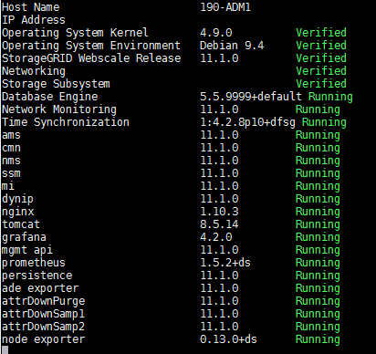

= Aktuellen Status aller Dienste anzeigen
:allow-uri-read: 
:icons: font
:imagesdir: ../media/

[role="lead"]
Sie können jederzeit den aktuellen Status aller auf einem Grid-Knoten laufenden Dienste einsehen.

.Bevor Sie beginnen
Sie haben die `Passwords.txt` Datei.

.Schritte
. Melden Sie sich beim Grid-Knoten an:
+
.. Geben Sie den folgenden Befehl ein: `ssh admin@_grid_node_IP_`
.. Geben Sie das Passwort ein, das in der `Passwords.txt` Datei.
.. Geben Sie den folgenden Befehl ein, um zum Root zu wechseln: `su -`
.. Geben Sie das Passwort ein, das in der `Passwords.txt` Datei.

+
Wenn Sie als Root angemeldet sind, ändert sich die Eingabeaufforderung von `$` Zu `#` .

. Zeigen Sie den Status aller auf dem Grid-Knoten ausgeführten Dienste an: `storagegrid-status`
+
Beispielsweise zeigt die Ausgabe für den primären Admin-Knoten den aktuellen Status der AMS-, CMN- und NMS-Dienste als „Ausgeführt“ an.  Diese Ausgabe wird sofort aktualisiert, wenn sich der Status eines Dienstes ändert.

+

. Kehren Sie zur Befehlszeile zurück und drücken Sie *Strg*+*C*.
. Optional können Sie einen statischen Bericht für alle auf dem Grid-Knoten ausgeführten Dienste anzeigen: `/usr/local/servermanager/reader.rb`
+
Dieser Bericht enthält dieselben Informationen wie der kontinuierlich aktualisierte Bericht, wird jedoch nicht aktualisiert, wenn sich der Status eines Dienstes ändert.

. Melden Sie sich von der Befehlsshell ab: `exit`

