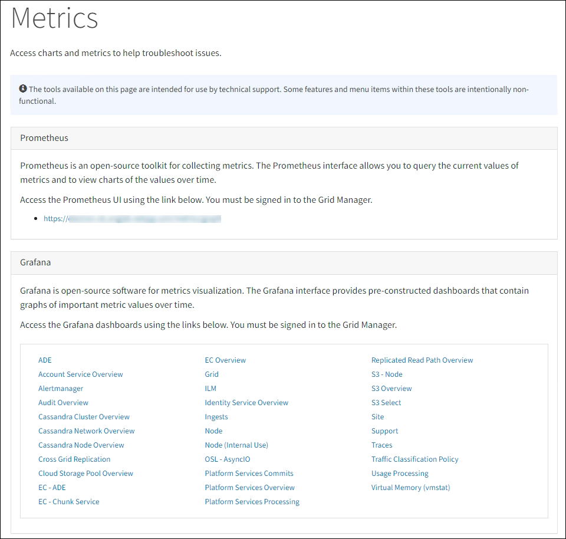

= Überprüfen der Supportmetriken
:allow-uri-read: 
:icons: font
:imagesdir: ../media/

[role="lead"]
Bei der Fehlerbehebung können Sie mit dem technischen Support zusammenarbeiten, um detaillierte Messwerte und Diagramme für Ihr StorageGRID System zu überprüfen.

.Bevor Sie beginnen
* Sie müssen beim Grid Manager mit einemlink:../admin/web-browser-requirements.html["unterstützter Webbrowser"] .
* Du hastlink:../admin/admin-group-permissions.html["spezifische Zugriffsberechtigungen"] .

.Informationen zu diesem Vorgang
Über die Seite „Metriken“ können Sie auf die Benutzeroberflächen von Prometheus und Grafana zugreifen.  Prometheus ist eine Open-Source-Software zum Sammeln von Metriken.  Grafana ist eine Open-Source-Software zur Visualisierung von Metriken.

NOTE: Die auf der Seite „Metriken“ verfügbaren Tools sind für die Verwendung durch den technischen Support vorgesehen.  Einige Funktionen und Menüelemente dieser Tools sind absichtlich nicht funktionsfähig und können sich ändern.  Siehe die Liste derlink:commonly-used-prometheus-metrics.html["häufig verwendete Prometheus-Metriken"] .

.Schritte
. Wählen Sie gemäß den Anweisungen des technischen Supports *SUPPORT* > *Tools* > *Metriken*.
+
Ein Beispiel für die Seite „Metriken“ wird hier angezeigt:

+

. Um die aktuellen Werte der StorageGRID -Metriken abzufragen und Diagramme der Werte im Zeitverlauf anzuzeigen, klicken Sie auf den Link im Abschnitt „Prometheus“.
+
Die Prometheus-Oberfläche wird angezeigt.  Sie können diese Schnittstelle verwenden, um Abfragen zu den verfügbaren StorageGRID -Metriken auszuführen und StorageGRID -Metriken im Zeitverlauf grafisch darzustellen.

+

NOTE: Metriken, deren Namen „_private_“ enthalten, sind nur für den internen Gebrauch bestimmt und können zwischen StorageGRID Versionen ohne Vorankündigung geändert werden.

. Um auf vorgefertigte Dashboards mit Diagrammen der StorageGRID -Metriken im Zeitverlauf zuzugreifen, klicken Sie auf die Links im Abschnitt „Grafana“.
+
Die Grafana-Schnittstelle für den von Ihnen ausgewählten Link wird angezeigt.

+
image::../media/metrics_page_grafana.png[Metrikseite Grafana]

