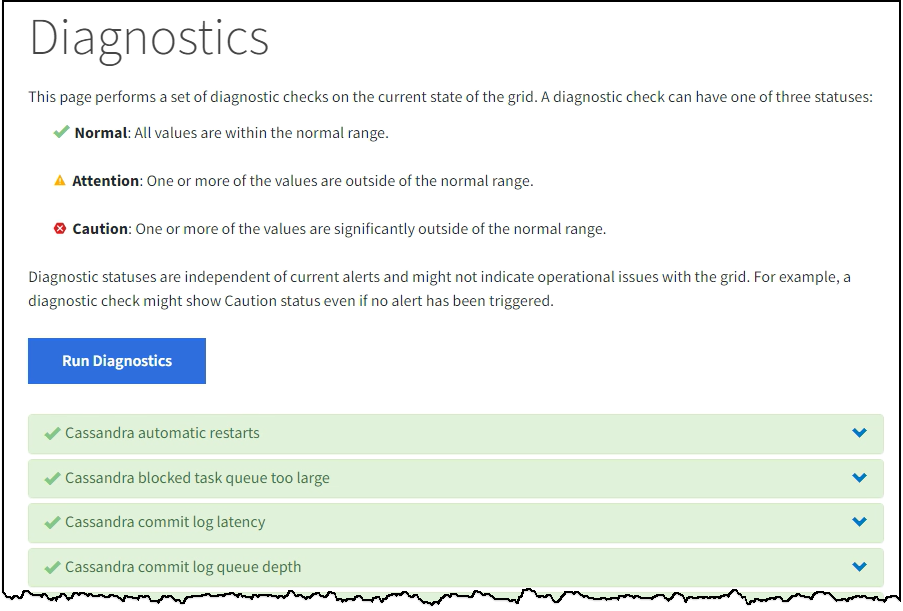

= Diagnose ausführen
:allow-uri-read: 
:icons: font
:imagesdir: ../media/

[role="lead"]
Bei der Fehlerbehebung können Sie mit dem technischen Support zusammenarbeiten, um eine Diagnose Ihres StorageGRID -Systems durchzuführen und die Ergebnisse zu überprüfen.

* link:reviewing-support-metrics.html["Überprüfen der Supportmetriken"]
* link:commonly-used-prometheus-metrics.html["Häufig verwendete Prometheus-Metriken"]

.Bevor Sie beginnen
* Sie sind beim Grid Manager angemeldet mit einemlink:../admin/web-browser-requirements.html["unterstützter Webbrowser"] .
* Du hastlink:../admin/admin-group-permissions.html["spezifische Zugriffsberechtigungen"] .

.Informationen zu diesem Vorgang
Auf der Seite „Diagnose“ wird eine Reihe von Diagnoseprüfungen zum aktuellen Status des Rasters durchgeführt.  Jede Diagnoseprüfung kann einen von drei Status haben:

* image:../media/icon_alert_green_checkmark.png["Symbol Alarm Grünes Häkchen"]*Normal*: Alle Werte liegen im Normalbereich.
* image:../media/icon_alert_yellow_minor.png["Symbol Warnung Gelb Geringfügig"]*Achtung*: Einer oder mehrere Werte liegen außerhalb des Normalbereichs.
* image:../media/icon_alert_red_critical.png["Symbol Alarm Rot Kritisch"]*Achtung*: Einer oder mehrere Werte liegen deutlich außerhalb des Normalbereichs.

Diagnosestatus sind unabhängig von aktuellen Warnungen und weisen möglicherweise nicht auf Betriebsprobleme mit dem Netz hin.  Beispielsweise kann eine Diagnoseprüfung den Status „Vorsicht“ anzeigen, auch wenn kein Alarm ausgelöst wurde.

.Schritte
. Wählen Sie *SUPPORT* > *Tools* > *Diagnose*.
+
Die Seite „Diagnose“ wird angezeigt und listet die Ergebnisse für jede Diagnoseprüfung auf.  Die Ergebnisse werden nach Schweregrad sortiert (Vorsicht, Achtung und dann Normal).  Innerhalb jedes Schweregrads werden die Ergebnisse alphabetisch sortiert.

+
In diesem Beispiel haben alle Diagnosen den Status „Normal“.

+

. Um mehr über eine bestimmte Diagnose zu erfahren, klicken Sie irgendwo in die Zeile.
+
Es werden Details zur Diagnose und ihren aktuellen Ergebnissen angezeigt.  Die folgenden Details sind aufgeführt:

+
** *Status*: Der aktuelle Status dieser Diagnose: Normal, Achtung oder Vorsicht.
** *Prometheus-Abfrage*: Falls für die Diagnose verwendet, der Prometheus-Ausdruck, der zum Generieren der Statuswerte verwendet wurde.  (Nicht für alle Diagnosen wird ein Prometheus-Ausdruck verwendet.)
** *Schwellenwerte*: Sofern für die Diagnose verfügbar, die systemdefinierten Schwellenwerte für jeden abnormalen Diagnosestatus.  (Schwellenwerte werden nicht für alle Diagnosen verwendet.)
+

NOTE: Sie können diese Schwellenwerte nicht ändern.

** *Statuswerte*: Eine Tabelle, die den Status und den Wert der Diagnose im gesamten StorageGRID -System anzeigt. In diesem Beispiel wird die aktuelle CPU-Auslastung für jeden Knoten in einem StorageGRID -System angezeigt. Alle Knotenwerte liegen unter den Schwellenwerten „Achtung“ und „Vorsicht“, sodass der Gesamtstatus der Diagnose „Normal“ ist.

+
image::../media/support_diagnostics_cpu_utilization.png[Supportdiagnose CPU-Auslastung]

. *Optional*: Um Grafana-Diagramme im Zusammenhang mit dieser Diagnose anzuzeigen, klicken Sie auf den Link *Grafana-Dashboard*.
+
Dieser Link wird nicht für alle Diagnosen angezeigt.

+
Das zugehörige Grafana-Dashboard wird angezeigt. In diesem Beispiel wird das Knoten-Dashboard angezeigt, das die CPU-Auslastung im Zeitverlauf für diesen Knoten sowie andere Grafana-Diagramme für den Knoten anzeigt.

+

NOTE: Sie können auch über den Abschnitt „Grafana“ auf der Seite *SUPPORT* > *Tools* > *Metriken* auf die vorgefertigten Grafana-Dashboards zugreifen.

+
image::../media/grafana_dashboard_nodes.png[Grafana Dashboard-Knoten]

. *Optional*: Um ein Diagramm des Prometheus-Ausdrucks im Zeitverlauf anzuzeigen, klicken Sie auf *In Prometheus anzeigen*.
+
Es wird ein Prometheus-Diagramm des in der Diagnose verwendeten Ausdrucks angezeigt.

+
image::../media/support_diagnostics_prometheus_png.png[Support-Diagnose Prometheus-Seite]

