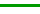

= Verwenden Sie Diagramme und Grafiken
:allow-uri-read: 
:icons: font
:imagesdir: ../media/

[role="lead"]
Mithilfe von Diagrammen und Berichten können Sie den Zustand des StorageGRID -Systems überwachen und Probleme beheben.

NOTE: Der Grid Manager wird mit jeder Version aktualisiert und stimmt möglicherweise nicht mit den Beispiel-Screenshots auf dieser Seite überein.

== Diagrammtypen

Diagramme und Grafiken fassen die Werte bestimmter StorageGRID -Metriken und -Attribute zusammen.

Das Grid Manager-Dashboard enthält Karten, die den verfügbaren Speicher für das Grid und jede Site zusammenfassen.

image::../media/dashboard_data_and_metadata_space_usage_breakdown.png[Aufschlüsselung der Speicherplatznutzung für Dashboard-Daten und Metadaten]

Das Speichernutzungsfenster im Tenant Manager-Dashboard zeigt Folgendes an:

* Eine Liste der größten Buckets (S3) oder Container (Swift) für den Mandanten
* Ein Balkendiagramm, das die relativen Größen der größten Eimer oder Behälter darstellt
* Die insgesamt verwendete Speicherplatzmenge und, falls ein Kontingent festgelegt ist, die Menge und der Prozentsatz des verbleibenden Speicherplatzes

image::../media/tenant_dashboard_with_buckets.png[Mandanten-Dashboard]

Darüber hinaus sind auf der Seite „Knoten“ und auf der Seite *SUPPORT* > *Tools* > *Grid-Topologie* Diagramme verfügbar, die zeigen, wie sich die Metriken und Attribute von StorageGRID im Laufe der Zeit ändern.

Es gibt vier Arten von Diagrammen:

* *Grafana-Diagramme*: Die auf der Knotenseite angezeigten Grafana-Diagramme werden verwendet, um die Werte der Prometheus-Metriken im Zeitverlauf darzustellen.  Beispielsweise enthält die Registerkarte *NODES* > *Network* für einen Storage Node ein Grafana-Diagramm für den Netzwerkverkehr.
+
image::../media/nodes_page_network_tab.png[Knotenseite Registerkarte „Netzwerk“]

+

NOTE: Grafana-Diagramme sind auch in den vorgefertigten Dashboards enthalten, die auf der Seite *SUPPORT* > *Tools* > *Metriken* verfügbar sind.

* *Liniendiagramme*: Verfügbar auf der Knotenseite und auf der Seite *SUPPORT* > *Tools* > *Gittertopologie* (wählen Sie das Diagrammsymbolimage:../media/icon_chart_new_for_11_5.png["Symboldiagramm (Neu)"] nach einem Datenwert) werden Liniendiagramme verwendet, um die Werte von StorageGRID -Attributen darzustellen, die einen Einheitswert haben (z. B. NTP-Frequenzversatz in ppm).  Die Wertänderungen werden in regelmäßigen Datenintervallen (Bins) über die Zeit aufgetragen.
+
image::../media/line_graph.gif[Liniendiagramm]

* *Flächendiagramme*: Verfügbar auf der Seite Knoten und auf der Seite *SUPPORT* > *Tools* > *Gittertopologie* (wählen Sie das Diagrammsymbolimage:../media/icon_chart_new_for_11_5.png["Symboldiagramm (Neu)"] nach einem Datenwert) werden Flächendiagramme verwendet, um volumetrische Attributmengen wie Objektanzahlen oder Betriebslastwerte darzustellen.  Flächendiagramme ähneln Liniendiagrammen, weisen jedoch unterhalb der Linie eine hellbraune Schattierung auf.  Die Wertänderungen werden in regelmäßigen Datenintervallen (Bins) über die Zeit aufgetragen.
+
image::../media/area_graph.gif[Flächendiagramm]

* Einige Diagramme sind mit einem anderen Diagrammsymbol gekennzeichnetimage:../media/icon_chart_new_for_11_5.png["Diagrammsymbol"] und haben ein anderes Format:
+
image::../media/charts_lost_object_detected.png[Diagramme Verlorenes Objekt erkannt]

* *Zustandsdiagramm*: Verfügbar auf der Seite *SUPPORT* > *Tools* > *Gittertopologie* (wählen Sie das Diagrammsymbolimage:../media/icon_chart_new_for_11_5.png["Symboldiagramm (Neu)"] nach einem Datenwert) werden Zustandsdiagramme verwendet, um Attributwerte darzustellen, die unterschiedliche Zustände darstellen, wie z. B. einen Dienstzustand, der online, Standby oder offline sein kann.  Zustandsgraphen ähneln Liniengraphen, der Übergang ist jedoch diskontinuierlich, d. h. der Wert springt von einem Zustandswert zum anderen.
+
image::../media/state_graph.gif[Zustandsgraph]

.Ähnliche Informationen
* link:viewing-nodes-page.html["Anzeigen der Seite „Knoten“"]
* link:viewing-grid-topology-tree.html["Den Netztopologie-Baum anzeigen"]
* link:reviewing-support-metrics.html["Überprüfen der Supportmetriken"]

== Diagrammlegende

Die zum Zeichnen von Diagrammen verwendeten Linien und Farben haben eine bestimmte Bedeutung.

[cols="1a,3a"]
|===
| Beispiel | Bedeutung 

 a| 

 a| 
Die gemeldeten Attributwerte werden mithilfe dunkelgrüner Linien dargestellt.

 a| 
image:../media/light_green_chart_line.gif["Screenshot mit Schattierung, die auf Daten-Binning hinweist"]
 a| 
Eine hellgrüne Schattierung um dunkelgrüne Linien weist darauf hin, dass die tatsächlichen Werte in diesem Zeitbereich variieren und für eine schnellere Darstellung in „Binnings“ zusammengefasst wurden.  Die dunkle Linie stellt den gewichteten Durchschnitt dar.  Der hellgrüne Bereich gibt die Maximal- und Minimalwerte innerhalb des Behälters an.  Für Flächendiagramme wird eine hellbraune Schattierung verwendet, um volumetrische Daten anzuzeigen.

 a| 
image:../media/no_data_plotted_chart.gif["Screenshot mit leeren Bereichen auf der Plotlinie"]
 a| 
Leere Bereiche (keine dargestellten Daten) zeigen an, dass die Attributwerte nicht verfügbar waren.  Der Hintergrund kann blau, grau oder eine Mischung aus Grau und Blau sein, je nach Status des Dienstes, der das Attribut meldet.

 a| 
image:../media/light_blue_chart_shading.gif["Screenshot mit hellblauer Schattierung, die unbestimmte Werte anzeigt"]
 a| 
Eine hellblaue Schattierung weist darauf hin, dass einige oder alle Attributwerte zu diesem Zeitpunkt unbestimmt waren. Das Attribut meldete keine Werte, weil sich der Dienst in einem unbekannten Zustand befand.

 a| 
image:../media/gray_chart_shading.gif["Screenshot mit grauer Schattierung aufgrund unbekannter Werte"]
 a| 
Eine graue Schattierung weist darauf hin, dass einige oder alle Attributwerte zu diesem Zeitpunkt nicht bekannt waren, da der Dienst, der die Attribute meldete, administrativ nicht erreichbar war.

 a| 
image:../media/gray_blue_chart_shading.gif["Screenshot, der eine Mischung aus unbestimmten und unbekannten Werten zeigt"]
 a| 
Eine Mischung aus grauer und blauer Schattierung weist darauf hin, dass einige der Attributwerte zu diesem Zeitpunkt unbestimmt waren (weil sich der Dienst in einem unbekannten Zustand befand), während andere nicht bekannt waren, weil der Dienst, der die Attribute meldete, administrativ nicht erreichbar war.

|===

== Diagramme und Grafiken anzeigen

Die Seite „Knoten“ enthält die Diagramme und Grafiken, auf die Sie regelmäßig zugreifen sollten, um Attribute wie Speicherkapazität und Durchsatz zu überwachen.  In einigen Fällen, insbesondere bei der Zusammenarbeit mit dem technischen Support, können Sie über die Seite *SUPPORT* > *Tools* > *Grid-Topologie* auf zusätzliche Diagramme zugreifen.

.Bevor Sie beginnen
Sie müssen beim Grid Manager mit einemlink:../admin/web-browser-requirements.html["unterstützter Webbrowser"] .

.Schritte
. Wählen Sie *NODES*. Wählen Sie dann einen Knoten, eine Site oder das gesamte Raster aus.
. Wählen Sie die Registerkarte aus, zu der Sie Informationen anzeigen möchten.
+
Einige Registerkarten enthalten ein oder mehrere Grafana-Diagramme, mit denen die Werte der Prometheus-Metriken im Zeitverlauf dargestellt werden.  Beispielsweise enthält die Registerkarte *KNOTEN* > *Hardware* für einen Knoten zwei Grafana-Diagramme.

+
image::../media/nodes_page_hardware_tab_graphs.png[Knotenseite Hardware-Registerkarte Diagramme]

. Optional können Sie den Cursor über dem Diagramm positionieren, um detailliertere Werte für einen bestimmten Zeitpunkt anzuzeigen.
+
image::../media/nodes_page_memory_usage_details.png[Details zur Speichernutzung der Knotenseite]

. Bei Bedarf können Sie häufig ein Diagramm für ein bestimmtes Attribut oder eine bestimmte Metrik anzeigen.  Wählen Sie in der Tabelle auf der Seite „Knoten“ das Diagrammsymbolimage:../media/icon_chart_new_for_11_5.png["Diagrammsymbol"] rechts neben dem Attributnamen.
+

NOTE: Diagramme sind nicht für alle Metriken und Attribute verfügbar.

+
*Beispiel 1*: Auf der Registerkarte „Objekte“ für einen Speicherknoten können Sie das Diagrammsymbol auswählenimage:../media/icon_chart_new_for_11_5.png["Diagrammsymbol"] um die Gesamtzahl der erfolgreichen Metadatenspeicherabfragen für den Speicherknoten anzuzeigen.

+
image::../media/nodes_page_objects_successful_metadata_queries.png[Erfolgreiche Metadatenabfragen]

+
image::../media/nodes_page-objects_chart_successful_metadata_queries.png[Diagramme erfolgreicher Metadatenabfragen]

+
*Beispiel 2*: Auf der Registerkarte „Objekte“ für einen Speicherknoten können Sie das Diagrammsymbol auswählenimage:../media/icon_chart_new_for_11_5.png["Diagrammsymbol"] um das Grafana-Diagramm mit der Anzahl der im Laufe der Zeit erkannten verlorenen Objekte anzuzeigen.

+
image::../media/object_count_table.png[Objektanzahltabelle]

+
image::../media/charts_lost_object_detected.png[Diagramme Verlorenes Objekt erkannt]

. Um Diagramme für Attribute anzuzeigen, die nicht auf der Knotenseite angezeigt werden, wählen Sie *SUPPORT* > *Tools* > *Gittertopologie*.
. Wählen Sie *_Grid-Knoten_* > *_Komponente oder Dienst_* > *Übersicht* > *Haupt*.
+
image::../media/nms_chart.gif[Screenshot durch umgebenden Text beschrieben]

. Wählen Sie das Diagrammsymbolimage:../media/icon_chart_new_for_11_5.png["Diagrammsymbol"] neben dem Attribut.
+
Die Anzeige wechselt automatisch zur Seite *Berichte* > *Diagramme*.  Das Diagramm zeigt die Daten des Attributs für den letzten Tag.

== Diagramme erstellen

Diagramme zeigen eine grafische Darstellung von Attributdatenwerten.  Sie können über einen Rechenzentrumsstandort, einen Netzknoten, eine Komponente oder einen Dienst berichten.

.Bevor Sie beginnen
* Sie müssen beim Grid Manager mit einemlink:../admin/web-browser-requirements.html["unterstützter Webbrowser"] .
* Du hastlink:../admin/admin-group-permissions.html["spezifische Zugriffsberechtigungen"] .

.Schritte
. Wählen Sie *SUPPORT* > *Tools* > *Gittertopologie*.
. Wählen Sie *_Rasterknoten_* > *_Komponente oder Dienst_* > *Berichte* > *Diagramme*.
. Wählen Sie aus der Dropdown-Liste *Attribut* das Attribut aus, über das berichtet werden soll.
. Um zu erzwingen, dass die Y-Achse bei Null beginnt, deaktivieren Sie das Kontrollkästchen *Vertikale Skalierung*.
. Um Werte mit voller Genauigkeit anzuzeigen, aktivieren Sie das Kontrollkästchen *Rohdaten*. Um Werte auf maximal drei Dezimalstellen zu runden (z. B. für als Prozentsätze gemeldete Attribute), deaktivieren Sie das Kontrollkästchen *Rohdaten*.
. Wählen Sie aus der Dropdown-Liste *Schnellabfrage* den Zeitraum aus, über den berichtet werden soll.
+
Wählen Sie die Option „Benutzerdefinierte Abfrage“, um einen bestimmten Zeitraum auszuwählen.

+
Das Diagramm wird nach einigen Augenblicken angezeigt.  Planen Sie für die tabellarische Darstellung großer Zeiträume mehrere Minuten ein.

. Wenn Sie „Benutzerdefinierte Abfrage“ ausgewählt haben, passen Sie den Zeitraum für das Diagramm an, indem Sie das *Startdatum* und das *Enddatum* eingeben.
+
Verwenden Sie das Format `_YYYY/MM/DDHH:MM:SS_` in Ortszeit.  Um dem Format zu entsprechen, sind führende Nullen erforderlich.  Beispielsweise schlägt die Validierung bei 2017/4/6 7:30:00 fehl.  Das richtige Format ist: 06.04.2017 07:30:00.

. Wählen Sie *Aktualisieren*.
+
Nach einigen Sekunden wird ein Diagramm erstellt.  Planen Sie für die tabellarische Darstellung großer Zeiträume mehrere Minuten ein.  Abhängig von der für die Abfrage eingestellten Zeitdauer wird entweder ein Rohtextbericht oder ein aggregierter Textbericht angezeigt.

