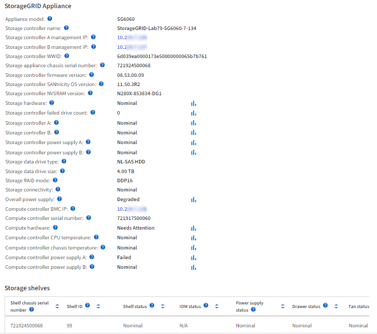

= Registerkarte „Hardware“ anzeigen
:allow-uri-read: 
:icons: font
:imagesdir: ../media/

[role="lead"]
Auf der Registerkarte „Hardware“ werden die CPU-Auslastung und die Speichernutzung für jeden Knoten sowie zusätzliche Hardwareinformationen zu den Geräten angezeigt.

NOTE: Der Grid Manager wird mit jeder Version aktualisiert und stimmt möglicherweise nicht mit den Beispiel-Screenshots auf dieser Seite überein.

Die Registerkarte „Hardware“ wird für alle Knoten angezeigt.

image::../media/nodes_page_hardware_tab_graphs.png[Seite „Knoten“ Registerkarte „Hardware“]

Um ein anderes Zeitintervall anzuzeigen, wählen Sie eines der Steuerelemente über dem Diagramm oder der Grafik aus.  Sie können die verfügbaren Informationen für Intervalle von 1 Stunde, 1 Tag, 1 Woche oder 1 Monat anzeigen.  Sie können auch ein benutzerdefiniertes Intervall festlegen, in dem Sie Datums- und Zeitbereiche angeben können.

Um Details zur CPU-Auslastung und Speichernutzung anzuzeigen, positionieren Sie den Cursor über jedem Diagramm.

image::../media/nodes_page_memory_usage_details.png[Knotenseite > Hardware > Details zur Speichernutzung]

Wenn es sich bei dem Knoten um einen Appliance-Knoten handelt, enthält diese Registerkarte auch einen Abschnitt mit weiteren Informationen zur Appliance-Hardware.

== Informationen zu Appliance-Speicherknoten anzeigen

Auf der Seite „Knoten“ werden Informationen zum Dienstzustand und zu allen Rechen-, Festplatten- und Netzwerkressourcen für jeden Appliance-Speicherknoten aufgelistet.  Sie können auch Speicher, Speicherhardware, Controller-Firmware-Version, Netzwerkressourcen, Netzwerkschnittstellen, Netzwerkadressen sowie Empfangs- und Sendedaten sehen.

.Schritte
. Wählen Sie auf der Seite „Knoten“ einen Appliance-Speicherknoten aus.
. Wählen Sie *Übersicht*.
+
Im Abschnitt „Knoteninformationen“ der Registerkarte „Übersicht“ werden zusammenfassende Informationen zum Knoten angezeigt, z. B. Name, Typ, ID und Verbindungsstatus des Knotens.  Die Liste der IP-Adressen enthält den Namen der Schnittstelle für jede Adresse wie folgt:

+
** *eth*: Das Grid-Netzwerk, Admin-Netzwerk oder Client-Netzwerk.
** *hic*: Einer der physischen 10-, 25- oder 100-GbE-Ports auf dem Gerät.  Diese Ports können miteinander verbunden und mit dem StorageGRID Grid Network (eth0) und Client Network (eth2) verbunden werden.
** *mtc*: Einer der physischen 1-GbE-Ports auf dem Gerät.  Eine oder mehrere MTC-Schnittstellen werden verbunden, um die StorageGRID Admin Network-Schnittstelle (eth1) zu bilden.  Sie können andere MTC-Schnittstellen für die temporäre lokale Konnektivität für einen Techniker im Rechenzentrum verfügbar lassen.
+
image::../media/nodes_page_overview_tab_extended.png[Knotenseitenübersicht erweitert]

+
Im Abschnitt „Warnungen“ der Registerkarte „Übersicht“ werden alle aktiven Warnungen für den Knoten angezeigt.

. Wählen Sie *Hardware* aus, um weitere Informationen zum Gerät anzuzeigen.
+
.. Zeigen Sie die Diagramme zur CPU-Auslastung und zum Speicher an, um die Prozentsätze der CPU- und Speicherauslastung im Zeitverlauf zu ermitteln.  Um ein anderes Zeitintervall anzuzeigen, wählen Sie eines der Steuerelemente über dem Diagramm oder der Grafik aus.  Sie können die verfügbaren Informationen für Intervalle von 1 Stunde, 1 Tag, 1 Woche oder 1 Monat anzeigen.  Sie können auch ein benutzerdefiniertes Intervall festlegen, in dem Sie Datums- und Zeitbereiche angeben können.
+
image::../media/nodes_page_hardware_tab_graphs.png[Hardware-Diagramme]

.. Scrollen Sie nach unten, um die Komponententabelle für das Gerät anzuzeigen.  Diese Tabelle enthält Informationen wie den Modellnamen des Geräts, Controllernamen, Seriennummern und IP-Adressen sowie den Status jeder Komponente.
+

NOTE: Einige Felder, wie z. B. „Compute Controller BMC IP“ und „Compute Hardware“, werden nur für Geräte mit dieser Funktion angezeigt.

+
Komponenten für die Lagerregale und Erweiterungsregale, sofern diese Teil der Installation sind, werden in einer separaten Tabelle unterhalb der Gerätetabelle angezeigt.

+

+
[cols="1a,2a"]
|===
| Feld in der Appliance-Tabelle | Beschreibung 

 a| 
Gerätemodell
 a| 
Die Modellnummer für dieses StorageGRID Gerät wird im SANtricity -Betriebssystem angezeigt.

 a| 
Name des Speichercontrollers
 a| 
Der Name für dieses StorageGRID Gerät wird im SANtricity -Betriebssystem angezeigt.

 a| 
Speichercontroller A Verwaltungs-IP
 a| 
IP-Adresse für Verwaltungsport 1 auf Speichercontroller A. Sie verwenden diese IP, um auf SANtricity OS zuzugreifen und Speicherprobleme zu beheben.

 a| 
Verwaltungs-IP des Speichercontrollers B
 a| 
IP-Adresse für Verwaltungsport 1 auf Speichercontroller B. Sie verwenden diese IP, um auf SANtricity OS zuzugreifen und Speicherprobleme zu beheben.

Einige Gerätemodelle verfügen nicht über einen Speichercontroller B.

 a| 
WWID des Speichercontrollers
 a| 
Die weltweite Kennung des Speichercontrollers, die im SANtricity -Betriebssystem angezeigt wird.

 a| 
Seriennummer des Speichergerätgehäuses
 a| 
Die Gehäuseseriennummer des Geräts.

 a| 
Firmware-Version des Speichercontrollers
 a| 
Die Version der Firmware auf dem Speichercontroller für dieses Gerät.

 a| 
Speichercontroller SANtricity OS-Version
 a| 
Die SANtricity OS-Version des Speichercontrollers A.

 a| 
NVSRAM-Version des Speichercontrollers
 a| 
NVSRAM-Version des Speichercontrollers, wie vom SANtricity System Manager gemeldet.

Wenn beim SG6060 und SG6160 eine Nichtübereinstimmung der NVSRAM-Versionen zwischen den beiden Controllern vorliegt, wird die Version von Controller A angezeigt.  Wenn Controller A nicht installiert oder betriebsbereit ist, wird die Version von Controller B angezeigt.

 a| 
Speicherhardware
 a| 
Der Gesamtstatus der Speichercontroller-Hardware.  Wenn SANtricity System Manager den Status „Benötigt Aufmerksamkeit“ für die Speicherhardware meldet, meldet das StorageGRID -System ebenfalls diesen Wert.

Wenn der Status „Benötigt Aufmerksamkeit“ lautet, überprüfen Sie zuerst den Speichercontroller mit SANtricity OS.  Stellen Sie dann sicher, dass keine anderen Warnungen vorhanden sind, die für den Compute Controller gelten.

 a| 
Anzahl der Laufwerksfehler des Speichercontrollers
 a| 
Die Anzahl der Laufwerke, die nicht optimal sind.

 a| 
Speichercontroller A
 a| 
Der Status des Speichercontrollers A.

 a| 
Speichercontroller B
 a| 
Der Status des Speichercontrollers B. Einige Appliance-Modelle verfügen nicht über einen Speichercontroller B.

 a| 
Speichercontroller-Netzteil A
 a| 
Der Status des Netzteils A für den Speichercontroller.

 a| 
Speichercontroller-Netzteil B
 a| 
Der Status der Stromversorgung B für den Speichercontroller.

 a| 
Speicherdatenlaufwerkstyp
 a| 
Der Laufwerkstyp im Gerät, z. B. HDD (Festplatte) oder SSD (Solid-State-Laufwerk).

 a| 
Größe des Speicherdatenlaufwerks
 a| 
Die effektive Größe eines Datenlaufwerks.

Beim SG6160 wird auch die Größe des Cache-Laufwerks angezeigt.

*Hinweis*: Für Knoten mit Erweiterungs-Shelfs verwenden Sie die<<shelf_data_drive_size,Datenlaufwerksgröße für jedes Regal>> stattdessen.  Die effektive Laufwerksgröße kann je nach Regal unterschiedlich sein.

 a| 
Speicher-RAID-Modus
 a| 
Der für das Gerät konfigurierte RAID-Modus.

 a| 
Speicherkonnektivität
 a| 
Der Speicherkonnektivitätsstatus.

 a| 
Gesamtstromversorgung
 a| 
Der Status aller Stromversorgungen für das Gerät.

 a| 
BMC -IP des Rechencontrollers
 a| 
Die IP-Adresse des Baseboard Management Controller (BMC)-Ports im Compute Controller.  Sie verwenden diese IP, um eine Verbindung zur BMC Schnittstelle herzustellen und die Appliance-Hardware zu überwachen und zu diagnostizieren.

Dieses Feld wird für Appliance-Modelle ohne BMC nicht angezeigt.

 a| 
Seriennummer des Compute-Controllers
 a| 
Die Seriennummer des Compute-Controllers.

 a| 
Computerhardware
 a| 
Der Status der Compute-Controller-Hardware.  Dieses Feld wird für Appliance-Modelle ohne separate Rechen- und Speicherhardware nicht angezeigt.

 a| 
CPU-Temperatur des Compute-Controllers
 a| 
Der Temperaturstatus der CPU des Compute Controllers.

 a| 
Gehäusetemperatur des Compute-Controllers
 a| 
Der Temperaturstatus des Compute-Controllers.

|===
+
[cols="1a,2a"]
|===
| Spalte in der Tabelle „Lagerregale“ | Beschreibung 

 a| 
Seriennummer des Regalgehäuses
 a| 
Die Seriennummer für das Lagerregalgehäuse.

 a| 
Regal-ID
 a| 
Die numerische Kennung für das Lagerregal.

*** 99: Speichercontroller-Regal
*** 0: Erstes Erweiterungsregal
*** 1: Zweites Erweiterungsregal

*Hinweis:* Erweiterungsregale gelten nur für SG6060 und SG6160.

 a| 
Regalstatus
 a| 
Der Gesamtstatus des Lagerregals.

 a| 
IOM-Status
 a| 
Der Status der Eingabe-/Ausgabemodule (IOMs) in allen Erweiterungsregalen.  N/A, wenn es sich nicht um ein Erweiterungsregal handelt.

 a| 
Stromversorgungsstatus
 a| 
Der Gesamtstatus der Stromversorgungen für das Speicherregal.

 a| 
Schubladenstatus
 a| 
Der Status der Schubladen im Lagerregal.  N/A, wenn das Regal keine Schubladen enthält.

 a| 
Lüfterstatus
 a| 
Der Gesamtstatus der Kühllüfter im Lagerregal.

 a| 
Laufwerkssteckplätze
 a| 
Die Gesamtzahl der Laufwerkssteckplätze im Speicherregal.

 a| 
Datenlaufwerke
 a| 
Die Anzahl der Laufwerke im Speicherregal, die zur Datenspeicherung verwendet werden.

 a| 
[[shelf_data_drive_size]]Größe des Datenlaufwerks
 a| 
Die effektive Größe eines Datenlaufwerks im Speicherregal.

 a| 
Cache-Laufwerke
 a| 
Die Anzahl der Laufwerke im Speicherregal, die als Cache verwendet werden.

 a| 
Cache-Laufwerksgröße
 a| 
Die Größe des kleinsten Cache-Laufwerks im Speicherregal.  Normalerweise haben alle Cache-Laufwerke die gleiche Größe.

 a| 
Konfigurationsstatus
 a| 
Der Konfigurationsstatus des Speicherregals.

|===
.. Bestätigen Sie, dass alle Status „Nominal“ sind.
+
Wenn ein Status nicht „Nominal“ ist, überprüfen Sie alle aktuellen Warnungen.  Sie können auch SANtricity System Manager verwenden, um mehr über einige dieser Hardwarewerte zu erfahren.  Lesen Sie die Anweisungen zur Installation und Wartung Ihres Geräts.

. Wählen Sie *Netzwerk*, um Informationen zu jedem Netzwerk anzuzeigen.
+
Das Netzwerkverkehrsdiagramm bietet eine Zusammenfassung des gesamten Netzwerkverkehrs.

+
image::../media/nodes_page_network_traffic_graph.png[Netzwerkverkehrsdiagramm der Knotenseite]

+
.. Lesen Sie den Abschnitt „Netzwerkschnittstellen“.
+
image::../media/nodes_page_network_interfaces.png[Knotenseite Netzwerkschnittstellen]

+
Verwenden Sie die folgende Tabelle mit den Werten in der Spalte *Geschwindigkeit* in der Tabelle „Netzwerkschnittstellen“, um zu bestimmen, ob die 10/25-GbE-Netzwerkports auf der Appliance für die Verwendung des Aktiv-/Sicherungsmodus oder des LACP-Modus konfiguriert wurden.

+

NOTE: Bei den in der Tabelle angezeigten Werten wird davon ausgegangen, dass alle vier Links verwendet werden.

+
[cols="1a,1a,1a,1a"]
|===
| Link-Modus | Bond-Modus | Individuelle HIC-Verbindungsgeschwindigkeit (hic1, hic2, hic3, hic4) | Erwartete Grid-/Client-Netzwerkgeschwindigkeit (eth0,eth2) 

 a| 
Aggregat
 a| 
LACP
 a| 
25
 a| 
100

 a| 
Behoben
 a| 
LACP
 a| 
25
 a| 
50

 a| 
Behoben
 a| 
Aktiv/Backup
 a| 
25
 a| 
25

 a| 
Aggregat
 a| 
LACP
 a| 
10
 a| 
40

 a| 
Behoben
 a| 
LACP
 a| 
10
 a| 
20

 a| 
Behoben
 a| 
Aktiv/Backup
 a| 
10
 a| 
10

|===
+
Sehen https://docs.netapp.com/us-en/storagegrid-appliances/installconfig/configuring-network-links.html["Konfigurieren von Netzwerkverbindungen"^] Weitere Informationen zum Konfigurieren der 10/25-GbE-Ports.

.. Lesen Sie den Abschnitt „Netzwerkkommunikation“.
+
Die Empfangs- und Sendetabellen zeigen, wie viele Bytes und Pakete über jedes Netzwerk empfangen und gesendet wurden, sowie weitere Empfangs- und Sendemetriken.

+
image::../media/nodes_page_network_communication.png[Knoten Seite Netzwerk Kommunikation]

. Wählen Sie *Speicher* aus, um Diagramme anzuzeigen, die den Prozentsatz des im Zeitverlauf für Objektdaten und Objektmetadaten verwendeten Speichers sowie Informationen zu Festplattengeräten, Volumes und Objektspeichern zeigen.
+
image::../media/nodes_page_storage_used_object_data.png[Verwendeter Speicher – Objektdaten]

+
image::../media/storage_used_object_metadata.png[Verwendeter Speicher – Objektmetadaten]

+
.. Scrollen Sie nach unten, um die Menge des verfügbaren Speichers für jedes Volume und jeden Objektspeicher anzuzeigen.
+
Der weltweite Name für jede Festplatte entspricht der weltweiten Volume-Kennung (WWID), die angezeigt wird, wenn Sie die Standard-Volume-Eigenschaften in SANtricity OS anzeigen (der Verwaltungssoftware, die mit dem Speichercontroller des Geräts verbunden ist).

+
Um Ihnen die Interpretation der Lese- und Schreibstatistiken für die Datenträger in Bezug auf Volume-Mount-Punkte zu erleichtern, entspricht der erste Teil des in der Spalte *Name* der Tabelle „Datenträgergeräte“ angezeigten Namens (also _sdc_, _sdd_, _sde_ usw.) dem in der Spalte *Gerät* der Tabelle „Volumes“ angezeigten Wert.

+
image::../media/nodes_page_storage_tables.png[Knotenseiten-Speichertabellen]

== Informationen zu Appliance-Admin-Knoten und Gateway-Knoten anzeigen

Auf der Seite „Knoten“ werden Informationen zum Dienstzustand und zu allen Rechen-, Festplatten- und Netzwerkressourcen für jede Dienst-Appliance aufgelistet, die als Admin-Knoten oder Gateway-Knoten verwendet wird.  Sie können auch Speicher, Speicherhardware, Netzwerkressourcen, Netzwerkschnittstellen, Netzwerkadressen sowie Empfangs- und Sendedaten sehen.

.Schritte
. Wählen Sie auf der Seite „Knoten“ einen Appliance-Admin-Knoten oder einen Appliance-Gateway-Knoten aus.
. Wählen Sie *Übersicht*.
+
Im Abschnitt „Knoteninformationen“ der Registerkarte „Übersicht“ werden zusammenfassende Informationen zum Knoten angezeigt, z. B. Name, Typ, ID und Verbindungsstatus des Knotens.  Die Liste der IP-Adressen enthält den Namen der Schnittstelle für jede Adresse wie folgt:

+
** *adllb* und *adlli*: Wird angezeigt, wenn Active/Backup-Bonding für die Admin-Netzwerkschnittstelle verwendet wird
** *eth*: Das Grid-Netzwerk, Admin-Netzwerk oder Client-Netzwerk.
** *hic*: Einer der physischen 10-, 25- oder 100-GbE-Ports auf dem Gerät.  Diese Ports können miteinander verbunden und mit dem StorageGRID Grid Network (eth0) und Client Network (eth2) verbunden werden.
** *mtc*: Einer der physischen 1-GbE-Ports auf dem Gerät.  Eine oder mehrere MTC-Schnittstellen werden zur Admin-Netzwerkschnittstelle (eth1) verbunden.  Sie können andere MTC-Schnittstellen für die temporäre lokale Konnektivität für einen Techniker im Rechenzentrum verfügbar lassen.
+
image::../media/nodes_page_overview_tab_services_appliance.png[Registerkarte „Übersicht“ der Knotenseite für die Dienst-Appliance]

+
Im Abschnitt „Warnungen“ der Registerkarte „Übersicht“ werden alle aktiven Warnungen für den Knoten angezeigt.

. Wählen Sie *Hardware* aus, um weitere Informationen zum Gerät anzuzeigen.
+
.. Zeigen Sie die Diagramme zur CPU-Auslastung und zum Speicher an, um die Prozentsätze der CPU- und Speicherauslastung im Zeitverlauf zu ermitteln.  Um ein anderes Zeitintervall anzuzeigen, wählen Sie eines der Steuerelemente über dem Diagramm oder der Grafik aus.  Sie können die verfügbaren Informationen für Intervalle von 1 Stunde, 1 Tag, 1 Woche oder 1 Monat anzeigen.  Sie können auch ein benutzerdefiniertes Intervall festlegen, in dem Sie Datums- und Zeitbereiche angeben können.
+
image::../media/nodes_page_hardware_tab_graphs_services_appliance.png[Knotenseite Hardware-Registerkartendiagramme für Service-Appliance]

.. Scrollen Sie nach unten, um die Komponententabelle für das Gerät anzuzeigen.  Diese Tabelle enthält Informationen wie den Modellnamen, die Seriennummer, die Firmware-Version des Controllers und den Status jeder Komponente.
+
image::../media/nodes_page_hardware_tab_services_appliance.png[Knotenseite – Registerkarte „Hardware“ für Service-Appliance]

+
[cols="1a,2a"]
|===
| Feld in der Appliance-Tabelle | Beschreibung 

 a| 
Gerätemodell
 a| 
Die Modellnummer für dieses StorageGRID Gerät.

 a| 
Anzahl der Laufwerksfehler des Speichercontrollers
 a| 
Die Anzahl der Laufwerke, die nicht optimal sind.

 a| 
Speicherdatenlaufwerkstyp
 a| 
Der Laufwerkstyp im Gerät, z. B. HDD (Festplatte) oder SSD (Solid-State-Laufwerk).

 a| 
Größe des Speicherdatenlaufwerks
 a| 
Die effektive Größe eines Datenlaufwerks.

 a| 
Speicher-RAID-Modus
 a| 
Der RAID-Modus für das Gerät.

 a| 
Gesamtstromversorgung
 a| 
Der Status aller Netzteile im Gerät.

 a| 
BMC -IP des Rechencontrollers
 a| 
Die IP-Adresse des Baseboard Management Controller (BMC)-Ports im Compute Controller.  Sie können diese IP verwenden, um eine Verbindung zur BMC Schnittstelle herzustellen und die Appliance-Hardware zu überwachen und zu diagnostizieren.

Dieses Feld wird für Appliance-Modelle ohne BMC nicht angezeigt.

 a| 
Seriennummer des Compute-Controllers
 a| 
Die Seriennummer des Compute-Controllers.

 a| 
Computerhardware
 a| 
Der Status der Compute-Controller-Hardware.

 a| 
CPU-Temperatur des Compute-Controllers
 a| 
Der Temperaturstatus der CPU des Compute Controllers.

 a| 
Gehäusetemperatur des Compute-Controllers
 a| 
Der Temperaturstatus des Compute-Controllers.

|===
.. Bestätigen Sie, dass alle Status „Nominal“ sind.
+
Wenn ein Status nicht „Nominal“ ist, überprüfen Sie alle aktuellen Warnungen.

. Wählen Sie *Netzwerk*, um Informationen zu jedem Netzwerk anzuzeigen.
+
Das Netzwerkverkehrsdiagramm bietet eine Zusammenfassung des gesamten Netzwerkverkehrs.

+
image::../media/nodes_page_network_traffic_graph.png[Netzwerkverkehrsdiagramm der Knotenseite]

+
.. Lesen Sie den Abschnitt „Netzwerkschnittstellen“.
+
image::../media/nodes_page_hardware_tab_network_services_appliance.png[Knotenseite Registerkarte „Hardware“ Netzwerkdienstegerät]

+
Verwenden Sie die folgende Tabelle mit den Werten in der Spalte *Geschwindigkeit* in der Tabelle „Netzwerkschnittstellen“, um zu bestimmen, ob die vier 40/100-GbE-Netzwerkports auf der Appliance für die Verwendung des Aktiv-/Sicherungsmodus oder des LACP-Modus konfiguriert wurden.

+

NOTE: Bei den in der Tabelle angezeigten Werten wird davon ausgegangen, dass alle vier Links verwendet werden.

+
[cols="1a,1a,1a,1a"]
|===
| Link-Modus | Bond-Modus | Individuelle HIC-Verbindungsgeschwindigkeit (hic1, hic2, hic3, hic4) | Erwartete Grid-/Client-Netzwerkgeschwindigkeit (eth0, eth2) 

 a| 
Aggregat
 a| 
LACP
 a| 
100
 a| 
400

 a| 
Behoben
 a| 
LACP
 a| 
100
 a| 
200

 a| 
Behoben
 a| 
Aktiv/Backup
 a| 
100
 a| 
100

 a| 
Aggregat
 a| 
LACP
 a| 
40
 a| 
160

 a| 
Behoben
 a| 
LACP
 a| 
40
 a| 
80

 a| 
Behoben
 a| 
Aktiv/Backup
 a| 
40
 a| 
40

|===
.. Lesen Sie den Abschnitt „Netzwerkkommunikation“.
+
Die Empfangs- und Sendetabellen zeigen, wie viele Bytes und Pakete über jedes Netzwerk empfangen und gesendet wurden, sowie andere Empfangs- und Sendemetriken.

+
image::../media/nodes_page_network_communication.png[Knoten Seite Netzwerk Kommunikation]

. Wählen Sie *Speicher* aus, um Informationen zu den Festplattengeräten und Volumes auf der Service-Appliance anzuzeigen.
+
image::../media/nodes_page_storage_tab_services_appliance.png[Knotenseite Registerkarte „Speicher“ Dienste Appliance]

