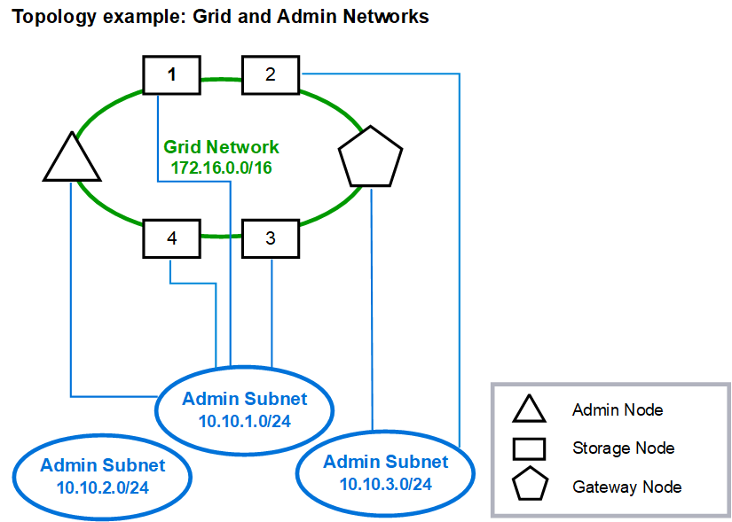

= Admin-Netzwerktopologie
:allow-uri-read: 
:icons: font
:imagesdir: ../media/

[role="lead"]
Ein Admin-Netzwerk ist optional.  Eine Möglichkeit, ein Admin-Netzwerk und ein Grid-Netzwerk zu verwenden, besteht darin, für jeden Knoten ein routingfähiges Grid-Netzwerk und ein begrenztes Admin-Netzwerk zu konfigurieren.

Wenn Sie das Admin-Netzwerk konfigurieren, legen Sie die Host-IP-Adresse, die Subnetzmaske und die Gateway-IP-Adresse für die eth1-Schnittstelle für jeden Grid-Knoten fest.

Das Admin-Netzwerk kann für jeden Knoten eindeutig sein und aus mehreren Subnetzen bestehen.  Jeder Knoten kann mit einer Admin External Subnet List (AESL) konfiguriert werden.  Die AESL listet die über das Admin-Netzwerk erreichbaren Subnetze für jeden Knoten auf.  Die AESL muss auch die Subnetze aller Dienste enthalten, auf die das Grid über das Admin-Netzwerk zugreift, z. B. NTP, DNS, KMS und LDAP.  Für jedes Subnetz in der AESL werden statische Routen angewendet.

In diesem Beispiel wird das Grid-Netzwerk für den Datenverkehr im Zusammenhang mit S3-Clientanforderungen und Objektverwaltung verwendet, während das Admin-Netzwerk für Verwaltungsfunktionen verwendet wird.

image::../media/grid_admin_networks_ips.png[IPs von Grid Admin Networks]
