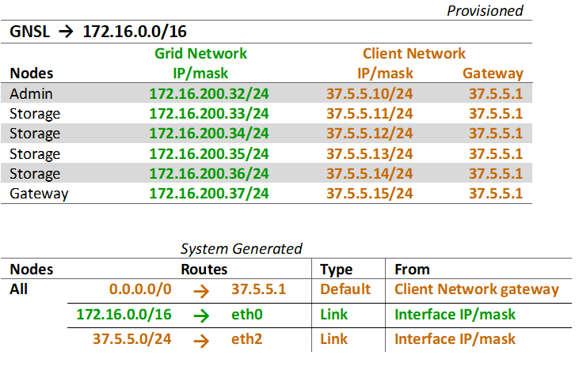

= Client-Netzwerktopologie
:allow-uri-read: 
:icons: font
:imagesdir: ../media/

[role="lead"]
Ein Client-Netzwerk ist optional.  Durch die Verwendung eines Client-Netzwerks kann der Client-Netzwerkverkehr (z. B. S3) vom internen Grid-Verkehr getrennt werden, wodurch die Grid-Vernetzung sicherer wird.  Der Verwaltungsverkehr kann entweder vom Client- oder vom Grid-Netzwerk abgewickelt werden, wenn das Admin-Netzwerk nicht konfiguriert ist.

Wenn Sie das Client-Netzwerk konfigurieren, legen Sie die Host-IP-Adresse, die Subnetzmaske und die Gateway-IP-Adresse für die eth2-Schnittstelle für den konfigurierten Knoten fest.  Das Client-Netzwerk jedes Knotens kann unabhängig vom Client-Netzwerk auf jedem anderen Knoten sein.

Wenn Sie während der Installation ein Client-Netzwerk für einen Knoten konfigurieren, wechselt das Standard-Gateway des Knotens nach Abschluss der Installation vom Grid-Netzwerk-Gateway zum Client-Netzwerk-Gateway.  Wenn später ein Client-Netzwerk hinzugefügt wird, wechselt das Standard-Gateway des Knotens auf die gleiche Weise.

In diesem Beispiel wird das Client-Netzwerk für S3-Client-Anfragen und für Verwaltungsfunktionen verwendet, während das Grid-Netzwerk für interne Objektverwaltungsvorgänge vorgesehen ist.

image::../media/grid_client_networks.png[Grid-Client-Netzwerke]

.Ähnliche Informationen
link:../maintain/changing-nodes-network-configuration.html["Knotennetzwerkkonfiguration ändern"]
