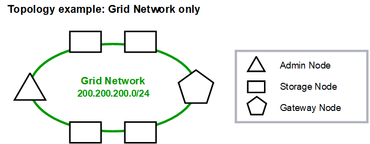

= Grid-Netzwerktopologie
:allow-uri-read: 
:icons: font
:imagesdir: ../media/

[role="lead"]
Die einfachste Netzwerktopologie wird erstellt, indem nur das Grid-Netzwerk konfiguriert wird.

Wenn Sie das Grid-Netzwerk konfigurieren, legen Sie die Host-IP-Adresse, die Subnetzmaske und die Gateway-IP-Adresse für die eth0-Schnittstelle für jeden Grid-Knoten fest.

Während der Konfiguration müssen Sie alle Grid Network-Subnetze zur Grid Network Subnet List (GNSL) hinzufügen.  Diese Liste enthält alle Subnetze für alle Sites und kann auch externe Subnetze enthalten, die Zugriff auf kritische Dienste wie NTP, DNS oder LDAP bieten.

Bei der Installation wendet die Grid Network-Schnittstelle statische Routen für alle Subnetze im GNSL an und legt die Standardroute des Knotens zum Grid Network-Gateway fest, sofern eines konfiguriert ist.  Das GNSL ist nicht erforderlich, wenn kein Client-Netzwerk vorhanden ist und das Grid-Netzwerk-Gateway die Standardroute des Knotens ist.  Außerdem werden Hostrouten zu allen anderen Knoten im Grid generiert.

In diesem Beispiel wird der gesamte Datenverkehr über dasselbe Netzwerk abgewickelt, einschließlich des Datenverkehrs im Zusammenhang mit S3-Clientanforderungen sowie Verwaltungs- und Wartungsfunktionen.

NOTE: Diese Topologie eignet sich für Einzelstandortbereitstellungen, die nicht extern verfügbar sind, für Proof-of-Concept- oder Testbereitstellungen oder wenn ein Lastenausgleich eines Drittanbieters als Clientzugriffsgrenze fungiert.  Wenn möglich, sollte das Grid-Netzwerk ausschließlich für den internen Verkehr verwendet werden.  Sowohl das Admin-Netzwerk als auch das Client-Netzwerk unterliegen zusätzlichen Firewall-Einschränkungen, die den externen Datenverkehr zu internen Diensten blockieren.  Die Verwendung des Grid-Netzwerks für externen Client-Verkehr wird unterstützt, diese Verwendung bietet jedoch weniger Schutzebenen.

image::../media/grid_network_ips.png[Grid-Netzwerk-IPs]
