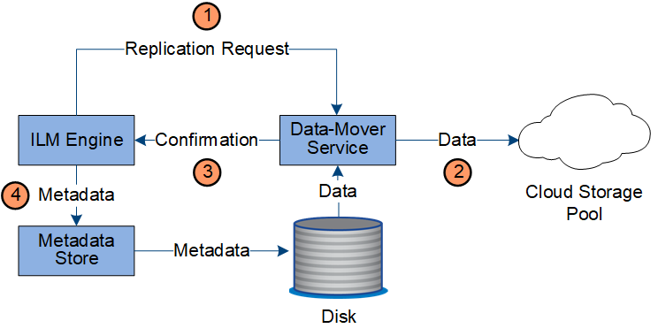

= Kopierverwaltung
:allow-uri-read: 
:icons: font
:imagesdir: ../media/

[role="lead"]
Objektdaten werden durch die aktiven ILM-Richtlinien und zugehörigen ILM-Regeln verwaltet.  ILM-Regeln erstellen replizierte oder löschcodierte Kopien, um Objektdaten vor Verlust zu schützen.

Zu unterschiedlichen Zeitpunkten im Lebenszyklus eines Objekts können unterschiedliche Typen oder Speicherorte von Objektkopien erforderlich sein.  ILM-Regeln werden regelmäßig ausgewertet, um sicherzustellen, dass Objekte wie erforderlich platziert werden.

Die Objektdaten werden vom LDR-Dienst verwaltet.

== Inhaltsschutz: Replikation

Wenn die Anweisungen zur Inhaltsplatzierung einer ILM-Regel replizierte Kopien von Objektdaten erfordern, werden Kopien erstellt und von den Speicherknoten, aus denen der konfigurierte Speicherpool besteht, auf der Festplatte gespeichert.

Die ILM-Engine im LDR-Dienst steuert die Replikation und stellt sicher, dass die richtige Anzahl von Kopien an den richtigen Orten und für die richtige Zeit gespeichert wird.

image::../media/replication_data_flow.png[Diagramm, das den im umgebenden Text beschriebenen Prozess zeigt]

. Die ILM-Engine fragt den ADC-Dienst ab, um den besten Ziel-LDR-Dienst innerhalb des durch die ILM-Regel angegebenen Speicherpools zu ermitteln.  Anschließend sendet es diesem LDR-Dienst einen Befehl zum Starten der Replikation.
. Der Ziel-LDR-Dienst fragt den ADC-Dienst nach dem besten Quellstandort ab.  Anschließend sendet es eine Replikationsanforderung an den Quell-LDR-Dienst.
. Der Quell-LDR-Dienst sendet eine Kopie an den Ziel-LDR-Dienst.
. Der Ziel-LDR-Dienst benachrichtigt die ILM-Engine, dass die Objektdaten gespeichert wurden.
. Die ILM-Engine aktualisiert den Metadatenspeicher mit Objektstandortmetadaten.

== Inhaltsschutz: Erasure Coding

Wenn eine ILM-Regel Anweisungen zum Erstellen von Erasure-Coding-Kopien von Objektdaten enthält, zerlegt das entsprechende Erasure-Coding-Schema die Objektdaten in Daten- und Paritätsfragmente und verteilt diese Fragmente auf die im Erasure-Coding-Profil konfigurierten Speicherknoten.

Die ILM-Engine, die Bestandteil des LDR-Dienstes ist, steuert das Erasure Coding und stellt sicher, dass das Erasure-Coding-Profil auf die Objektdaten angewendet wird.

image::../media/erasure_coding_data_flow.png[Erasure Coding-Datenfluss]

. Die ILM-Engine fragt den ADC-Dienst ab, um zu ermitteln, welcher DDS-Dienst den Erasure-Coding-Vorgang am besten durchführen kann.  Wenn dies festgestellt wird, sendet die ILM-Engine eine „Initialisierungs“-Anforderung an diesen Dienst.
. Der DDS-Dienst weist einen LDR an, die Objektdaten mit einem Löschcode zu versehen.
. Der Quell-LDR-Dienst sendet eine Kopie an den für die Erasure Coding ausgewählten LDR-Dienst.
. Nachdem die entsprechende Anzahl an Paritäts- und Datenfragmenten erstellt wurde, verteilt der LDR-Dienst diese Fragmente auf die Speicherknoten (Chunk-Dienste), die den Speicherpool des Erasure-Coding-Profils bilden.
. Der LDR-Dienst benachrichtigt die ILM-Engine und bestätigt, dass die Objektdaten erfolgreich verteilt wurden.
. Die ILM-Engine aktualisiert den Metadatenspeicher mit Objektstandortmetadaten.

== Inhaltsschutz: Cloud-Speicherpool

Wenn die Anweisungen zur Inhaltsplatzierung einer ILM-Regel erfordern, dass eine replizierte Kopie der Objektdaten in einem Cloud-Speicherpool gespeichert wird, werden die Objektdaten in den externen S3-Bucket oder Azure Blob-Speichercontainer dupliziert, der für den Cloud-Speicherpool angegeben wurde.

Die ILM-Engine, die eine Komponente des LDR-Dienstes ist, und der Data Mover-Dienst steuern die Bewegung von Objekten in den Cloud Storage Pool.

. Die ILM-Engine wählt einen Data Mover-Dienst zur Replikation in den Cloud Storage Pool aus.
. Der Data Mover-Dienst sendet die Objektdaten an den Cloud Storage Pool.
. Der Data Mover-Dienst benachrichtigt die ILM-Engine, dass die Objektdaten gespeichert wurden.
. Die ILM-Engine aktualisiert den Metadatenspeicher mit Objektstandortmetadaten.

