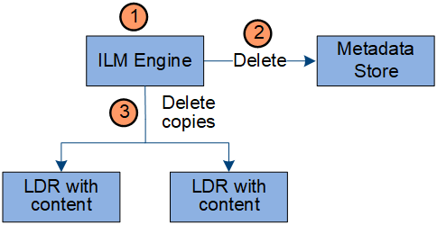

= Datenfluss löschen
:allow-uri-read: 
:icons: font
:imagesdir: ../media/

[role="lead"]
Alle Objektkopien werden aus dem StorageGRID -System entfernt, wenn ein Client einen Löschvorgang durchführt oder wenn die Lebensdauer des Objekts abläuft und dadurch seine automatische Entfernung ausgelöst wird.  Für die Objektlöschung gibt es einen definierten Datenfluss.

== Löschhierarchie

StorageGRID bietet mehrere Methoden zur Steuerung, wann Objekte aufbewahrt oder gelöscht werden.  Objekte können auf Clientanforderung oder automatisch gelöscht werden.  StorageGRID priorisiert alle S3-Objektsperreinstellungen immer gegenüber Client-Löschanforderungen, die wiederum Vorrang vor dem S3-Bucket-Lebenszyklus und ILM-Platzierungsanweisungen haben.

* *S3-Objektsperre*: Wenn die globale Einstellung „S3-Objektsperre“ für das Raster aktiviert ist, können S3-Clients Buckets mit aktivierter S3-Objektsperre erstellen und dann die S3-REST-API verwenden, um Einstellungen für die Aufbewahrungsdauer und die rechtliche Aufbewahrung für jede diesem Bucket hinzugefügte Objektversion festzulegen.
+
** Eine Objektversion, die einer rechtlichen Sperre unterliegt, kann mit keiner Methode gelöscht werden.
** Bevor das Aufbewahrungsdatum einer Objektversion erreicht ist, kann diese Version mit keiner Methode gelöscht werden.
** Objekte in Buckets mit aktivierter S3-Objektsperre werden von ILM „für immer“ aufbewahrt.  Nach Erreichen des Aufbewahrungsdatums kann eine Objektversion jedoch durch eine Clientanforderung oder den Ablauf des Bucket-Lebenszyklus gelöscht werden.
** Wenn S3-Clients ein Standard-Aufbewahrungsdatum auf den Bucket anwenden, müssen sie nicht für jedes Objekt ein Aufbewahrungsdatum angeben.

* *Client-Löschanforderung*: Ein S3-Client kann eine Löschanforderung für ein Objekt stellen.  Wenn ein Client ein Objekt löscht, werden alle Kopien des Objekts aus dem StorageGRID System entfernt.
* *Objekte im Bucket löschen*: Tenant Manager-Benutzer können diese Option verwenden, um alle Kopien der Objekte und Objektversionen in ausgewählten Buckets dauerhaft aus dem StorageGRID System zu entfernen.
* *S3-Bucket-Lebenszyklus*: S3-Clients können ihren Buckets eine Lebenszykluskonfiguration hinzufügen, die eine Ablaufaktion angibt.  Wenn ein Bucket-Lebenszyklus vorhanden ist, löscht StorageGRID automatisch alle Kopien eines Objekts, wenn das in der Ablaufaktion angegebene Datum oder die Anzahl der Tage erreicht ist, es sei denn, der Client löscht das Objekt zuerst.
* *Anweisungen zur ILM-Platzierung*: Vorausgesetzt, für den Bucket ist die S3-Objektsperre nicht aktiviert und es gibt keinen Bucket-Lebenszyklus, löscht StorageGRID ein Objekt automatisch, wenn der letzte Zeitraum in der ILM-Regel endet und keine weiteren Platzierungen für das Objekt angegeben sind.
+

NOTE: Wenn ein S3-Bucket-Lebenszyklus konfiguriert ist, überschreiben die Aktionen zum Ablauf des Lebenszyklus die ILM-Richtlinie für Objekte, die dem Lebenszyklusfilter entsprechen.  Dies kann dazu führen, dass ein Objekt auch dann noch auf dem Raster verbleibt, wenn keine ILM-Anweisungen zum Platzieren des Objekts mehr vorliegen.

Sehen link:../ilm/how-objects-are-deleted.html["So werden Objekte gelöscht"] für weitere Informationen.

== Datenfluss für Clientlöschungen

image::../media/delete_data_flow.png[Client-Löschdatenfluss]

. Der LDR-Dienst empfängt eine Löschanforderung von der Clientanwendung.
. Der LDR-Dienst aktualisiert den Metadatenspeicher, sodass das Objekt für Clientanforderungen als gelöscht angezeigt wird, und weist die ILM-Engine an, alle Kopien der Objektdaten zu entfernen.
. Das Objekt wird aus dem System entfernt.  Der Metadatenspeicher wird aktualisiert, um Objektmetadaten zu entfernen.

== Datenfluss für ILM-Löschvorgänge

. Die ILM-Engine stellt fest, dass das Objekt gelöscht werden muss.
. Die ILM-Engine benachrichtigt den Metadatenspeicher.  Der Metadatenspeicher aktualisiert die Objektmetadaten, sodass das Objekt für Clientanforderungen gelöscht aussieht.
. Die ILM-Engine entfernt alle Kopien des Objekts.  Der Metadatenspeicher wird aktualisiert, um Objektmetadaten zu entfernen.

