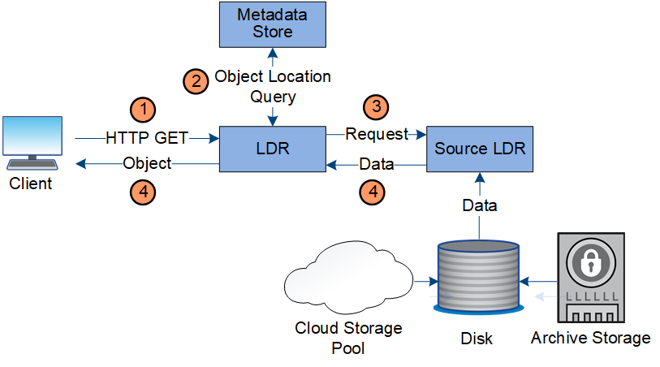

= Datenfluss abrufen
:allow-uri-read: 
:icons: font
:imagesdir: ../media/

[role="lead"]
Ein Abrufvorgang besteht aus einem definierten Datenfluss zwischen dem StorageGRID -System und dem Client.  Das System verwendet Attribute, um den Abruf des Objekts von einem Speicherknoten oder, falls erforderlich, einem Cloud-Speicherpool zu verfolgen.

Der LDR-Dienst des Speicherknotens fragt den Metadatenspeicher nach dem Speicherort der Objektdaten ab und ruft sie vom Quell-LDR-Dienst ab.  Der Abruf erfolgt vorzugsweise von einem Speicherknoten.  Wenn das Objekt auf einem Speicherknoten nicht verfügbar ist, wird die Abrufanforderung an einen Cloud-Speicherpool weitergeleitet.

NOTE: Wenn sich die einzige Objektkopie im AWS Glacier-Speicher oder in der Azure-Archivebene befindet, muss die Clientanwendung eine S3 RestoreObject-Anforderung ausgeben, um eine abrufbare Kopie im Cloud-Speicherpool wiederherzustellen.

. Der LDR-Dienst empfängt eine Abrufanforderung von der Clientanwendung.
. Der LDR-Dienst fragt den Metadatenspeicher nach dem Speicherort der Objektdaten und den Metadaten ab.
. Der LDR-Dienst leitet die Abrufanforderung an den Quell-LDR-Dienst weiter.
. Der Quell-LDR-Dienst gibt die Objektdaten vom abgefragten LDR-Dienst zurück und das System gibt das Objekt an die Clientanwendung zurück.

