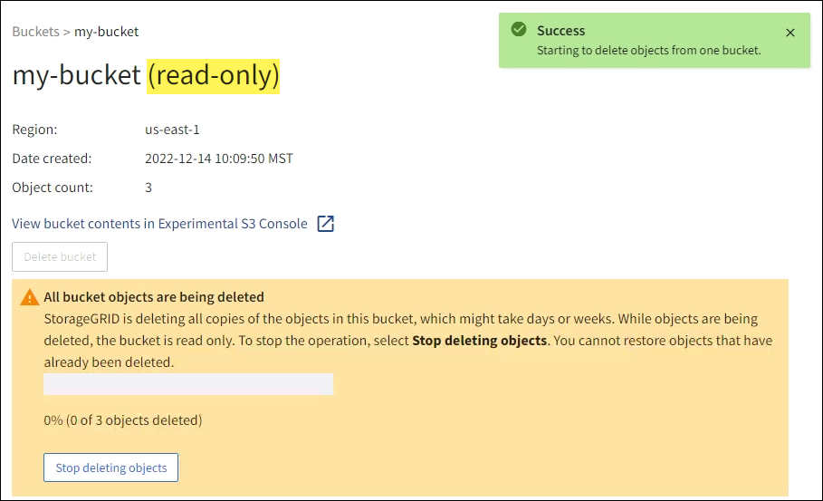

= Objekte im Bucket löschen
:allow-uri-read: 
:icons: font
:imagesdir: ../media/

[role="lead"]
Mit dem Tenant Manager können Sie die Objekte in einem oder mehreren Buckets löschen.

.Überlegungen und Anforderungen
Beachten Sie vor der Durchführung dieser Schritte Folgendes:

* Wenn Sie die Objekte in einem Bucket löschen, entfernt StorageGRID dauerhaft alle Objekte und alle Objektversionen in jedem ausgewählten Bucket von allen Knoten und Sites in Ihrem StorageGRID System.  StorageGRID entfernt auch alle zugehörigen Objektmetadaten.  Sie können diese Informationen nicht wiederherstellen.
* Das Löschen aller Objekte in einem Bucket kann je nach Anzahl der Objekte, Objektkopien und gleichzeitigen Vorgängen Minuten, Tage oder sogar Wochen dauern.
* Wenn ein Eimerlink:using-s3-object-lock.html["S3-Objektsperre aktiviert"] , kann es _Jahre_ lang im Status *Objekte werden gelöscht: schreibgeschützt* verbleiben.
+

TIP: Ein Bucket, der S3 Object Lock verwendet, verbleibt im Status *Objekte werden gelöscht: schreibgeschützt*, bis das Aufbewahrungsdatum für alle Objekte erreicht ist und alle rechtlichen Sperren aufgehoben wurden.

* Während Objekte gelöscht werden, lautet der Status des Buckets *Objekte werden gelöscht: schreibgeschützt*.  In diesem Zustand können Sie dem Bucket keine neuen Objekte hinzufügen.
* Wenn alle Objekte gelöscht wurden, bleibt der Bucket im schreibgeschützten Zustand.  Sie können einen der folgenden Schritte ausführen:
+
** Setzen Sie den Bucket wieder in den Schreibmodus und verwenden Sie ihn erneut für neue Objekte
** Löschen Sie den Bucket
** Behalten Sie den Bucket im schreibgeschützten Modus, um seinen Namen für die zukünftige Verwendung zu reservieren

* Wenn für einen Bucket die Objektversionierung aktiviert ist, können Löschmarkierungen, die in StorageGRID 11.8 oder höher erstellt wurden, mithilfe der Vorgänge „Objekte im Bucket löschen“ entfernt werden.
* Wenn für einen Bucket die Objektversionierung aktiviert ist, werden beim Löschen von Objekten keine Löschmarkierungen entfernt, die in StorageGRID 11.7 oder früher erstellt wurden.  Informationen zum Löschen von Objekten in einem Bucket finden Sie inlink:../ilm/how-objects-are-deleted.html#delete-s3-versioned-objects["So werden versionierte S3-Objekte gelöscht"] .
* Wenn Sielink:grid-federation-manage-cross-grid-replication.html["Cross-Grid-Replikation"] , beachten Sie Folgendes:
+
** Durch die Verwendung dieser Option werden keine Objekte aus dem Bucket im anderen Raster gelöscht.
** Wenn Sie diese Option für den Quell-Bucket auswählen, wird die Warnung *Fehler bei der Grid-übergreifenden Replikation* ausgelöst, wenn Sie dem Ziel-Bucket im anderen Grid Objekte hinzufügen.  Wenn Sie nicht garantieren können, dass niemand Objekte zum Bucket auf dem anderen Raster hinzufügt,link:../tenant/grid-federation-manage-cross-grid-replication.html["Deaktivieren Sie die Cross-Grid-Replikation"] für diesen Bucket, bevor alle Bucket-Objekte gelöscht werden.

.Bevor Sie beginnen
* Sie sind beim Tenant Manager angemeldet mit einemlink:../admin/web-browser-requirements.html["unterstützter Webbrowser"] .
* Sie gehören einer Benutzergruppe an, die über dielink:tenant-management-permissions.html["Root-Zugriffsberechtigung"] .  Diese Berechtigung überschreibt die Berechtigungseinstellungen in Gruppen- oder Bucket-Richtlinien.

.Schritte
. Wählen Sie im Dashboard *Buckets anzeigen* oder wählen Sie *STORAGE (S3)* > *Buckets*.
+
Die Seite „Buckets“ wird angezeigt und zeigt alle vorhandenen S3-Buckets.

. Verwenden Sie das Menü *Aktionen* oder die Detailseite für einen bestimmten Bucket.
+
[role="tabbed-block"]
====
.Menü „Aktionen“
--
.. Aktivieren Sie das Kontrollkästchen für jeden Bucket, aus dem Sie Objekte löschen möchten.
.. Wählen Sie *Aktionen* > *Objekte im Bucket löschen*.

--
.Detailseite
--
.. Wählen Sie einen Bucket-Namen aus, um dessen Details anzuzeigen.
.. Wählen Sie *Objekte im Bucket löschen*.

--
====
. Wenn das Bestätigungsdialogfeld angezeigt wird, überprüfen Sie die Details, geben Sie *Ja* ein und wählen Sie *OK*.
. Warten Sie, bis der Löschvorgang beginnt.
+
Nach einigen Minuten:

+
** Auf der Bucket-Detailseite wird ein gelbes Statusbanner angezeigt.  Der Fortschrittsbalken zeigt an, wie viel Prozent der Objekte gelöscht wurden.
** *(schreibgeschützt)* wird nach dem Bucket-Namen auf der Bucket-Detailseite angezeigt.
** *(Objekte löschen: schreibgeschützt)* wird neben dem Namen des Buckets auf der Seite „Buckets“ angezeigt.

+

. Wählen Sie bei Bedarf während der Ausführung des Vorgangs *Löschen von Objekten stoppen* aus, um den Prozess anzuhalten.  Wählen Sie dann optional *Objekte im Bucket löschen* aus, um den Vorgang fortzusetzen.
+
Wenn Sie „Löschen von Objekten beenden“ auswählen, wird der Bucket wieder in den Schreibmodus versetzt. Sie können jedoch nicht auf gelöschte Objekte zugreifen oder diese wiederherstellen.

. Warten Sie, bis der Vorgang abgeschlossen ist.
+
Wenn der Bucket leer ist, wird das Statusbanner aktualisiert, der Bucket bleibt jedoch schreibgeschützt.

+
image::../media/delete-bucket-objects-complete.png[Screenshot, der alle gelöschten Bucket-Objekte zeigt]

. Führen Sie einen der folgenden Schritte aus:
+
** Verlassen Sie die Seite, um den Bucket im schreibgeschützten Modus zu belassen.  Sie können beispielsweise einen leeren Bucket im schreibgeschützten Modus belassen, um den Bucket-Namen für die zukünftige Verwendung zu reservieren.
** Löschen Sie den Bucket.  Sie können *Bucket löschen* auswählen, um einen einzelnen Bucket zu löschen, oder zur Buckets-Seite zurückkehren und *Aktionen* > *Buckets löschen* auswählen, um mehr als einen Bucket zu entfernen.
+

NOTE: Wenn Sie einen versionierten Bucket nicht löschen können, nachdem alle Objekte gelöscht wurden, bleiben möglicherweise Löschmarkierungen zurück.  Um den Bucket zu löschen, müssen Sie alle verbleibenden Löschmarkierungen entfernen.

** Bringen Sie den Bucket zurück in den Schreibmodus und verwenden Sie ihn optional für neue Objekte erneut.  Sie können *Löschen von Objekten stoppen* für einen einzelnen Bucket auswählen oder zur Buckets-Seite zurückkehren und *Aktion* > *Löschen von Objekten stoppen* für mehr als einen Bucket auswählen.

