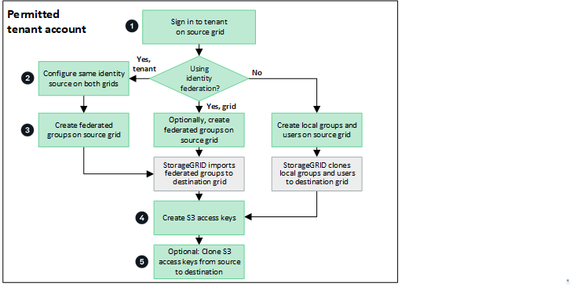

= Mandantengruppen und Benutzer klonen
:allow-uri-read: 
:icons: font
:imagesdir: ../media/

[role="lead"]
Wenn ein Mandant erstellt oder bearbeitet wurde, um eine Grid-Föderation-Verbindung zu verwenden, wird dieser Mandant von einem StorageGRID -System (dem Quellmandanten) auf ein anderes StorageGRID System (dem Replikatmandanten) repliziert.  Nachdem der Mandant repliziert wurde, werden alle dem Quellmandanten hinzugefügten Gruppen und Benutzer in den Replikatmandanten geklont.

Das StorageGRID -System, in dem der Mandant ursprünglich erstellt wurde, ist das _Quell-Grid_ des Mandanten.  Das StorageGRID -System, in dem der Mandant repliziert wird, ist das _Ziel-Grid_ des Mandanten.  Beide Mandantenkonten haben dieselbe Konto-ID, denselben Namen, dieselbe Beschreibung, dasselbe Speicherkontingent und dieselben zugewiesenen Berechtigungen, aber der Zielmandant hat zunächst kein Root-Benutzerkennwort.  Weitere Einzelheiten finden Sie unterlink:../admin/grid-federation-what-is-account-clone.html["Was ist ein Kontoklon?"] Undlink:../admin/grid-federation-manage-tenants.html["Zulässige Mandanten verwalten"] .

Das Klonen von Mandantenkontoinformationen ist erforderlich fürlink:../admin/grid-federation-what-is-cross-grid-replication.html["Cross-Grid-Replikation"] von Bucket-Objekten.  Wenn Sie auf beiden Grids dieselben Mandantengruppen und Benutzer haben, können Sie auf beiden Grids auf die entsprechenden Buckets und Objekte zugreifen.

== Mandanten-Workflow für Kontoklon

Wenn Ihr Mandantenkonto über die Berechtigung *Grid-Föderationsverbindung verwenden* verfügt, überprüfen Sie das Workflow-Diagramm, um die Schritte anzuzeigen, die Sie zum Klonen von Gruppen, Benutzern und S3-Zugriffsschlüsseln ausführen müssen.

Dies sind die wichtigsten Schritte im Workflow:

.image:https://raw.githubusercontent.com/NetAppDocs/common/main/media/number-1.png["Eins"]Beim Mandanten Sign in
[role="quick-margin-para"]
Sign in (das Raster, in dem der Mandant ursprünglich erstellt wurde).

.image:https://raw.githubusercontent.com/NetAppDocs/common/main/media/number-2.png["Zwei"]Optional: Konfigurieren Sie die Identitätsföderation
[role="quick-margin-para"]
Wenn Ihr Mandantenkonto über die Berechtigung *Eigene Identitätsquelle verwenden* zur Verwendung föderierter Gruppen und Benutzer verfügt, konfigurieren Sie dieselbe Identitätsquelle (mit denselben Einstellungen) sowohl für das Quell- als auch das Zielmandantenkonto.  Föderierte Gruppen und Benutzer können nicht geklont werden, es sei denn, beide Grids verwenden dieselbe Identitätsquelle. Anweisungen hierzu finden Sie unterlink:using-identity-federation.html["Verwenden der Identitätsföderation"] .

.image:https://raw.githubusercontent.com/NetAppDocs/common/main/media/number-3.png["Drei"]Erstellen von Gruppen und Benutzern
[role="quick-margin-para"]
Beginnen Sie beim Erstellen von Gruppen und Benutzern immer mit dem Quellraster des Mandanten.  Wenn Sie eine neue Gruppe hinzufügen, klont StorageGRID sie automatisch in das Zielraster.

[role="quick-margin-list"]
* Wenn die Identitätsföderation für das gesamte StorageGRID -System oder für Ihr Mandantenkonto konfiguriert ist,link:creating-groups-for-s3-tenant.html["Erstellen Sie neue Mandantengruppen"] durch Importieren föderierter Gruppen aus der Identitätsquelle.

[role="quick-margin-list"]
* Wenn Sie keine Identitätsföderation verwenden,link:creating-groups-for-s3-tenant.html["neue lokale Gruppen erstellen"] und dannlink:managing-local-users.html["lokale Benutzer erstellen"] .

.image:https://raw.githubusercontent.com/NetAppDocs/common/main/media/number-4.png["Vier"]Erstellen von S3-Zugriffsschlüsseln
[role="quick-margin-para"]
Du kannstlink:creating-your-own-s3-access-keys.html["Erstellen Sie Ihre eigenen Zugriffsschlüssel"] oder zulink:creating-another-users-s3-access-keys.html["Erstellen Sie die Zugriffsschlüssel eines anderen Benutzers"] entweder auf dem Quell- oder dem Zielraster, um auf Buckets auf diesem Raster zuzugreifen.

.image:https://raw.githubusercontent.com/NetAppDocs/common/main/media/number-5.png["Fünf"]Optional: S3-Zugriffsschlüssel klonen
[role="quick-margin-para"]
Wenn Sie auf Buckets mit denselben Zugriffsschlüsseln auf beiden Grids zugreifen müssen, erstellen Sie die Zugriffsschlüssel auf dem Quellgrid und verwenden Sie dann die Tenant Manager-API, um sie manuell in das Zielgrid zu klonen. Anweisungen hierzu finden Sie unterlink:../tenant/grid-federation-clone-keys-with-api.html["Klonen Sie S3-Zugriffsschlüssel mithilfe der API"] .

== Wie werden Gruppen, Benutzer und S3-Zugriffsschlüssel geklont?

Lesen Sie diesen Abschnitt, um zu verstehen, wie Gruppen, Benutzer und S3-Zugriffsschlüssel zwischen dem Mandantenquellraster und dem Mandantenzielraster geklont werden.

=== Lokale Gruppen, die im Quellraster erstellt wurden, werden geklont

Nachdem ein Mandantenkonto erstellt und in das Zielraster repliziert wurde, klont StorageGRID automatisch alle lokalen Gruppen, die Sie zum Quellraster des Mandanten hinzufügen, in das Zielraster des Mandanten.

Sowohl die ursprüngliche Gruppe als auch ihr Klon haben denselben Zugriffsmodus, dieselben Gruppenberechtigungen und dieselbe S3-Gruppenrichtlinie. Anweisungen hierzu finden Sie unterlink:creating-groups-for-s3-tenant.html["Erstellen Sie Gruppen für den S3-Mandanten"] .

image::../media/grid-federation-account-clone.png[Bild, das zeigt, dass lokale Gruppen vom Quellraster in das Zielraster geklont werden]

NOTE: Alle Benutzer, die Sie beim Erstellen einer lokalen Gruppe im Quellraster auswählen, werden nicht einbezogen, wenn die Gruppe in das Zielraster geklont wird.  Wählen Sie aus diesem Grund beim Erstellen der Gruppe keine Benutzer aus.  Wählen Sie stattdessen die Gruppe aus, wenn Sie die Benutzer erstellen.

=== Lokale Benutzer, die im Quellraster erstellt wurden, werden geklont

Wenn Sie einen neuen lokalen Benutzer im Quell-Grid erstellen, klont StorageGRID diesen Benutzer automatisch in das Ziel-Grid. Sowohl der ursprüngliche Benutzer als auch sein Klon haben denselben vollständigen Namen, Benutzernamen und dieselbe Einstellung für *Zugriff verweigern*. Beide Benutzer gehören außerdem denselben Gruppen an. Anweisungen hierzu finden Sie unterlink:managing-local-users.html["Lokale Benutzer verwalten"] .

Aus Sicherheitsgründen werden lokale Benutzerkennwörter nicht in das Zielraster geklont. Wenn ein lokaler Benutzer auf den Mandantenmanager im Zielraster zugreifen muss, muss der Root-Benutzer für das Mandantenkonto ein Kennwort für diesen Benutzer im Zielraster hinzufügen. Anweisungen hierzu finden Sie unterlink:managing-local-users.html["Lokale Benutzer verwalten"] .

image::../media/grid-federation-local-user-clone.png[Bild, das zeigt, dass lokale Benutzer vom Quellraster in das Zielraster geklont werden]

=== Im Quellraster erstellte föderierte Gruppen werden geklont

Vorausgesetzt, die Voraussetzungen für die Verwendung des Kontoklonens mitlink:../admin/grid-federation-what-is-account-clone.html#account-clone-sso["Einmaliges Anmelden"] Undlink:../admin/grid-federation-what-is-account-clone.html#account-clone-identity-federation["Identitätsföderation"] erfüllt sind, werden föderierte Gruppen, die Sie für den Mandanten im Quellraster erstellen (importieren), automatisch auf den Mandanten im Zielraster geklont.

Beide Gruppen haben denselben Zugriffsmodus, dieselben Gruppenberechtigungen und dieselbe S3-Gruppenrichtlinie.

Nachdem Verbundgruppen für den Quellmandanten erstellt und auf den Zielmandanten geklont wurden, können sich Verbundbenutzer in beiden Rastern beim Mandanten anmelden.

image::../media/grid-federation-federated-group-clone.png[Bild, das zeigt, dass föderierte Gruppen vom Quellraster in das Zielraster geklont werden]

=== S3-Zugriffsschlüssel können manuell geklont werden

StorageGRID klont S3-Zugriffsschlüssel nicht automatisch, da die Sicherheit durch unterschiedliche Schlüssel in jedem Grid verbessert wird.

Um Zugriffsschlüssel in den beiden Rastern zu verwalten, können Sie einen der folgenden Schritte ausführen:

* Wenn Sie nicht für jedes Raster die gleichen Schlüssel verwenden müssen, können Sielink:creating-your-own-s3-access-keys.html["Erstellen Sie Ihre eigenen Zugriffsschlüssel"] oderlink:creating-another-users-s3-access-keys.html["Erstellen Sie die Zugriffsschlüssel eines anderen Benutzers"] auf jedem Raster.
* Wenn Sie die gleichen Schlüssel auf beiden Grids verwenden müssen, können Sie Schlüssel auf dem Quell-Grid erstellen und dann die Tenant Manager API verwenden, um manuelllink:../tenant/grid-federation-clone-keys-with-api.html["Klonen Sie die Schlüssel"] zum Zielraster.

image::../media/grid-federation-s3-access-key.png[Bild, das zeigt, dass S3-Zugriffsschlüssel optional vom Quellraster in das Zielraster geklont werden können]

NOTE: Wenn Sie S3-Zugriffsschlüssel für einen Verbundbenutzer klonen, werden sowohl der Benutzer als auch die S3-Zugriffsschlüssel in den Zielmandanten geklont.

=== Zum Zielraster hinzugefügte Gruppen und Benutzer werden nicht geklont

Das Klonen erfolgt nur vom Quellraster des Mandanten zum Zielraster des Mandanten.  Wenn Sie Gruppen und Benutzer im Zielraster des Mandanten erstellen oder importieren, klont StorageGRID diese Elemente nicht zurück in das Quellraster des Mandanten.

image::../media/grid-federation-account-not-cloned.png[Bild, das zeigt, dass Details im Zielraster nicht in das Quellraster geklont werden]

=== Bearbeitete oder gelöschte Gruppen, Benutzer und Zugriffsschlüssel werden nicht geklont

Das Klonen erfolgt nur, wenn Sie neue Gruppen und Benutzer erstellen.

Wenn Sie Gruppen, Benutzer oder Zugriffsschlüssel in einem der Raster bearbeiten oder löschen, werden Ihre Änderungen nicht in das andere Raster geklont.

image::../media/grid-federation-account-clone-edit-delete.png[Bild, das zeigt, dass bearbeitete oder gelöschte Details nicht geklont werden]
