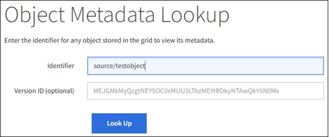

= Bestätigen Sie die Speicherorte der Objektdaten
:allow-uri-read: 
:icons: font
:imagesdir: ../media/

[role="lead"]
Je nach Problem möchten Sie vielleichtlink:../audit/object-ingest-transactions.html["Bestätigen Sie, wo die Objektdaten gespeichert werden"] .  Sie möchten beispielsweise überprüfen, ob die ILM-Richtlinie wie erwartet funktioniert und die Objektdaten am vorgesehenen Ort gespeichert werden.

.Bevor Sie beginnen
* Sie müssen über eine Objektkennung verfügen. Dabei kann es sich um eine der folgenden handeln:
+
** *UUID*: Die universell eindeutige Kennung des Objekts. Geben Sie die UUID in Großbuchstaben ein.
** *CBID*: Die eindeutige Kennung des Objekts innerhalb von StorageGRID . Sie können die CBID eines Objekts aus dem Prüfprotokoll abrufen. Geben Sie die CBID in Großbuchstaben ein.
** *S3-Bucket und Objektschlüssel*: Wenn ein Objekt über denlink:../s3/operations-on-objects.html["S3-Schnittstelle"] verwendet die Clientanwendung eine Bucket- und Objektschlüsselkombination zum Speichern und Identifizieren des Objekts.

.Schritte
. Wählen Sie *ILM* > *Objektmetadatensuche*.
. Geben Sie die Kennung des Objekts in das Feld *Kennung* ein.
+
Sie können eine UUID, CBID, einen S3-Bucket/Objektschlüssel oder einen Swift-Container/Objektnamen eingeben.

. Wenn Sie eine bestimmte Version des Objekts suchen möchten, geben Sie die Versions-ID ein (optional).
+

. Wählen Sie *Nachschlagen*.
+
Derlink:../ilm/verifying-ilm-policy-with-object-metadata-lookup.html["Ergebnisse der Objektmetadatensuche"] erscheinen.  Auf dieser Seite sind die folgenden Arten von Informationen aufgeführt:

+
** Systemmetadaten, einschließlich der Objekt-ID (UUID), der Versions-ID (optional), des Objektnamens, des Namens des Containers, des Mandantenkontonamens oder der ID, der logischen Größe des Objekts, des Datums und der Uhrzeit der ersten Objekterstellung sowie des Datums und der Uhrzeit der letzten Objektänderung.
** Alle benutzerdefinierten Schlüssel-Wert-Paare der Benutzermetadaten, die mit dem Objekt verknüpft sind.
** Bei S3-Objekten alle mit dem Objekt verknüpften Schlüssel-Wert-Paare des Objekt-Tags.
** Bei replizierten Objektkopien der aktuelle Speicherort jeder Kopie.
** Bei Erasure-Coded-Objektkopien der aktuelle Speicherort jedes Fragments.
** Bei Objektkopien in einem Cloud Storage Pool der Speicherort des Objekts, einschließlich des Namens des externen Buckets und der eindeutigen Kennung des Objekts.
** Für segmentierte Objekte und mehrteilige Objekte eine Liste von Objektsegmenten einschließlich Segmentkennungen und Datengrößen.  Bei Objekten mit mehr als 100 Segmenten werden nur die ersten 100 Segmente angezeigt.
** Alle Objektmetadaten im unverarbeiteten, internen Speicherformat.  Diese Rohmetadaten umfassen interne Systemmetadaten, deren Beibehaltung von Version zu Version nicht garantiert ist.
+
Das folgende Beispiel zeigt die Ergebnisse der Objektmetadatensuche für ein S3-Testobjekt, das als zwei replizierte Kopien gespeichert ist.

+
image::../media/object_lookup_results.png[Ergebnisse der Objektsuche]

